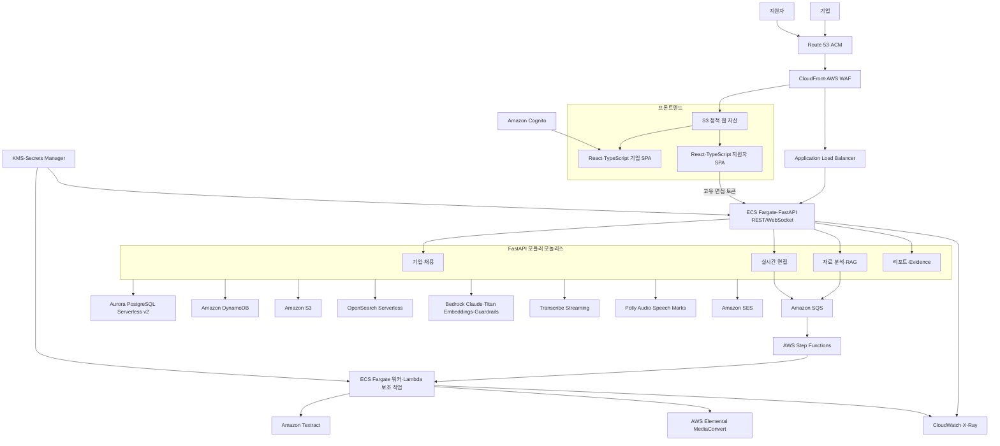
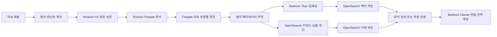
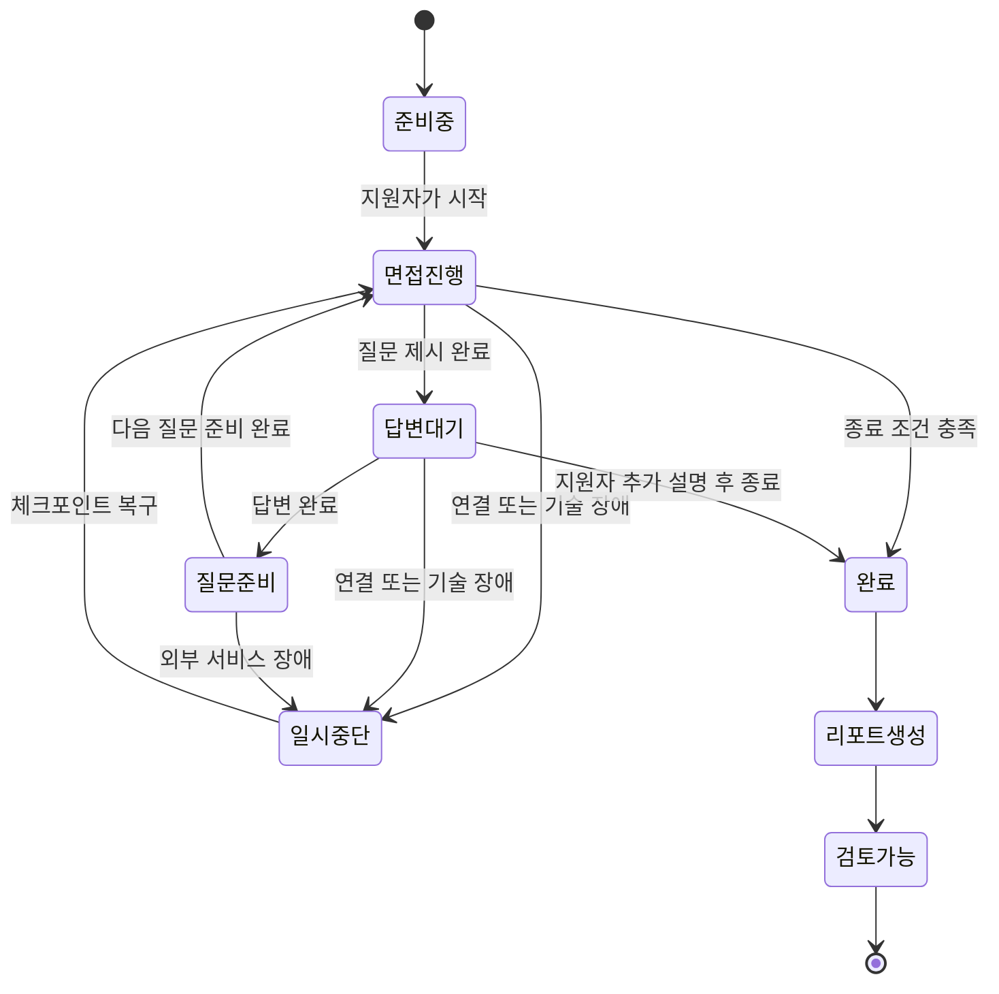

# IT/개발 직군 특화 AI 구조화 면접 플랫폼 프로젝트 기획서

> 문서 성격: 제품 콘셉트 및 서비스 기획서  
> 버전: 1.4  
> 작성일: 2026-08-13
> 개정일: 2026-08-14  
> 개정 범위: AWS 인프라 코드를 Terraform HCL로 확정하고, 관리 범위·모듈 구조·원격 상태·Bedrock/OpenSearch 의존성·환경 분리·배포 파이프라인을 구체화

---

## 1. 프로젝트 개요

### 1.1 프로젝트명(가칭)

**Interview Evidence Platform**  
기업의 기준으로 질문하고, IT/개발 지원자의 실무 산출물과 실제 답변에서 채용 판단의 근거를 만드는 AI 구조화 면접 플랫폼

### 1.2 한 문장 정의

IT/개발 직군 채용에 특화하여, 기업이 직무별 인재상과 평가 기준을 설정하면 기업의 AI 면접관이 지원자의 이력서·포트폴리오·코드 저장소·기술 산출물을 이해한 뒤 실시간 맞춤 면접을 진행하고, 모든 질문과 답변을 근거 중심의 검토 자료로 정리해 주는 기업용 채용 플랫폼이다.

### 1.3 핵심 명제

이 플랫폼은 AI가 사람을 대신해 합격과 불합격을 결정하는 서비스가 아니다. 기업이 많은 지원자를 더 일관되고 깊이 있게 만나도록 돕고, 기업이 최종 판단에 필요한 증거를 빠르게 확인하도록 만드는 **AI 기반 사전 면접 및 채용 검토 플랫폼**이다.

### 1.4 대상 도메인

제품의 대상 도메인은 **IT/개발 직군 전체**다. 세부 직무, 기술 스택, 산업 분야나 경력 수준을 특정 목록으로 제한하지 않으며, 지원자가 제출한 직무 관련 자료와 실무 산출물을 바탕으로 역량을 검증할 수 있는 모든 IT/개발 채용을 다룬다. 이는 초기 출시 단계의 임시 제한이 아니라 제품의 질문 생성, 평가 기준, 자료 분석과 리포트 구조를 결정하는 핵심 정체성이다. 비IT·비개발 직군은 서비스 범위에 포함하지 않는다.

### 1.5 확정된 1차 제공 조건

1차 제품은 아이디어 검증용 화면 시안이 아니라 실제 종단 흐름을 실행할 수 있는 SaaS를 목표로 한다. 다만 처음부터 대규모 트래픽을 전제로 하지 않고, 기업 1~5개사, 동시 면접 1~5건, 누적 면접 수백 건의 파일럿 규모에서 제품 가치와 운영 가능성을 검증한다.

- 서비스 언어는 UI, AI 면접 대화와 리포트를 포함해 한국어로 한정한다.
- 기업 콘솔과 지원자 면접룸은 분리된 웹 인터페이스로 제공한다.
- 기업은 이메일과 비밀번호로 인증하고, 지원자는 회원가입 없이 만료 기한이 있는 고유 면접 링크와 본인 확인을 통해 접근한다.
- 공개 코드 저장소만 분석하며 비공개 저장소 인증과 광범위한 ATS 연동은 초기 범위에서 제외한다.
- 초기 개발·통합 검증은 Docker Compose 기반 로컬 환경에서 수행하고, 외부 AI 기능은 AWS 서비스를 실제로 호출한다.
- AWS 운영 구조와 배포 자동화는 28절의 구성을 기준으로 하며, 동시 면접 100건 이상의 대규모 확장만 파일럿 이후 단계로 둔다.

---

## 2. 기획 배경

### 2.1 채용 환경의 변화

생성형 AI의 보편화로 자기소개서와 포트폴리오의 완성도만으로는 지원자의 실제 역량과 이해도를 판단하기 어려워지고 있다. 문서는 잘 작성되어 있지만 본인이 해당 경험을 어느 정도 이해하고 있는지, 실제로 어떤 역할을 수행했는지, 문제를 어떤 방식으로 해결했는지는 결국 대화를 통해 확인해야 한다.

반면 기업은 모든 지원자의 자기소개서, 기술 문서, 포트폴리오와 코드 저장소를 일일이 검토하고 면접하기 어렵다. 지원자가 많을수록 기업의 검토 시간이 크게 소모되고, 면접을 수행하는 사람에 따라 질문의 깊이와 평가 기준이 달라지는 문제도 발생한다.

즉, 기업은 더 많은 자료를 받게 되었지만 오히려 다음 질문에 답하기 어려워졌다.

- 지원자가 제출한 경험과 결과물은 실제 본인의 역량을 반영하는가?
- 기업이 중요하게 생각하는 역량을 충분히 검증했는가?
- 서로 다른 지원자를 일관된 기준으로 비교할 수 있는가?
- 평가의 근거가 실제 어떤 답변에서 나왔는지 다시 확인할 수 있는가?
- 기업이 꼭 필요한 지원자에게 검토 시간을 집중할 수 있는가?

### 2.2 현재 채용 과정의 주요 페인포인트

#### 기업 관점

- 지원자별 서류와 포트폴리오를 검토하는 데 많은 시간이 필요하다.
- 공개된 프로젝트가 지원자의 실제 기여와 이해도를 보여주는지 확인하기 어렵다.
- 사전 면접을 확대할수록 기업의 일정과 검토 부담이 커진다.
- 면접관마다 질문과 평가 방식이 달라 평가 결과의 일관성이 떨어진다.
- 면접 이후에는 기억이나 간단한 메모에 의존해 판단하기 쉽다.
- 결과만 남고 그 결과를 뒷받침하는 질문·답변 근거가 충분히 보존되지 않는다.

#### 지원자 관점

- 제출한 포트폴리오와 프로젝트를 충분히 설명할 기회를 얻지 못할 수 있다.
- 면접관의 성향이나 컨디션에 따라 질문 경험이 달라질 수 있다.
- 자신의 실제 문제 해결 과정이나 사고력을 서류만으로 전달하기 어렵다.
- 채용 과정이 어떤 기준으로 진행되는지 알기 어렵고, 반복되는 일정 조율에 부담을 느낀다.

### 2.3 IT/개발 직군에 집중하는 이유

#### 분석 가능한 명확한 실무 산출물

IT/개발 직군은 자기소개서의 서술만이 아니라 코드, 설계 자료, 기술 문서, 분석 결과, 운영 기록과 포트폴리오처럼 분석 가능한 실무 산출물이 존재한다. 이러한 자료에는 지원자가 실제로 해결한 문제, 맡은 역할, 기술적 판단과 결과가 담겨 있어 서류의 주장과 실제 이해도를 연결해 확인할 수 있다.

AI는 이러한 산출물에서 사용 기술, 구조, 가정, 의사결정과 결과를 파악한 뒤 기술 선택의 이유, 설계의 타당성, 문제 해결 과정, 대안 검토와 본인 기여 범위를 묻는 **실무 밀착형 꼬리질문**을 만들 수 있다. 이는 텍스트 중심의 범용 면접보다 지원자의 실제 이해도를 깊이 검증하기에 적합하다.

#### 현업 실무자의 면접 비용 절감

IT/개발 인재 채용에서 비용이 큰 과정 중 하나는 기술 면접과 코드·포트폴리오 리뷰에 시니어 개발자와 핵심 실무자가 참여하는 시간이다. AI가 사전 기술 면접에서 이력서에 적힌 기술 스택과 제출 산출물에 대한 실제 이해도를 먼저 확인하고, 판단 근거가 된 답변과 영상 타임라인을 제공하면 현업 실무자는 전체 면접을 반복하는 대신 중요한 쟁점과 유력 지원자의 심층 검증에 시간을 집중할 수 있다.

#### 구조화된 평가 기준 설계

IT/개발 직군은 기술 이해도, 설계와 구현의 타당성, 문제 해결 과정, 품질 개선, 협업과 운영 대응처럼 직무 수행과 연결된 관찰 기준을 구체적으로 정의하기 용이하다. 기업은 세부 직무와 기술 환경에 맞는 평가 기준을 구조화하고, 플랫폼은 각 기준을 실제 질문·답변·산출물 근거와 연결할 수 있다. 이는 점수보다 검토 가능한 증거를 우선하는 제품 비전과 직접 맞닿아 있다.

---

## 3. 해결하고자 하는 문제

이 프로젝트가 해결하려는 본질적인 문제는 **서류의 완성도와 지원자의 실제 역량 사이에 생긴 검증 공백**이다.

플랫폼은 서류를 단순히 요약하거나 자동 채점하지 않는다. 지원자가 제출한 자료에서 주장, 경험, 기술 선택, 성과, 기여 범위를 찾아낸 후 이를 대화로 검증한다. 기업이 중요하게 여기는 역량과 지원자 개인의 자료를 함께 반영해 질문하되, 모든 지원자는 동일한 핵심 평가축 안에서 검토되도록 한다.

결과적으로 기업이 얻는 것은 또 하나의 AI 점수가 아니라 다음과 같은 **채용 판단용 증거 묶음**이다.

- 기업 평가 항목별로 확인된 답변
- 지원자 주장과 답변의 일치 또는 불일치 지점
- 실제 이해도와 문제 해결 과정을 확인한 꼬리질문
- 질문 및 답변과 연결된 영상·자막 타임라인
- AI 평가의 이유와 근거가 된 구간
- 추가 대면면접에서 확인해야 할 미검증 사항

---

## 4. 제품 비전과 목표

### 4.1 제품 비전

**IT/개발 지원자에게는 자신의 역량을 설명할 기회를, IT/개발 인재를 채용하는 기업에는 근거 있는 판단을 제공한다.**

기업이 지원자 전원을 직접 면접하지 않더라도, 각 지원자의 경험을 깊이 있게 검증하고 그 결과를 투명하게 검토할 수 있는 새로운 사전 면접 표준을 만든다.

### 4.2 제품 목표

1. 기업이 원하는 인재상과 직무 역량을 실제 면접 질문과 평가 기준으로 전환한다.
2. 지원자의 이력서·포트폴리오·코드 저장소·기술 산출물에 담긴 내용을 실시간 대화로 검증한다.
3. 공통 평가 기준과 개인화된 꼬리질문을 결합해 깊이와 비교 가능성을 함께 확보한다.
4. 면접 영상, 자막, 질문, 답변, 자료 및 평가를 하나의 검토 경험으로 연결한다.
5. 기업의 반복 업무를 줄이고, 사람이 중요한 최종 판단에 집중하도록 돕는다.
6. AI가 내린 결론이 아니라 사람이 검토할 수 있는 근거와 불확실성을 제공한다.

### 4.3 지향하지 않는 것

- AI가 단독으로 합격 또는 불합격을 결정하는 자동 채용 시스템
- 표정, 시선, 말투만으로 성격·정직성·잠재력을 단정하는 감정 판독 시스템
- 지원자가 모르는 상태에서 감시하거나 부정행위를 확정하는 감독 시스템
- 기업의 평가 기준 없이 범용 점수 하나로 모든 지원자를 줄 세우는 서비스
- 사람 면접을 완전히 제거하는 것이 목적이 되는 서비스
- 비IT·비개발 직군까지 포괄하는 범용 채용 플랫폼

---

## 5. 핵심 사용자

서비스 참여 주체는 **기업**과 **사용자** 두 종류로만 구분한다. 기업 내부의 관리자·채용 담당자·현업 평가자를 서로 다른 사용자 유형으로 나누지 않으며 모두 하나의 `기업`으로 표현한다. 이 문서에서 면접을 보는 일반 사용자는 기능상 `지원자`라고 표기한다.

### 5.1 기업

기업은 회사 정보와 채용 공간을 관리하고, 포지션·인재상·평가 기준·AI 면접관을 설정한다. 지원자를 초대하고 면접 진행 상황, 제출 자료, 영상·자막, AI 리포트와 평가 Evidence를 검토한다. AI 평가를 수정하거나 내부 의견을 남길 수 있으며 최종 채용 판단은 기업이 직접 기록한다.

1차에서는 동일 기업에 속한 구성원이 같은 기본 기능을 사용한다. 세밀한 역할별 권한은 후속 범위지만 향후 확장을 위해 기업 구성원과 역할 필드는 데이터 모델에 포함한다.

### 5.2 사용자(지원자)

지원자는 개인별 고유 링크를 통해 본인 확인과 개인정보 동의를 거친다. 자기소개서·이력서·포트폴리오·공개 GitHub 자료를 제출하고 장비와 환경을 점검한 뒤 AI 면접관과 화상면접을 진행한다. 질문에 답하고 자신의 경험·기술적 판단·기여 범위를 설명하며, 면접 종료 후 제출 완료와 이후 절차를 확인한다.

---

## 6. 플랫폼의 핵심 가치

### 6.1 기업 맞춤성

모든 기업에 동일한 질문을 제공하는 것이 아니라, 기업이 정의한 인재상·직무 역량·조직의 관점이 면접의 공통 기준이 된다. AI 면접관은 해당 기업을 대표하는 역할과 태도를 갖는다.

### 6.2 지원자별 깊이 있는 검증

지원자의 자료를 요약하는 데 그치지 않고, 자료 속 주장과 실제 이해도를 확인한다. 같은 프로젝트라도 기술 선택의 이유, 본인의 기여 범위, 실패 경험, 대안 검토, 운영 문제 등 답변의 맥락에 따라 질문이 달라진다.

### 6.3 비교 가능한 공정한 구조

지원자마다 꼬리질문은 달라질 수 있지만 핵심 역량과 평가 기준은 동일하게 유지한다. 개인화는 검증의 깊이를 위한 것이며 평가 기준을 임의로 바꾸기 위한 것이 아니다.

### 6.4 근거 추적성

모든 평가는 실제 답변, 자막, 영상 시점, 제출 자료와 연결된다. 기업은 AI의 결론을 그대로 믿는 대신 직접 근거를 확인할 수 있다.

### 6.5 사람 중심의 최종 판단

AI는 질문, 기록, 요약, 평가 보조를 담당한다. 최종 채용 판단과 책임은 기업의 사람에게 남는다. AI가 확인하지 못한 내용과 평가의 불확실성도 함께 보여준다.

### 6.6 기업 브랜드 경험

지원자가 만나는 AI 면접관은 단순한 챗봇이 아니라 해당 기업의 채용 경험을 대표한다. 기업의 정체성을 반영한 외형, 음성, 말투와 안내 방식으로 일관된 지원자 경험을 제공한다.

---

## 7. 서비스 콘셉트

### 7.1 기업이 만드는 것은 ‘면접 링크’가 아니라 ‘면접 기준’이다

기업은 포지션을 개설하면서 다음 내용을 정의한다.

- 채용 직무와 역할
- 회사가 원하는 인재상
- 반드시 확인할 핵심 역량
- 역량별 관찰 기준과 중요도
- 공통으로 확인할 질문과 주제
- 지원자 자료에서 중점적으로 검증할 관점
- 면접 시간, 분위기 및 진행 방식
- 질문해서는 안 되는 민감 영역
- AI 면접관의 이름, 외형, 음성, 말투 및 회사 브랜딩

이 설정은 AI에게 막연히 “좋은 인재를 찾아 달라”는 요청이 아니다. 기업의 관점을 면접 가능한 언어와 평가 기준으로 구조화하는 과정이다.

### 7.2 지원자 자료는 평가 결과가 아니라 면접의 출발점이다

지원자는 면접 전 다음 자료를 제출할 수 있다.

- 자기소개서 또는 이력서
- PDF 형식의 포트폴리오와 직무 관련 기술 문서
- 공개된 코드 저장소 또는 실무 산출물 URL

플랫폼은 자료에서 지원자가 강조하는 경험, 성과, 기술, 역할과 의사결정을 파악한다. 동시에 구체성이 부족하거나 추가 설명이 필요한 지점, 기업의 평가 기준과 연결되는 검증 포인트를 준비한다.

자료의 완성도가 높다는 이유만으로 좋은 점수를 주지 않는다. 자료는 지원자에게 무엇을 질문할지 결정하는 맥락이며, 실제 평가는 면접에서 드러난 설명과 근거를 중심으로 이루어진다.

### 7.3 모든 질문을 미리 생성하지 않는다

면접 전에는 완성된 전체 질문지가 아니라 **면접 전략**이 준비된다.

- 모든 지원자에게 적용되는 공통 평가 주제
- 지원자 자료에서 발견한 개인별 검증 포인트
- 답변 수준에 따라 더 깊게 확인할 꼬리질문 방향
- 제한된 면접 시간 안에서 반드시 확보해야 할 평가 근거

실제 질문은 지원자의 답변에 따라 이어진다. AI 면접관은 답변의 구체성, 모순, 근거 부족, 이해 깊이와 남은 시간을 고려해 다음 질문을 선택한다.

### 7.4 아바타는 면접 경험의 인터페이스다

기업별 AI 아바타는 단순한 장식이 아니라 지원자가 기업과 처음 대면하는 창구다. 아바타는 기업의 분위기를 전달하고 면접의 긴장감을 낮추며, 질문과 안내가 일관된 한 명의 면접관을 통해 전달되도록 한다.

다만 아바타의 화려함보다 자연스러운 대화, 빠른 반응, 명확한 질문, 안정적인 진행이 우선된다.

---

## 8. 전체 서비스 여정

### 8.1 기업의 면접 설계

1. 기업이 채용 포지션을 만든다.
2. 직무 설명, 인재상과 핵심 역량을 입력한다.
3. 평가 항목별로 무엇을 좋은 답변과 부족한 답변으로 볼지 정의한다.
4. 공통 질문, 필수 검증 항목과 금지 질문을 설정한다.
5. 기업을 대표할 AI 면접관과 아바타를 구성한다.
6. 면접 시간과 지원자 안내 내용을 확인한 후 채용 캠페인을 공개한다.

### 8.2 지원자 초대

1. 기업이 지원자를 개별 등록하거나 CSV로 일괄 등록한다.
2. 지원자별 고유 면접 URL이 발급된다.
3. 지원자는 안내 메시지와 함께 자신의 면접 링크를 받는다.
4. 기업은 미응시, 준비 중, 완료, 검토 완료 등 진행 상태를 확인한다.

### 8.3 지원자의 사전 준비

1. 지원자가 개인 면접 페이지에 접속한다.
2. 본인 확인과 개인정보 처리·녹화·AI 활용에 대한 안내 및 동의를 거친다.
3. 자기소개서, 이력서, PDF 포트폴리오·기술 문서와 공개 코드 저장소·실무 산출물 URL을 제출한다.
4. 카메라, 마이크, 네트워크와 면접 환경을 점검한다.
5. 면접 진행 방식과 유의사항을 확인한다.
6. 플랫폼은 이 준비 시간 동안 지원자 자료를 분석하고 면접 전략을 구성한다.
7. 준비가 완료되면 지원자가 직접 면접 시작을 선택한다.

지원자 초대와 면접은 다음 상태를 중심으로 관리한다.

```text
초대됨 → 본인 확인 → 동의 완료 → 자료 제출 → 자료 분석 중 → 준비 완료
       → 면접 진행 중 → 일시 중단 → 면접 재개 → 면접 완료 → 검토 완료
```

각 상태 변경은 시점과 수행 주체를 기록한다. 자료 일부의 분석이 실패하더라도 분석된 자료와 공통 평가 기준으로 면접을 진행할 수 있으며, 실패한 자료와 영향 범위는 기업 화면에 표시한다.

### 8.4 AI 화상면접

1. AI 면접관이 기업과 포지션을 소개하고 면접 방식을 안내한다.
2. 공통 질문을 통해 모든 지원자가 동일한 핵심 역량을 설명할 기회를 갖는다.
3. AI는 지원자 자료를 근거로 경험, 프로젝트와 역할을 질문한다.
4. 지원자의 답변에 따라 구체적인 사례, 선택 이유, 실패와 대안, 본인 기여 범위를 꼬리질문으로 확인한다.
5. 답변이 모호하면 표현을 바꿔 다시 묻고, 질문을 이해하지 못한 경우 설명 기회를 제공한다.
6. 필수 평가 항목을 충분히 확인하면서 제한 시간을 관리한다.
7. 면접 종료 전 지원자에게 추가로 설명하거나 정정할 기회를 준다.
8. 면접이 끝나면 제출 완료와 이후 절차를 안내한다.

지원자의 답변은 음성으로 녹음되며, 지원자가 `답변 완료`를 선택하면 해당 답변이 확정된다. 자발적인 재녹음은 허용하지 않지만 네트워크·마이크·업로드 오류처럼 지원자의 역량과 무관한 기술 장애는 재시도 또는 세션 복구 대상으로 구분한다.

답변 확정 후 다음 질문은 다음 흐름으로 준비한다.

```text
답변 확정 → 음성 인식 → 최근 대화 문맥 조회 → 관련 자료·과거 대화 검색
         → 다음 질문 생성 → 금지 질문·중복 질문 검사 → 음성 합성 → 질문 제시
```

질문 준비 중에는 현재 처리 상태를 지원자에게 보여준다. 고정된 응답 시간만 맞추기 위해 인위적으로 기다리지 않으며, 각 단계가 완료되는 즉시 다음 질문을 제시한다. 단계별 처리 시간과 오류는 개인정보 원문을 제외한 구조화 로그로 기록한다.

### 8.5 면접 기록과 분석

면접 과정에서 다음 정보가 하나의 세션으로 정리된다.

- 전체 영상과 음성
- AI 면접관의 질문
- 지원자의 답변과 화자별 자막
- 질문과 답변의 시작·종료 시점
- 지원자 자료에서 참조한 근거
- 답변 중 확인된 핵심 주장과 미확인 사항
- 연결 끊김, 장시간 무응답, 얼굴 미검출 등 객관적 진행 이벤트

실시간 문맥과 장기 검토 자료는 서로 다른 목적으로 관리한다. 최근 질문과 답변은 빠른 다음 질문 생성을 위해 실시간 저장소에서 읽고, 확정된 질문·답변의 순서와 자막·영상 시점은 장기 근거 체인에 연결할 수 있도록 영구 기록한다. 오래된 대화는 요약과 검색 가능한 단위로 전환해 전체 대화를 매번 AI 프롬프트에 넣지 않는다.

### 8.6 기업의 사후 검토

1. 기업은 지원자 목록에서 진행 상태와 핵심 요약을 확인한다.
2. 지원자별로 자기소개서, 포트폴리오, 기술 문서, 코드 저장소, 공개 실무 산출물, 면접 영상과 AI 리포트를 한 화면에서 검토한다.
3. 역량별 평가를 선택하면 근거가 된 답변과 해당 영상 시점으로 이동한다.
4. 질문별 답변, 주요 구간, 모순 또는 추가 확인이 필요한 항목을 살펴본다.
5. 기업은 의견과 검토 메모를 남긴다.
6. AI가 제안한 후속 질문을 활용해 사람 면접을 준비한다.
7. 최종 합격·불합격과 채용 의사결정은 기업 내부 절차에서 사람이 수행한다.

---

## 9. 핵심 제품 영역

### 9.1 기업 채용 공간

- 기업 및 브랜드 관리
- 채용 포지션과 캠페인 관리
- 구성원 초대와 기본 구성원 관리
- 지원자 초대 및 진행 현황 관리
- 면접 결과 공유와 내부 검토 기록

### 9.2 인재상 및 평가 기준 설계

- 자연어로 입력한 인재상을 평가 가능한 역량 항목으로 정리
- 직무별 필수·우대 역량 정의
- 항목별 중요도와 관찰 기준 설정
- 좋은 답변, 부족한 답변과 판단 유보 기준 정의
- 공통 질문, 필수 검증 항목과 금지 영역 설정
- 설정된 기준의 편향 또는 모호한 표현 검토 안내

### 9.3 기업 AI 면접관 및 아바타

- 기업을 대표하는 이름과 외형
- 음성, 말투, 질문 방식과 면접 분위기
- 회사 및 직무 소개 방식
- 질문의 깊이와 압박 수준
- 지원자에게 제공할 안내 및 종료 메시지
- 면접 전에 확인 가능한 미리보기와 시험 면접

### 9.4 지원자 면접룸

- 지원자별 고유 접근 링크
- 자료 제출과 제출 상태 확인
- 개인정보·녹화·AI 분석 범위 안내 및 동의
- 카메라·마이크·네트워크 사전 점검
- 면접 예상 시간과 진행 절차 안내
- 실시간 AI 아바타 면접
- 연결 장애 발생 시 재접속과 이어서 진행
- 면접 종료 및 제출 확인

### 9.5 지원자 자료 이해

- 자기소개서와 이력서에서 경험, 역량, 성과 및 주장 파악
- PDF 포트폴리오와 기술 문서에서 프로젝트, 구조, 역할, 문제와 결과 파악
- 공개 코드 저장소에서 구현 구조, 기술 선택과 주요 검증 포인트 파악
- 그 밖의 직무별 실무 산출물에서 의사결정과 주요 검증 포인트 파악
- 자료 간 일치하거나 충돌하는 내용 식별
- 자료 자체의 품질이 아니라 면접에서 확인할 질문 포인트 생성

### 9.6 실시간 면접 진행

- 공통 질문과 개인화 질문의 균형 유지
- 답변 내용에 따른 자연스러운 꼬리질문
- 모호한 답변, 과장 가능성, 기여 범위와 의사결정 근거 확인
- 면접 시간과 평가 항목별 확인 수준 관리
- 반복 질문 방지와 대화 맥락 유지
- 지원자가 정정하거나 추가 설명할 기회 제공

### 9.7 면접 타임라인

- 영상과 자막 동시 제공
- 질문별·역량별 구간 표시
- 자막 또는 키워드 검색
- 평가 근거를 클릭하면 해당 영상 시점으로 이동
- 중요 답변, 모순, 미확인 사항 및 진행 이벤트 표시
- 기업이 주요 구간을 북마크하고 내부 메모 작성

### 9.8 AI 평가 리포트

- 지원자 핵심 경험과 면접 내용 요약
- 평가 항목별 관찰 내용과 수준
- 각 평가의 근거가 된 질문·답변·영상 시점
- 지원자 자료와 실제 답변의 일치 여부
- 강점, 우려 사항과 아직 확인되지 않은 항목
- 답변 근거의 충분도와 AI 판단의 확신 수준
- 후속 사람 면접에서 확인할 추천 질문
- 기업이 AI 평가를 수정하거나 별도 의견을 기록하는 기능

### 9.9 비언어 및 진행 관찰 정보

플랫폼은 얼굴 미검출, 자리 비움, 카메라 중단, 장시간 무응답, 복수 얼굴 등장처럼 비교적 객관적으로 관찰 가능한 사건을 타임라인에 표시할 수 있다.

이 정보는 다음 원칙을 따른다.

- 관찰한 사실과 해석을 구분한다.
- 시선, 표정, 자세만으로 성격, 정직성, 자신감 또는 역량을 단정하지 않는다.
- 관찰 이벤트를 직무 역량 점수에 자동 합산하지 않는다.
- 지원자에게 수집 여부와 사용 목적을 사전에 명확히 알린다.
- 기업이 필요한 경우 원본 영상에서 직접 확인하도록 한다.

---

## 10. 평가 체계의 기본 원칙

### 10.1 동일한 평가축, 서로 다른 검증 질문

지원자별 제출 자료와 답변이 다르기 때문에 모든 질문을 동일하게 만들 수는 없다. 그러나 지원자마다 평가 기준까지 달라지면 비교 가능성과 공정성이 무너진다.

따라서 플랫폼은 다음 구조를 사용한다.

> 공통 핵심 역량 + 공통 기준 질문 + 지원자별 검증 포인트 + 실시간 꼬리질문

예를 들어 문제 해결 역량을 평가한다면 모든 지원자에게 문제 상황, 본인의 판단, 실행, 결과와 회고를 확인한다. 다만 어떤 프로젝트를 근거로 묻고 어느 부분을 더 깊게 검증할지는 지원자마다 달라질 수 있다.

### 10.2 점수보다 근거 우선

종합 점수는 빠른 탐색을 돕는 보조 정보로 사용할 수 있지만, 그것만으로 지원자를 판단하게 해서는 안 된다. 각 결과에는 반드시 다음 정보가 연결된다.

> 평가 항목 → 관찰 내용 → 판단 이유 → 실제 답변 → 영상 시점 → 근거 충분도

### 10.3 ‘평가 불가’를 허용

정보가 부족하거나 답변이 특정 역량을 판단하기에 충분하지 않으면 억지로 점수를 부여하지 않는다. `확인됨`, `부분 확인`, `근거 부족`, `추가 확인 필요`처럼 판단 상태를 명확히 보여준다.

### 10.4 AI와 사람의 역할 분리

AI는 반복적인 질문 진행, 자료 연결, 기록, 요약 및 평가 보조를 담당한다. 사람은 맥락을 검토하고 AI의 오류나 편향을 바로잡으며 최종 채용 결정을 내린다.

### 10.5 자료 출처와 평가 근거의 분리

지원자가 제출한 자기소개서, 포트폴리오와 코드는 질문을 만들기 위한 **자료 출처(Source Reference)** 다. 자료에 어떤 기술이나 성과가 적혀 있다는 사실만으로 해당 역량이 확인된 것으로 평가하지 않는다.

평가에 사용되는 **Evidence**는 면접에서 실제로 확인된 지원자의 답변을 중심으로 생성하며, 반드시 답변 레코드와 자막·영상 시점을 참조한다. 자료와 답변의 일치 또는 불일치를 보여줄 때는 자료 출처와 답변 Evidence를 나란히 연결하되 두 개념을 하나로 합치지 않는다.

```text
자료 출처 → 질문 생성 이유
실제 답변 + 자막·영상 시점 → 평가 Evidence
자료 출처 + Evidence → 주장과 답변의 일치·불일치 검토
```

---

## 11. 주요 사용자 경험 원칙

### 11.1 지원자는 ‘감시받는다’보다 ‘면접을 본다’고 느껴야 한다

장비 설정과 자료 분석 대기 시간은 자연스러운 온보딩 흐름으로 구성한다. 분석 중이라는 불안감을 키우기보다 면접 과정, 예상 시간과 주의 사항을 안내하고 연습 기회를 제공한다.

### 11.2 AI임을 명확히 알린다

지원자는 상대가 AI 면접관이며 어떤 정보가 수집되고 어떻게 활용되는지 면접 전에 이해해야 한다. 사람처럼 속이는 연출은 하지 않는다.

### 11.3 질문은 짧고 명확해야 한다

AI가 긴 설명이나 여러 질문을 한 번에 던지지 않도록 한다. 지원자가 질문을 다시 듣거나 이해하지 못했다고 말할 수 있어야 하며, 시스템은 불이익 없이 질문을 다시 설명한다.

### 11.4 장애가 평가에 영향을 주지 않아야 한다

네트워크 단절, 카메라 오류, 음성 인식 실패 같은 기술 문제를 지원자의 역량 부족으로 해석하지 않는다. 재접속, 답변 재시도와 사람 검토 절차를 제공한다.

### 11.5 기업은 전체 영상을 처음부터 볼 필요가 없어야 한다

요약, 평가 항목, 질문, 자막과 타임라인을 통해 원하는 근거로 바로 이동할 수 있어야 한다. 필요할 때만 앞뒤 맥락을 영상으로 확인하도록 검토 경험을 설계한다.

---

## 12. 대표 사용 시나리오

### 시나리오 A: 기업이 IT/개발 포지션을 개설한다

기업은 해당 직무에 필요한 기술 역량, 문제 해결, 협업과 학습 능력을 핵심 역량으로 설정한다. 각 항목에서 확인하고 싶은 행동과 답변 근거를 정의하고, 기업의 말투와 브랜드를 반영한 AI 면접관을 설정한다. 지원자들에게 고유 면접 링크를 발송한 후 진행률을 확인한다.

### 시나리오 B: 지원자가 자신의 대표 프로젝트를 설명한다

지원자는 자기소개서, 포트폴리오와 직무 관련 실무 산출물을 제출한다. AI 면접관은 해당 산출물에서 확인한 기술적 선택과 판단의 이유를 묻는다. 지원자가 문제를 해결했다고 답하면 문제가 어떻게 발견되었고 어떤 근거로 해결 방법을 선택했으며 다른 대안은 무엇이었는지 이어서 질문한다. 마지막에는 본인이 직접 수행한 부분과 팀원의 기여를 구분해 설명하도록 한다.

### 시나리오 C: 기업이 AI 평가의 근거를 검토한다

기업은 `시스템 설계: 부분 확인`이라는 결과를 확인한다. 결과 옆의 근거를 선택하면 해당 답변 자막과 영상 18분 42초로 이동한다. 앞뒤 답변을 확인한 후 “트래픽 증가 시 일관성 전략을 추가로 확인할 것”이라는 메모를 남기고 후속 면접 질문을 준비한다.

### 시나리오 D: 기술 문제가 발생한 면접을 처리한다

지원자의 네트워크가 끊겨 면접이 중단된다. 지원자는 동일한 링크로 다시 접속해 중단된 지점부터 이어간다. 리포트에는 연결 장애 구간이 별도 표시되며, 해당 구간의 침묵이나 시선 변화는 평가 근거로 사용되지 않는다.

---

## 13. 서비스 정책과 신뢰 원칙

### 13.1 개인정보 및 동의

- 수집하는 자료, 영상, 음성, 자막과 분석 항목을 면접 전에 명확히 고지한다.
- 녹화와 AI 분석에 필요한 동의를 구분해 이해하기 쉽게 설명한다.
- 기업의 보관 기간과 삭제 정책을 지원자에게 알린다.
- 정해진 목적을 벗어나 지원자 데이터를 재사용하지 않는다.
- 권한이 있는 기업 구성원만 지원자 자료와 면접 기록을 열람하도록 한다.
- 동의 항목, 동의 문구 버전, 동의 시점과 철회·삭제 요청 처리 이력을 보존한다.
- 기업이 보관 기간을 설정할 수 있게 하며 기본값은 6개월로 한다.
- 보관 기간 만료 또는 유효한 삭제 요청이 발생하면 관계형 데이터, 실시간 대화 데이터, 원본 파일, 영상·음성, 자막, 요약, 검색 청크와 임베딩을 동일한 삭제 작업으로 추적한다.
- 삭제 완료 여부는 저장소별로 검증하고, 지원자 원문 대신 삭제 대상 식별자와 처리 결과만 감사 기록으로 남긴다.
- 지원자 자료와 면접 기록의 조회·수정·다운로드 이력을 기록한다.

### 13.2 공정성과 차별 방지

- 직무 수행과 무관한 민감 정보가 평가 기준에 포함되지 않도록 한다.
- 기업이 입력한 인재상에 모호하거나 차별적인 표현이 있을 경우 수정 안내를 제공한다.
- 장애, 억양, 성별, 연령, 외모, 표정과 시선 같은 요소가 역량 평가를 왜곡하지 않도록 한다.
- 지원자별 질문 범위와 평가 근거가 지나치게 달라지는지 기업이 점검할 수 있게 한다.

### 13.3 설명 가능성과 이의 검토

- 모든 주요 AI 평가는 확인 가능한 근거를 제공한다.
- 사람이 AI 평가를 수정하거나 무시할 수 있어야 한다.
- 자료 또는 음성 인식 오류가 발견되면 원문을 확인하고 바로잡을 수 있어야 한다.
- 기업은 AI 결과만으로 자동 탈락시키기보다 내부 검토 절차를 두는 것을 기본 운영 원칙으로 삼는다.

---

## 14. 제품 범위

제품은 **IT/개발 직군의 채용 면접과 역량 검증에 한정**해 설계하고 제공한다.

### 14.1 초기 제품에서 반드시 제공할 가치

- 기업별 채용 포지션, 인재상과 평가 기준 설정
- 기업을 대표하는 기본 AI 면접관 설정
- 지원자별 고유 면접 링크 발급
- 자기소개서·이력서, PDF 포트폴리오·기술 문서와 공개 코드 저장소·실무 산출물 URL 제출
- 지원자 자료 기반 면접 전략과 질문 포인트 구성
- AI와 지원자 간 실시간 음성·화상 면접 및 꼬리질문
- 전체 면접 영상, 음성, 질문과 자막 기록
- 질문별·평가 항목별 타임라인
- 근거가 연결된 역량별 AI 리포트
- 기업의 지원자 목록, 자료 및 결과 검토 화면
- 사람이 남기는 내부 메모와 후속 면접 질문
- 동의, 접근 권한과 기본 삭제 정책

### 14.2 초기에는 제한하거나 후순위로 둘 영역

- AI가 생성한 고해상도 실사형 아바타의 완전한 커스터마이징
- 표정과 시선을 이용한 감정·성격·정직성 추론
- AI의 자동 합격·불합격 처리
- 비공개 코드 저장소 접근
- 모든 채용 관리 시스템과의 광범위한 연동
- 다자간 패널 면접과 그룹 토론
- 지원자에게 자동으로 상세 평가 결과를 공개하는 기능
- 직무별 범용 벤치마크 순위 제공

초기 제품의 성공 여부는 아바타의 사실감보다 **질문의 관련성, 꼬리질문의 깊이, 리포트 근거의 정확성, 기업의 검토 시간 절감**으로 판단한다.

---

## 15. 성공 기준

제품 가설을 검증하기 위한 초기 성공 기준은 다음과 같다.

### 기업 사용성

- 기업이 별도 교육 없이 30분 이내에 하나의 포지션, 평가 기준과 면접 캠페인을 만들 수 있다.
- 파일럿 기업의 80% 이상이 AI가 만든 질문 포인트를 실제 직무 검증에 관련 있다고 평가한다.
- 기업이 지원자 1명의 핵심 면접 내용을 파악하는 시간이 전체 영상을 처음부터 검토할 때보다 50% 이상 줄어든다.
- 주요 AI 평가의 95% 이상이 실제 답변 또는 제출 자료의 근거와 연결된다.

### 면접 품질

- 완료된 면접의 90% 이상에서 기업이 지정한 필수 평가 항목에 대해 최소 하나 이상의 유효한 답변 근거가 수집된다.
- 기업이 핵심 역량별 근거에 대해 `충분히 검토 가능하다`고 응답하는 비율이 80% 이상이다.
- 동일한 평가 기준을 사용할 때 기업 내부 판단의 편차가 기존 비구조화 면접보다 감소한다.

### 지원자 경험

- 면접을 시작한 지원자의 85% 이상이 기술적 중단 없이 면접을 완료한다.
- 지원자의 80% 이상이 질문을 이해하기 쉬웠으며 자신의 경험을 설명할 충분한 기회를 얻었다고 응답한다.
- 네트워크 문제로 중단된 지원자의 90% 이상이 같은 세션을 복구해 이어갈 수 있다.

### 신뢰와 통제

- AI의 자동 합격·불합격 결정 없이 모든 최종 채용 상태가 권한 있는 사람의 행동을 통해 기록된다.
- 평가 리포트에서 근거 부족과 추가 확인 필요 항목이 명확히 구분된다.
- 지원자 데이터의 수집 목적, 보관과 삭제 기준이 모든 면접 시작 전에 안내된다.

---

## 16. 핵심 차별점

### 일반 화상면접 도구와의 차이

영상 연결과 녹화가 목적이 아니라, 기업의 평가 기준에 따라 AI가 직접 질문하고 답변을 구조화한다.

### 녹화형 비동기 면접과의 차이

미리 정해진 질문에 답변만 녹화하는 것이 아니라, 지원자의 답변을 이해하고 실시간으로 꼬리질문을 이어간다.

### 서류 요약·채용 AI와의 차이

서류에 적힌 내용을 사실로 간주해 점수화하지 않고, 실제 대화를 통해 이해도와 기여 범위를 검증한다.

### 범용 AI 면접 서비스와의 차이

기업별 인재상과 평가 기준, 지원자별 자료, 근거 기반 리포트를 하나의 흐름으로 연결한다.

### 제품의 방어력

장기적으로 축적되는 핵심 자산은 아바타 이미지가 아니라 다음 요소다.

- 기업의 추상적인 인재상을 좋은 평가 기준으로 바꾸는 방법
- 지원자 자료에서 검증 가치가 높은 지점을 찾는 능력
- 답변에 맞춰 깊이 있으면서도 공정한 꼬리질문을 만드는 면접 운영 능력
- 평가와 원본 근거를 정확히 연결하는 구조
- 기업이 신뢰하고 빠르게 검토할 수 있는 리포트 경험

---

## 17. 핵심 정보 구조

플랫폼의 정보는 다음 관계를 중심으로 구성된다.

```text
기업
└─ 채용 포지션
   ├─ 인재상 및 역량 모델
   ├─ 평가 기준
   ├─ AI 면접관 및 아바타
   └─ 채용 캠페인
      └─ 지원자 초대
         ├─ 자기소개서 및 이력서
         ├─ PDF 포트폴리오 및 기술 문서
         ├─ 공개 코드 저장소
         ├─ 공개 실무 산출물
         ├─ 면접 세션
         │  ├─ 질문과 답변
         │  ├─ 영상·음성·자막
         │  ├─ 평가 근거
         │  └─ 객관적 진행 이벤트
         └─ AI 평가 리포트
            ├─ 역량별 관찰 내용
            ├─ 강점·우려·미확인 사항
            ├─ 근거와 영상 시점
            └─ 후속 면접 제안
```

---

## 18. 서비스의 핵심 원칙 요약

1. **서류의 문장보다 대화에서 드러난 이해도를 본다.**
2. **지원자별 질문은 달라도 평가축은 같아야 한다.**
3. **점수보다 근거를 먼저 보여준다.**
4. **모르는 것은 추측하지 않고 평가 불가로 남긴다.**
5. **기술 장애와 비언어적 특징을 역량으로 오해하지 않는다.**
6. **AI는 채용 판단을 돕고, 최종 결정은 사람이 한다.**
7. **지원자에게 수집 정보와 AI의 역할을 투명하게 알린다.**
8. **기업의 브랜드보다 먼저 안정적이고 존중받는 면접 경험을 만든다.**

---

## 19. 기대 효과

### 기업에게

- 반복적인 서류 검토와 사전 면접 부담 감소
- 더 많은 지원자에 대한 깊이 있는 검증 기회 확보
- 기업별 평가 기준의 일관된 적용
- 실무자의 면접 시간을 유력 지원자에게 집중
- 영상과 답변 근거에 기반한 협업 및 의사결정
- 채용 기록의 재검토 가능성과 설명 책임 강화

### 지원자에게

- 포트폴리오와 프로젝트를 직접 설명할 기회 확대
- 시간과 장소 제약이 적은 면접 참여
- 동일한 핵심 평가 기준 안에서 역량을 보여줄 기회
- 사람 면접 전 자신의 경험과 사고 과정을 충분히 전달
- 기업 브랜드와 직무에 맞춰진 일관된 면접 경험

### 채용 과정 전체에

- 서류 중심 선별에서 증거 중심 검토로의 전환
- AI 작성 문서의 완성도보다 실제 이해와 경험에 대한 검증 강화
- 무작정 면접을 자동화하는 대신 사람의 판단 품질을 높이는 채용 방식 정착

---

## 20. 최종 제품 정의

이 프로젝트는 **IT/개발 직군 채용에 특화된 플랫폼**이다. 기업이 원하는 기술 인재상과 평가 기준을 AI 면접관에 담고 지원자가 제출한 이력서·포트폴리오·코드 저장소·기술 산출물을 바탕으로 실시간 맞춤 면접을 진행하며, 그 과정에서 나온 모든 질문과 답변을 검토 가능한 증거로 전환한다.

제품의 중심은 아바타도, 자동 점수도, 단순한 화상면접도 아니다. 중심에는 다음 질문이 있다.

> “이 지원자가 제출한 경험을 실제로 이해하고 있으며, 우리 기업이 중요하게 생각하는 역량을 어떤 답변과 행동으로 보여주었는가?”

플랫폼은 이 질문에 대해 AI의 단정이 아니라, 사람이 빠르고 책임 있게 판단할 수 있는 구조화된 근거를 제공한다. 따라서 이 서비스의 정체성은 **AI 채용 결정 도구**가 아니라 **기업 맞춤형 AI 구조화 면접 및 채용 증거 플랫폼**이다.

---

## 21. 확정된 제품 및 기술 결정

이 절은 제품 구현과 후속 설계에서 다시 해석하지 않아야 하는 기준을 정리한다. 구체적인 라이브러리, 테이블 컬럼과 배포 토폴로지는 이후 상세 설계에서 정할 수 있지만 아래 결정의 의미를 바꾸어서는 안 된다.

| ID | 영역 | 확정 내용 | 제품에 미치는 영향 |
|---|---|---|---|
| PD-01 | 제품 수준 | 실제 종단 흐름을 실행할 수 있는 프로덕션 수준 SaaS를 목표로 한다 | 화면 시안이나 단순 챗봇으로 범위를 축소하지 않는다 |
| PD-02 | 초기 규모 | 기업 1~5개사, 동시 면접 1~5건, 누적 수백 건의 파일럿 규모 | 대규모 분산 시스템보다 정확성·추적성·복구를 우선한다 |
| PD-03 | 클라우드 | 데이터·AI·검색·배포·운영은 AWS 관리형 서비스를 사용한다 | 기본 리전은 서울로 두고 서비스·모델 가용성을 배포 전에 확인한다 |
| PD-04 | 애플리케이션 | 프론트엔드는 React 18+·TypeScript·Vite, 백엔드는 Python 3.12+·FastAPI·SQLAlchemy·Pydantic | 기업 콘솔과 지원자 면접룸을 별도 SPA로 빌드한다 |
| PD-05 | 아키텍처 | 핵심 API·WebSocket은 ECS Fargate의 모듈러 모놀리스, 자료 분석·영상 후처리는 SQS·Step Functions·ECS 워커 | 장기 작업이 실시간 면접을 방해하지 않게 한다 |
| PD-06 | AI 서비스 | LLM은 Bedrock의 Claude 계열, 임베딩은 Titan Text Embeddings V2, STT는 Transcribe Streaming, TTS·viseme은 Polly | 모델 ID는 설정으로 교체하고 Bedrock Guardrails를 보조 안전장치로 사용한다 |
| PD-07 | 실행 환경 | 개발·통합 검증은 Docker Compose, 운영은 CloudFront·S3·ALB·ECS Fargate 기반 AWS 배포 | 로컬과 AWS 구현은 같은 애플리케이션 인터페이스를 사용한다 |
| PD-08 | 면접 입력 | 지원자 답변은 음성 녹음 후 `답변 완료` 버튼으로 확정 | 자동 침묵 감지에 의존하지 않는다 |
| PD-09 | 재녹음 | 자발적 재녹음은 허용하지 않고 기술 장애만 별도 복구한다 | 실제 면접과 유사한 조건을 유지한다 |
| PD-10 | 아바타 | 사전 제작된 2D 아바타를 사용하고 발화 중 눈·입 움직임을 제공 | 사실감보다 안정적인 대화 경험을 우선한다 |
| PD-11 | 기록 | 면접 영상과 음성을 전체 녹화하고 자막·질문·답변 시점을 연결한다 | 사후 검토와 Evidence 이동의 기준이 된다 |
| PD-12 | 자료 범위 | 자기소개서·이력서, PDF 포트폴리오·기술 문서, 공개 Git 저장소와 공개 산출물 | 비공개 저장소 인증은 초기 범위에서 제외한다 |
| PD-13 | 인증 | 기업은 Amazon Cognito 이메일·비밀번호, 지원자는 고유 토큰 링크·본인 확인·만료 기한 | 지원자 회원가입 없이 접근을 통제한다 |
| PD-14 | 테넌트 | 모든 데이터는 기업 단위로 격리한다 | Aurora 조회, DynamoDB 파티션, S3 객체 경로, OpenSearch 필터와 워커 작업에 기업 식별자를 강제한다 |
| PD-15 | 개인정보 | 기업별 보관 기간, 기본 6개월, 만료 자동 삭제와 지원자 삭제 요청 처리 | 원본뿐 아니라 요약·색인·임베딩도 삭제 대상이다 |
| PD-16 | 사람의 통제 | AI는 합격·불합격을 자동 결정하지 않는다 | 최종 채용 상태는 권한 있는 사람의 명시적 행동만으로 바뀐다 |
| PD-17 | 공정성 | 표정·시선·억양만으로 성격·정직성·역량을 추론하지 않는다 | 관찰 이벤트와 역량 평가 입력을 분리한다 |
| PD-18 | 품질 검증 | 자동 지표, 고정 회귀 테스트셋과 사람 표본 검토를 함께 운영한다 | 프롬프트·모델·검색 설정 변경의 회귀를 확인한다 |
| PD-19 | 외부 연동 | 1차 외부 업무 연동은 지원자 초대 이메일까지 | ATS·SSO·다국어는 후속 범위다 |
| PD-20 | 언어 | UI, AI 면접과 리포트는 한국어 전용 | 한국어 STT와 한국어·영문 코드 혼합 검색 품질을 별도로 검증한다 |
| PD-21 | 관계형 DB | Amazon Aurora PostgreSQL Serverless v2를 기준 DB로 사용한다 | 정확한 값, JSONB, 관계, 버전과 Evidence 무결성을 관리한다 |
| PD-22 | RAG·검색 | Bedrock Knowledge Bases와 OpenSearch Serverless를 사용한다 | 문서는 Vector RAG, GitHub는 지원자 커밋별 변경과 작성 코드 문맥을 임베딩한 뒤 벡터·키워드·심볼을 결합한 Hybrid RAG로 검색한다 |
| PD-23 | 파일·미디어 | 원본 문서·영상·음성·자막 파일은 S3, 영상 후처리는 MediaConvert를 사용한다 | 대용량 원본을 DB와 분리하고 타임라인 메타데이터만 Aurora에 둔다 |
| PD-24 | 인증·알림 | 기업 인증은 Cognito User Pools, 이메일은 SES | 지원자는 Cognito 계정 없이 백엔드가 검증하는 만료 토큰을 사용한다 |
| PD-25 | 운영·보안 | CloudWatch·X-Ray, KMS, Secrets Manager, WAF, CloudTrail을 사용한다 | 지연·오류·접근·배포를 관측하고 자격 증명과 민감 데이터를 보호한다 |
| PD-26 | 인프라 코드 | Terraform HCL과 AWS Provider를 사용하고 환경별 S3 Remote State를 분리한다 | 인프라 변경은 Plan 검토와 승인된 Apply를 통해서만 수행하며 애플리케이션 배포·DB 마이그레이션·자료 색인은 Terraform과 분리한다 |

---

## 22. 시스템 구성과 모듈 경계

### 22.1 AWS 기반 전체 구성



기업 콘솔과 지원자 면접룸은 Vite로 각각 빌드해 비공개 S3 버킷에 저장하고 CloudFront Origin Access Control을 통해 제공한다. CloudFront는 정적 자산 요청은 S3로, `/api`와 `/ws` 요청은 ALB로 전달한다. ALB는 HTTP API와 WebSocket을 지원하는 FastAPI ECS 서비스로 요청을 보낸다.

핵심 업무는 하나의 FastAPI 애플리케이션 안에서 네 모듈로 분리한다. 실시간 질문 생성은 ECS 서비스가 직접 처리하고, 자료 파싱·임베딩·영상 후처리·리포트·삭제처럼 오래 걸리는 작업은 SQS와 Step Functions를 통해 ECS 워커 또는 짧은 Lambda 작업으로 실행한다.

| 계층 | 기술 | 사용 목적 |
|---|---|---|
| 프론트엔드 | React 18+, TypeScript, Vite, TanStack Query, Zustand | 기업 콘솔·지원자 면접룸, 서버 상태와 면접 로컬 상태 분리 |
| 브라우저 미디어 | MediaDevices, MediaRecorder, Web Audio API | 카메라·마이크 점검, 영상 조각 녹화, 음성 스트리밍 |
| 백엔드 | Python 3.12+, FastAPI, Pydantic, SQLAlchemy 2, Alembic | REST, WebSocket, 도메인 규칙, DB 접근과 마이그레이션 |
| 실시간 채널 | FastAPI WebSocket + ALB | 질문 상태·텍스트·TTS 결과·복구 이벤트 전달 |
| 백그라운드 작업 | Amazon SQS, Step Functions, ECS Fargate 워커, Lambda | 자료 분석·색인·리포트·삭제·영상 후처리 |
| AWS SDK | boto3·AWS SDK for JavaScript | Bedrock·S3·DynamoDB·Transcribe·Polly 호출 |
| 인프라 코드 | Terraform HCL, HashiCorp AWS Provider, OpenSearch Provider | 네트워크·컴퓨팅·데이터·AI 검색·보안 리소스 재현 |
| 컨테이너 | Docker, Amazon ECR, ECS Fargate | API와 워커 이미지의 동일한 실행 환경 보장 |

### 22.2 모듈별 책임

| 모듈 | 담당 책임 | 담당하지 않는 책임 |
|---|---|---|
| 기업·채용 관리 | 기업, 사용자, 포지션, 캠페인, 역량 모델, 평가 기준, AI 면접관, 초대, 동의·보관 정책 | 자료 내용 분석, 실시간 질문 생성, AI 평가 생성 |
| 자료 분석·검색 | 파일 수집, 텍스트·코드 추출, 청킹, 임베딩, 검색 색인, 자료 간 일치·충돌, 검증 포인트와 면접 전략 | 면접 세션 상태, 최종 평가 상태, 채용 결정 |
| 면접 엔진 | 세션 상태, 최근 문맥, STT→검색→LLM→TTS 흐름, 질문 선택, 금지·중복 질문 검사, 녹화와 진행 이벤트 | 기업 평가 기준 편집, 최종 리포트 수정, 최종 채용 상태 변경 |
| 리포트·사람 검토 | 평가 항목별 관찰, 판단 상태, Evidence 체인, 타임라인, AI 원본과 사람 수정본, 메모·북마크·후속 질문 | 실시간 대화 제어, 제출 자료 원본 파싱 |

### 22.3 횡단 책임

다음 책임은 모든 모듈에 공통 적용하되 담당 위치를 명확히 둔다.

- **테넌트 격리**: 모든 Repository 조회와 검색 질의는 `company_id`를 필수 입력으로 받는다.
- **개인정보 생애주기**: 기업·채용 관리 모듈이 삭제 요청을 접수하고 저장소별 삭제 작업을 오케스트레이션한다.
- **접근 기록**: 지원자 자료·영상·리포트의 조회와 수정은 감사 이벤트로 기록한다.
- **AI 품질**: 리포트 모듈이 질문 관련성·근거 연결률·검색 관련성 지표를 집계하고 회귀 테스트를 관리한다.
- **외부 서비스 추상화**: LLM, 임베딩, STT, TTS, 객체 저장소와 작업 큐는 테스트 대체 구현을 제공할 수 있는 인터페이스 뒤에 둔다.

### 22.4 동기 호출과 비동기 작업의 기준

| 처리 | 방식 | 이유 |
|---|---|---|
| 기업 설정 저장, 목록 조회, 면접 상태 조회 | 동기 API | 즉시 결과가 필요하다 |
| 답변 확정, 최근 문맥 조회, 다음 질문 상태 전달 | 동기·실시간 채널 | 지원자가 기다리는 임계 경로다 |
| PDF·코드 파싱, 임베딩·색인 구축 | 비동기 워커 | 처리 시간이 입력 크기에 따라 달라진다 |
| 영상 병합·후처리, 전체 자막 파일 생성 | 비동기 워커 | 실시간 질문 생성과 분리해야 한다 |
| 리포트 생성, 품질 자동 평가 | 비동기 워커 | 면접 종료 후 처리할 수 있다 |
| 삭제 오케스트레이션 | 비동기 작업 + 상태 조회 | 여러 저장소의 완료 여부를 추적해야 한다 |

---

## 23. 데이터 저장 및 검색 아키텍처

### 23.1 저장 원칙

1. 정확한 값, 관계, 이력과 제약이 필요한 데이터는 **Amazon Aurora PostgreSQL Serverless v2**를 기준 저장소로 사용한다.
2. 대용량 원본 파일과 미디어는 **Amazon S3**에 보존하고 Aurora에는 객체 키, 해시, 크기와 상태를 저장한다.
3. 최근 대화처럼 실시간으로 자주 읽는 데이터는 **Amazon DynamoDB**에 별도 Hot View를 둔다.
4. 의미 검색과 Hybrid RAG는 **Amazon Bedrock Knowledge Bases와 Amazon OpenSearch Serverless**를 사용한다.
5. 검색 색인과 캐시는 원본의 대체물이 아니다. 원본 삭제 시 파생된 청크, 임베딩, 요약과 캐시도 함께 삭제한다.
6. 평가 Evidence는 관계형 무결성을 유지하기 위해 Aurora PostgreSQL만을 기준으로 한다.

### 23.2 데이터별 저장·조회 방식

| 데이터 | 기준 저장소 | 검색·실시간 보조 | 선택 이유와 사용 방식 |
|---|---|---|---|
| 회사명, 직무, 포지션 상태 | Aurora PostgreSQL | 필요한 유연 필드는 JSONB | 정확한 값, 관계와 상태 전이가 필요하다 |
| 평가항목, 관찰 기준, 가중치 | Aurora PostgreSQL | 기준 문구·세부 설정은 JSONB, 버전 별도 보존 | 모든 지원자에게 동일한 평가축을 적용해야 한다 |
| 지원자 이름, 기술스택 목록 | Aurora PostgreSQL | 기술스택은 JSONB 배열, 별도 검색 인덱스 없음 | 정확한 조회가 목적이며 의미 검색이 필요하지 않다 |
| 자기소개서 | 텍스트 입력은 Aurora, 업로드 원본은 S3 | Bedrock Knowledge Bases + OpenSearch Vector RAG | 경험·성과·역할과 기업 역량의 의미 연결이 필요하다 |
| 이력서 | S3 원본 + Aurora 구조화 필드·JSONB | 서술형 프로젝트·경력 구간만 Vector RAG | 이름·기술스택은 정확값으로 보존하고 긴 경험 서술만 의미 검색한다 |
| 포트폴리오·기술문서 | S3 | Bedrock Knowledge Bases + OpenSearch Vector RAG | 원본 보존과 의미 기반 관련 구간 검색이 모두 필요하다 |
| 공개 GitHub 코드·커밋 이력 | Fargate 워커 임시 저장소, 저장소 스냅샷·커밋별 diff·분석 산출물은 S3 | 커밋별 변경 청크와 작성 코드 단위를 OpenSearch 벡터 + BM25 + 심볼·경로 `keyword`로 색인 | 커밋은 지원자 작성 범위와 출처를 판별하는 근거로 사용하고, 실제 질문은 해당 코드의 동작·설계·품질을 대상으로 한다 |
| 최근 질문·답변 | DynamoDB | Aurora에 최소 영구 `Turn` 앵커 기록 | 다음 질문 생성에서 최근 문맥을 빠르게 읽는다 |
| 오래된 면접 대화 | Aurora/S3 자막 원본 | 요약 + OpenSearch 대화 RAG | 전체 대화를 매번 프롬프트에 넣지 않는다 |
| 영상·음성 | S3 | Aurora에 객체·구간 메타데이터, MediaConvert 후처리 | 대용량 원본을 보존하고 서명된 URL로 제공한다 |
| 자막 | Aurora 세그먼트 + S3 전체 자막 파일 | OpenSearch 키워드 검색 인덱스 | 자막 텍스트와 영상 타임스탬프를 연결한다 |
| 질문의 자료 출처 | Aurora `SourceReference` | OpenSearch 문서·청크 ID 연결 | 질문이 어느 자료 구간에서 나왔는지 재현한다 |
| 평가 Evidence | Aurora PostgreSQL | 없음 | 평가 항목, 답변 Turn과 영상 시점의 관계를 강제한다 |
| 내부 메모·AI 평가 수정 | Aurora PostgreSQL | 없음 | 원본·수정본·수정 주체와 시간을 보존한다 |
| 동의·접근·삭제 감사 기록 | Aurora PostgreSQL | CloudTrail·CloudWatch에는 원문 미포함 | 개인정보 처리의 수행 근거를 남긴다 |

### 23.3 Aurora PostgreSQL의 핵심 정보 구조

```text
Company
└─ CompanyUser
└─ Position
   ├─ CompetencyModelVersion
   │  └─ EvaluationCriterion
   └─ Campaign
      └─ Invitation
         ├─ ConsentRecord
         ├─ ApplicantProfile
         ├─ Submission
         │  ├─ SubmissionAnalysis
         │  └─ SubmissionChunk
         │  └─ GitRepositoryAnalysis
         │     ├─ GitCommitAnalysis
         │     └─ CandidateCodeUnit
         ├─ InterviewStrategy
         └─ InterviewSession
            ├─ Turn
            ├─ SourceReference
            ├─ Recording
            ├─ TranscriptSegment
            ├─ SessionEvent
            └─ Report
               ├─ ReportItem
               │  └─ Evidence
               └─ HumanReview
```

핵심 관계는 다음 제약을 갖는다.

- 모든 주요 레코드는 `company_id`를 보유하거나 상위 관계를 통해 기업을 확정할 수 있어야 한다.
- `CompetencyModelVersion`은 캠페인 또는 면접 시작 전에 고정하며 지원자별로 임의 변경하지 않는다.
- `SubmissionChunk`는 반드시 원본 `Submission`과 파일·페이지·라인·코드 심볼 중 하나 이상의 위치를 참조한다.
- `GitCommitAnalysis`는 저장소와 parent/commit SHA, 지원자 식별 근거, 변경 파일과 처리 상태를 보존하고 OpenSearch 커밋 청크 ID에 연결한다.
- `CandidateCodeUnit`은 하나 이상의 `GitCommitAnalysis`에 연결되며 심볼, 작성 당시·현재 스냅샷 위치, 지원자 변경 영역과 코드 소유 신뢰도를 가진다.
- `ReportItem`은 Evidence를 0개 이상 가질 수 있다. Evidence가 0개이면 `근거 부족` 또는 `추가 확인 필요` 상태로만 표현한다.
- `Evidence`는 `turn_id`, 영상 시작 시점과 종료 시점을 필수로 갖는다.
- 사람 수정본은 AI 원본을 덮어쓰지 않고 별도 버전으로 저장한다.

### 23.4 DynamoDB 실시간 대화 모델

DynamoDB는 면접 중 LLM에 제공할 최근 문맥과 복구 체크포인트를 빠르게 조회하기 위한 저장소다. 장기 보관의 유일한 기준 저장소로 사용하지 않는다.

```text
Partition Key: SESSION#{interview_session_id}
Sort Key 예시:
  META
  CHECKPOINT#{sequence}
  TURN#{sequence}
  SUMMARY#{sequence_range}
```

각 `TURN` 항목은 공통 `turn_id`, 질문·답변 텍스트, 순서, 처리 상태, 최근 문맥 포함 여부와 TTL 정보를 가진다. 동일한 `turn_id`를 Aurora PostgreSQL `Turn`에도 기록하여 Evidence가 관계형 레코드를 참조할 수 있게 한다.

최근 문맥의 범위는 하드코딩하지 않고 다음 설정으로 관리한다.

- `max_recent_turns`: 최근 유지할 최대 질문·답변 수
- `max_recent_tokens`: LLM에 직접 전달할 최대 토큰 예산
- `summary_trigger_tokens`: 이전 대화 요약을 시작할 기준
- `hot_context_ttl`: 면접 완료 후 Hot View를 유지할 기간

### 23.5 S3 객체 구조

S3에는 원본과 파생 산출물을 구분해 저장한다.

```text
companies/{company_id}/invitations/{invitation_id}/
  submissions/{submission_id}/original/{filename}
  submissions/{submission_id}/derived/{artifact}
  submissions/{submission_id}/github/{repository_id}/snapshot/{commit_sha}
  submissions/{submission_id}/github/{repository_id}/commits/{commit_sha}/{artifact}
  sessions/{session_id}/recording/chunks/{sequence}
  sessions/{session_id}/recording/final/{video}
  sessions/{session_id}/audio/{artifact}
  sessions/{session_id}/transcript/{format}
  sessions/{session_id}/reports/{version}
```

- 객체 키에 지원자 이름이나 이메일을 직접 넣지 않는다.
- 모든 객체는 암호화하고 서명된 임시 URL로만 제공한다.
- 업로드 객체는 해시와 크기를 기록해 중복 처리와 무결성 검사를 지원한다.
- 영상은 분할 업로드하여 세션 중단 시 완료된 구간을 보존한다.
- 원본, 파생 파일과 검색 색인은 동일한 삭제 작업 ID로 연결한다.

### 23.6 1차 검색 기술 구성

운영 환경의 검색 계층은 다음 AWS 서비스로 구성한다.

- 문서 Vector RAG: S3 데이터 소스 → Bedrock Knowledge Bases → OpenSearch Serverless Vector Search 컬렉션
- 임베딩: Bedrock `amazon.titan-embed-text-v2:0`, 기본 1,024차원, 모델·차원은 설정 가능
- GitHub Commit/Code Hybrid RAG: 지원자 커밋별 diff와 변경 심볼을 임베딩하고, 해당 심볼의 전체 함수·클래스 및 현재 코드 문맥을 별도 청크로 연결한다. OpenSearch Serverless에서 벡터 유사도, BM25 원문 검색과 `path`·`symbol`·`language`·`commit_sha`의 정확 일치를 결합한다.
- 오래된 대화 RAG: 요약과 원본 Turn 범위를 별도 인덱스에 저장하고 `company_id`·`applicant_id`·`session_id` 필터 적용
- 자막 검색: OpenSearch Search 컬렉션 또는 별도 검색 인덱스에서 키워드 검색 후 Aurora의 타임스탬프로 이동

Bedrock Knowledge Bases의 자동 청킹을 그대로 고정하지 않고, 자기소개서·포트폴리오·코드별 청킹과 출처 위치를 애플리케이션 워커가 먼저 생성한 뒤 S3에 파생 문서로 저장한다. Knowledge Bases는 임베딩·벡터 검색과 자료 출처 반환을 담당한다.

검색 기능은 `VectorSearch`, `LexicalSearch`, `HybridRetriever` 인터페이스로 분리한다. 로컬 개발에서는 PostgreSQL+pgvector와 로컬 OpenSearch 컨테이너를 사용할 수 있지만 AWS 운영 환경에서는 OpenSearch Serverless를 기준 구현으로 사용한다.

---

## 24. 자료 분석, RAG와 대화 메모리

### 24.1 자료 수집과 색인 흐름



색인 구축은 SQS·Step Functions가 호출한 Fargate 워커에서 수행한다. 일부 자료가 실패해도 성공한 자료와 공통 평가 기준으로 면접 전략을 생성하고, 실패 대상·원인·면접에 미칠 수 있는 영향을 기록한다.

### 24.2 자료 유형별 청킹

| 자료 | 기본 청킹 단위 | 보존할 메타데이터 | 검색 특성 |
|---|---|---|---|
| 자기소개서·이력서 | 문단, 경력, 프로젝트, 성과·기술 묶음 | 섹션명, 문단 번호, 원문 위치 | 의미 유사도 중심 |
| 포트폴리오·기술문서 | 제목, 페이지, 섹션, 표·설명 블록 | 파일명, 페이지, 제목 경로 | 의미 유사도 + 문서 위치 |
| Git 저장소 | 지원자 커밋별 diff, 변경된 함수·클래스·메서드, 해당 코드의 전체 문맥과 현재 스냅샷 | 저장소, 작성자 식별값, parent/commit SHA, 경로, 언어, 심볼, 원본·현재 라인 범위, 코드 소유 신뢰도 | 커밋 변경 의미 + 정확한 심볼·경로 검색 + 지원자 작성 코드 필터 |
| 오래된 면접 대화 | 주제, 평가 항목, 주장·근거 단위 요약 | Turn 범위, 시간 범위, 요약 버전 | 의미 검색 + 원본 Turn 복귀 |
| 자막 | 화자별 발화 세그먼트 | 세션, Turn, 시작·종료 시점 | 키워드 검색 + 영상 이동 |

청킹 크기, 중첩 범위, 임베딩 모델, `top-k`, 유사도 임계값과 검색 가중치는 코드가 아니라 버전이 있는 설정으로 관리한다. 설정이 변경되면 고정 테스트셋으로 검색 결과와 질문 품질을 다시 검증한다.

### 24.3 검색 청크 공통 메타데이터

모든 검색 청크는 최소한 다음 정보를 가진다.

- `company_id`, `invitation_id`, `applicant_id`
- `submission_id`, `source_type`, `source_uri`
- 파일명, 페이지, 라인 범위, 코드 경로 또는 심볼
- GitHub 자료인 경우 저장소, `parent_commit_sha`, `commit_sha`, 작성자 식별값, 변경 유형, 코드 소유 신뢰도와 스냅샷 유형
- 원문 해시와 청크 해시
- 청킹 설정 버전, 임베딩 모델과 임베딩 버전
- 색인 생성 시점과 삭제 상태
- 접근 가능한 면접 세션 또는 캠페인 범위

검색 질의는 항상 기업과 지원자 범위를 먼저 제한한 뒤 수행한다. 관련도가 높은 청크라도 다른 지원자나 기업의 자료이면 검색 결과에 포함될 수 없다.

### 24.4 면접 전 검색

면접 전에는 다음 입력을 조합해 관련 자료를 검색한다.

- 기업의 역량 모델과 평가 항목
- 공통 질문과 필수 검증 항목
- 지원자가 강조한 경험·성과·기술·역할
- 자료 간 일치·충돌 후보
- 구체성이 부족하거나 추가 설명이 필요한 주장

검색 결과는 완성된 전체 질문지가 아니라 면접 전략으로 변환한다. 면접 전략에는 공통 평가 주제, 개인별 검증 포인트, 가능한 꼬리질문 방향, 반드시 확보할 Evidence와 시간 예산을 포함한다.

### 24.5 실시간 검색과 Hybrid RAG

다음 질문을 만들 때는 직전 답변, 최근 대화 요약, 아직 근거가 부족한 평가 항목과 남은 시간을 검색 질의에 사용한다.

GitHub 코드 검색은 다음 결과를 결합한다.

1. 제출된 GitHub 계정·커밋 SHA·PR 정보를 기준으로 지원자의 커밋 범위를 정한다.
2. 각 커밋을 부모 커밋과 비교해 추가·수정된 코드와 영향을 받은 파일·함수·클래스·테스트를 추출한다.
3. 커밋별 변경 청크를 임베딩하고, 변경된 코드가 포함된 전체 함수·클래스와 필요한 호출 관계를 별도의 `CandidateCodeUnit`으로 구성해 함께 임베딩한다.
4. 답변 의미와 가까운 커밋 변경 청크 및 코드 문맥 청크를 검색한다.
5. 답변에 등장한 정확한 파일·클래스·함수·라이브러리 이름과 저장소·commit·경로·언어 메타데이터를 결합한다.
6. 현재 평가 항목과 연결된 기술적 검증 포인트 및 코드 소유 신뢰도를 반영한다.

벡터 점수, 정확 일치 점수와 메타데이터 보정값은 설정 가능한 방식으로 합산한다. 정확한 심볼이 일치하면 우선순위를 높이되, 이름이 같다는 이유만으로 해당 코드가 지원자의 주장과 관련 있다고 단정하지 않는다.

커밋 메시지나 SHA 자체를 묻는 질문은 기본적으로 생성하지 않는다. 커밋은 지원자가 작성한 코드 범위를 찾고 출처를 재현하기 위한 선택자이며, 질문은 검색된 코드의 동작 원리, 설계 의도, 예외 처리, 데이터 정합성, 성능, 보안, 테스트와 개선 방향을 중심으로 생성한다.

검색 결과가 없거나 관련도가 낮으면 자료를 억지로 인용하지 않고 공통 평가 주제와 현재 답변만으로 질문을 이어간다. 이때 `자료 근거 없음` 상태를 기록한다.

### 24.6 출처 저장과 재현

질문 생성에 사용한 청크는 `SourceReference`로 저장한다.

```text
Question Turn
└─ SourceReference
   ├─ submission_id
   ├─ chunk_id
   ├─ 파일·페이지·라인·심볼 위치
   ├─ 저장소·parent/commit SHA·스냅샷 유형·코드 소유 신뢰도
   ├─ 검색 방식과 점수
   ├─ 검색 설정 버전
   └─ 질문 생성 시 사용한 프롬프트·모델 버전
```

리포트는 원칙적으로 면접 당시 저장된 SourceReference와 실제 답변 Evidence를 사용한다. 최신 색인을 다시 검색해 과거 질문의 이유를 사후 변경하지 않는다. 재분석이 필요하면 기존 결과를 덮어쓰지 않고 새로운 분석 버전을 생성한다.

### 24.7 오래된 대화의 요약과 RAG 전환

최근 대화가 설정된 Turn 수 또는 토큰 예산을 초과하면 다음 순서로 압축한다.

1. 오래된 Turn 범위를 확정하고 원본 Turn과 자막 위치를 보존한다.
2. 평가 항목별 확인된 주장, 미확인 사항, 이미 한 질문과 금지해야 할 반복 질문을 구조화해 요약한다.
3. 요약에 원본 Turn 범위와 생성 모델·프롬프트 버전을 연결한다.
4. 필요한 경우 요약과 원본 대화 청크를 검색 색인에 추가한다.
5. DynamoDB 최근 문맥에서는 원문 대신 요약을 사용한다.

요약은 원본 답변을 대체하는 Evidence가 아니다. 평가를 만들 때는 요약에서 원본 Turn과 영상 구간으로 되돌아가 실제 답변을 근거로 사용한다.

---

## 25. 실시간 면접 세션과 Evidence 처리

### 25.1 세션 상태 기계

면접 세션은 명시적인 상태와 허용 전이를 사용한다. 화면 문자열만 바꾸는 방식으로 상태를 관리하지 않는다.



허용되지 않은 상태 전이는 거부하고 감사 로그를 남긴다. 각 전이는 세션 버전과 순서를 증가시켜 중복 클릭, 재접속과 늦게 도착한 메시지가 이미 확정된 상태를 되돌리지 못하게 한다.

### 25.2 답변 확정과 다음 질문 처리

1. 브라우저는 답변 오디오와 영상 조각을 세션 순서와 함께 분할 업로드한다.
2. 지원자가 `답변 완료`를 누르면 클라이언트가 멱등 키와 마지막 업로드 조각 번호를 전송한다.
3. 서버는 동일한 멱등 키가 이미 처리되었는지 확인하고 답변을 한 번만 확정한다.
4. 답변 중 연결된 Amazon Transcribe Streaming의 최종 결과로 자막, confidence와 시간 정보를 확정한다.
5. Aurora PostgreSQL에 영구 `Turn` 앵커를 기록하고 동일한 `turn_id`와 순서로 DynamoDB 최근 문맥을 갱신한다.
6. 최근 문맥, 대화 요약, 남은 평가 항목과 관련 자료를 검색한다.
7. Bedrock의 Claude 계열 모델이 다음 질문 후보와 선택 이유를 구조화된 JSON으로 생성한다.
8. 금지 질문, 중복 질문, 한 번에 여러 질문, 평가축 변경 여부를 검사한다.
9. 통과한 질문과 SourceReference를 저장하고 Polly에 음성 합성과 viseme Speech Marks를 각각 요청한다.
10. 텍스트, 음성, viseme 시점과 아바타 발화 상태를 WebSocket으로 전달한다.

Aurora PostgreSQL과 DynamoDB는 하나의 트랜잭션으로 묶을 수 없으므로 동일한 `turn_id`, `session_sequence`와 멱등 키를 사용한다. Aurora의 Outbox 이벤트 또는 동등한 재처리 장치를 통해 DynamoDB 반영 실패를 복구하며, 불일치가 장시간 조용히 남지 않도록 동기화 상태를 관측한다. DynamoDB가 일시적으로 불가능하면 파일럿 규모에서는 Aurora의 최근 Turn으로 문맥을 재구성하는 제한 모드를 제공한다.

### 25.3 다음 질문 선택 규칙

질문 후보는 다음 순서로 걸러낸다.

1. 기업의 금지 질문·민감 영역 위반 제거
2. 직무와 무관한 개인정보 추론 또는 비언어 판단 제거
3. 이미 충분히 답한 내용과 동일 질문 제거
4. 모든 지원자에게 필요한 공통 질문의 미실행 여부 확인
5. 필수 평가 항목 중 Evidence가 부족한 항목 우선
6. 지원자 자료와 직전 답변의 충돌·모호성·기여 범위 확인
7. 남은 시간 안에 하나의 짧고 명확한 질문으로 축약

관련 자료가 검색되었다는 이유만으로 그 자료의 내용을 사실로 단정하지 않는다. 질문은 확인형으로 표현하고 지원자가 설명하거나 정정할 기회를 제공한다.

### 25.4 영상·자막과 타임라인

- 브라우저에서 녹화한 영상은 일정 길이의 조각으로 S3에 업로드한다.
- 각 조각은 세션 기준 시작·종료 시점과 클라이언트 순서를 가진다.
- 서버는 질문 Turn, 답변 Turn, 자막 세그먼트와 영상 기준 시각을 동일한 세션 시계에 맞춘다.
- 면접 완료 후 워커가 조각을 검증하고 최종 영상·음성·자막 파일과 재생 Manifest를 생성한다.
- 자막 세그먼트는 Aurora PostgreSQL에 저장해 Evidence와 연결하고 전체 VTT·JSON 파일은 S3에 저장한다.
- 타임라인 키워드 검색 결과는 `TranscriptSegment`의 시작 시점으로 이동한다.
- 업로드가 중단되면 완료된 조각을 유지하고 마지막 확인된 조각부터 재개한다.

### 25.5 평가 상태와 Evidence 무결성

각 평가 항목의 `ReportItem`은 다음 중 하나의 상태를 가진다.

| 상태 | 의미 | Evidence 규칙 |
|---|---|---|
| 확인됨 | 평가 기준을 판단할 충분하고 직접적인 답변이 있다 | 1개 이상의 유효 Evidence 필수 |
| 부분 확인 | 일부 관찰은 가능하지만 기준 전체를 판단하기 부족하다 | 1개 이상의 Evidence와 부족한 부분 설명 필수 |
| 근거 부족 | 판단할 수 있는 실제 답변이 없다 | Evidence 0개 허용, 점수 생성 금지 |
| 추가 확인 필요 | 답변이 모호·충돌하거나 후속 사람 면접이 필요하다 | Evidence는 선택적이며 미확인 질문 필수 |

모든 Evidence에는 다음 항목이 필요하다.

- 평가 항목 ID와 평가 기준 버전
- 실제 지원자 답변 `turn_id`
- 자막 시작·종료 시점
- 영상 시작·종료 시점
- 관찰 내용, 판단 이유와 근거 충분도
- 생성 모델·프롬프트·리포트 버전

`확인됨` 또는 `부분 확인` 상태인데 유효 Evidence가 없는 결과는 저장할 수 없게 한다. 자료 청크만 연결된 결과도 `확인됨`으로 저장할 수 없다.

### 25.6 장애 구간과 복구

다음 사건은 `SessionEvent`로 기록한다.

- 네트워크 연결 끊김과 재접속
- 카메라·마이크 중단
- 영상 조각 업로드 실패
- STT·LLM·검색·TTS 호출 실패
- 장시간 무응답
- 얼굴 미검출, 자리 비움, 복수 얼굴 등장과 같은 객관적 관찰

기술 장애 구간은 평가 입력에서 제외할 수 있는 플래그를 가지며 AI가 이를 지원자의 역량 부족으로 해석하지 못하게 한다. 재접속 시 마지막 확정 Turn, 미완료 답변, 업로드된 영상 조각, 최근 문맥과 세션 상태를 확인해 안전한 지점부터 재개한다.

### 25.7 외부 서비스 실패 처리

| 실패 대상 | 기본 처리 | 사용자 경험 | 기록 |
|---|---|---|---|
| Transcribe | 제한된 재시도 후 실패 시 답변 오디오 보존, 면접 중단 또는 사람 확인 경로 | 기술 문제임을 안내 | 오디오 객체, 오류 유형, 재시도 횟수 |
| 벡터·키워드 검색 | 검색 없이 공통 평가 기준과 최근 문맥으로 질문 생성 | 면접을 계속 진행 | 자료 근거 없음, 검색 오류 |
| Bedrock LLM | 제한된 재시도, 안전한 공통 질문 또는 세션 일시중단 | 준비 지연 또는 재개 안내 | 모델·요청 버전, 오류 유형 |
| Polly | 질문 텍스트 우선 표시, 재시도 또는 제한 모드 | 질문을 읽고 답변 가능 | TTS 상태와 대체 경로 |
| S3 업로드 | 로컬 조각 유지 후 재업로드, 마지막 성공 조각부터 재개 | 녹화 상태 경고 | 실패 조각·재시도 상태 |
| DynamoDB | Aurora 최근 Turn 기반 제한 모드, 동기화 재처리 | 문맥 품질 저하 없이 진행 우선 | 동기화 지연과 복구 상태 |

---

## 26. 비기능 요구사항과 품질 기준

### 26.1 성능과 확장성

| 항목 | 기준 | 검증 방식 |
|---|---|---|
| 다음 질문 준비 | 답변 완료 후 파이프라인을 즉시 착수하고 준비 완료 즉시 출력한다 | 단계별 착수 시각과 완료 시각 측정 |
| 면접 파이프라인 지연 | 고정 SLA를 먼저 강제하지 않고 STT·검색·LLM·TTS의 p50/p95를 지속 관측한다 | 세션별 구조화 지표 |
| 타임라인 이동 | Evidence 선택 후 해당 영상 시점 재생을 2초 안에 시작한다 | 브라우저 통합 테스트 |
| 파일럿 부하 | 기업 5개사, 동시 면접 5건, 누적 수백 건을 안정적으로 처리한다 | 부하·장시간 실행 테스트 |
| 장기 작업 분리 | 자료 분석, 임베딩, 영상 후처리와 리포트 생성이 실시간 면접 자원을 고갈시키지 않는다 | 워커·큐 격리 검증 |

### 26.2 신뢰성·보안·개인정보

| 분류 | 요구사항 |
|---|---|
| 세션 복구 | 브라우저 또는 네트워크 장애 후 마지막 확정 Turn과 체크포인트부터 재개한다 |
| 미디어 보존 | 녹화 조각을 분할 업로드해 중단 전 완료된 구간을 보존한다 |
| 외부 서비스 | 제한된 재시도, 타임아웃, 대체 경로와 사용자 안내를 제공한다 |
| 테넌트 격리 | API, Repository, 워커, S3 객체와 모든 검색 질의에서 기업·지원자 범위를 검사한다 |
| 지원자 링크 | 충분히 무작위이고 만료되며 한 지원자·세션 범위로 제한한다 |
| 객체 접근 | 저장 시 암호화하고 권한 검증 후 짧은 만료의 서명 URL을 발급한다 |
| 자격 증명 | 비밀번호는 안전하게 해시하고 AWS·메일 자격 증명을 코드나 저장소에 넣지 않는다 |
| 동의 | 유효한 동의 없이 자료 분석, 녹화와 AI 평가를 시작하지 않는다 |
| 삭제 | 만료와 삭제 요청 시 Aurora, DynamoDB, S3, OpenSearch, 요약·임베딩의 삭제 완료를 확인한다 |
| 로그 | 지원자 답변·문서 원문, 토큰과 서명 URL을 로그에 남기지 않는다 |

### 26.3 공정성·설명 가능성·사람의 통제

- 평가축은 포지션의 평가 기준 버전으로 고정하고 지원자별로 바꾸지 않는다.
- 개인화는 어떤 프로젝트와 답변을 더 깊게 확인할지에만 사용한다.
- 장애, 억양, 성별, 연령, 외모, 표정과 시선을 역량 점수에 반영하지 않는다.
- 주요 AI 평가는 실제 답변과 영상 시점을 연결한다.
- 사람은 AI 평가를 수정·무시할 수 있으며 원본과 수정 이력을 모두 확인할 수 있다.
- AI는 최종 채용 상태를 변경할 수 있는 권한과 호출 경로를 갖지 않는다.
- 질문과 리포트에는 근거 부족, 불확실성과 추가 확인 필요를 명시한다.

### 26.4 유지보수성·테스트성·관측성

- 프롬프트, 출력 스키마, LLM·임베딩 모델, 청킹, `top-k`, 유사도 임계값과 Hybrid 검색 가중치는 버전이 있는 설정으로 관리한다.
- 외부 AI, 검색, 객체 저장소와 작업 큐는 테스트용 대체 구현으로 교체할 수 있어야 한다.
- 네 개 업무 모듈의 내부 코드에 다른 모듈이 직접 의존하지 않도록 공개 인터페이스를 둔다.
- 세션별로 STT, 검색, LLM, TTS, 업로드와 DB 동기화 소요 시간을 기록한다.
- AI 품질 지표와 사람 검토 결과는 프롬프트·모델·검색 설정 버전별로 비교한다.
- 고정 지원자 자료와 기대 검증 포인트를 가진 회귀 테스트셋을 유지한다.
- 검색 테스트에서는 다른 기업·지원자의 청크가 결과에 포함되지 않는지 반드시 검증한다.

### 26.5 제품 성공 지표

| ID | 지표 | 목표 |
|---|---|---|
| KPI-01 | 포지션·평가 기준·캠페인 생성 시간 | 별도 교육 없이 30분 이내 |
| KPI-02 | AI 생성 질문 포인트의 직무 관련성 | 파일럿 기업 80% 이상 긍정 |
| KPI-03 | 지원자 한 명의 핵심 면접 파악 시간 | 전체 영상 검토 대비 50% 이상 단축 |
| KPI-04 | 주요 AI 평가의 실제 답변·자료 출처 연결률 | 95% 이상 |
| KPI-05 | 필수 평가 항목별 유효 답변 근거 확보 | 완료 면접의 90% 이상 |
| KPI-06 | 기업의 `충분히 검토 가능` 응답 | 80% 이상 |
| KPI-07 | 기술적 중단 없는 면접 완료 | 85% 이상 |
| KPI-08 | 지원자의 질문 이해·설명 기회 만족 | 80% 이상 긍정 |
| KPI-09 | 중단 세션 복구 성공 | 90% 이상 |
| KPI-10 | AI 자동 합격·불합격 결정 | 0건 |
| KPI-11 | 면접 시작 전 수집·보관·삭제 안내 | 100% |

KPI-04의 `자료 출처 연결`은 질문이 어떤 자료에서 생성되었는지를 의미하며, 평가의 Evidence는 별도로 실제 답변과 영상 시점을 가져야 한다.

### 26.6 품질 게이트

| ID | 게이트 | 통과 조건 |
|---|---|---|
| QG-01 | 종단 흐름 | 기업 기준 생성 → 초대 → 자료 분석 → 면접 → 타임라인 → Evidence 검토 → 사람 최종 상태 기록이 재현된다 |
| QG-02 | Evidence 무결성 | 근거 없는 평가가 `확인됨` 또는 `부분 확인`으로 저장되지 않는다 |
| QG-03 | 사람의 최종 결정 | AI가 최종 채용 상태를 변경할 수 있는 API·작업·권한이 없다 |
| QG-04 | 테넌트 격리 | API, 워커, 검색과 객체 접근에서 타 기업 데이터가 차단된다 |
| QG-05 | 개인정보 처리 | 동의 없는 처리 차단, 보관 만료와 삭제 요청, 접근 기록이 동작한다 |
| QG-06 | 파생 데이터 삭제 | 원본 삭제 후 청크, 임베딩, 검색 문서, 대화 요약과 DynamoDB Hot View가 남지 않는다 |
| QG-07 | 비언어 판단 부재 | 표정·시선 기반 성격·정직성·역량 판단 코드와 평가 경로가 없다 |
| QG-08 | 세션 복구 | 연결 중단 후 중복 Turn 없이 안전한 지점부터 재개한다 |
| QG-09 | 검색 출처 재현 | 질문에 저장된 SourceReference로 원본의 같은 위치를 다시 확인할 수 있다 |
| QG-10 | 검색 범위 격리 | 다른 기업·지원자 자료가 검색 결과에 포함되지 않는다 |
| QG-11 | 로컬 실행 | 전체 1차 스택이 Docker Compose 환경에서 재현 가능하게 구동된다 |
| QG-12 | 설정 회귀 | 프롬프트·모델·청킹·검색 설정 변경 후 고정 테스트셋이 자동 재실행된다 |
| QG-13 | AWS 스테이징 | Terraform Plan·Apply로 스테이징 환경을 재현하고 CloudFront→ALB→ECS→AWS 데이터·AI 서비스 종단 흐름이 동작한다 |
| QG-14 | 운영 보안 | 공개 S3·공개 Aurora가 없고 IAM 최소 권한, KMS 암호화, Secrets Manager와 WAF가 적용된다 |
| QG-15 | GitHub 코드 질문 | 테스트 저장소의 지원자 커밋이 커밋별로 색인되고, 질문은 커밋 메타정보 암기보다 연결된 작성 코드의 동작·설계·품질을 검증하며 원본 코드 위치를 재현한다 |
| QG-16 | Terraform 재현·격리 | 환경별 Remote State와 IAM Role이 분리되고, 승인된 Plan으로 빈 AWS 환경을 재현하며 운영 데이터 리소스의 예상하지 않은 교체·삭제가 차단된다 |

---

## 27. 구현 순서, 위험과 추적성

### 27.1 구현 단위와 순서

전체 항목은 1차 제품 범위에 포함하되 기술적 의존성에 따라 다음 순서로 구현한다.

| 순서 | 구현 단위 | 주요 산출물 | 완료 확인 |
|---|---|---|---|
| 1 | 플랫폼 기반 | Cognito 기업 인증, 테넌트 격리, Aurora·S3·DynamoDB·SQS 인터페이스, 감사 로그 | 다른 기업 데이터 접근 차단 |
| 2 | 채용 기준 설계 | 포지션, 역량 모델 버전, 평가 기준·가중치, AI 면접관 설정 | 고정 평가축 생성·조회 |
| 3 | 지원자 온보딩 | 초대 링크, 본인 확인, 동의, 자료 제출, 장비 점검 | 동의 없는 처리 차단 |
| 4 | 자료 분석과 RAG | 문서·코드 파싱, 청킹, Vector/Hybrid 검색, 면접 전략 | 검색 출처 재현·테넌트 격리 |
| 5 | 실시간 면접 | 세션 상태 기계, 녹음, STT→검색→LLM→TTS, 최근 문맥, 복구 | 질문·답변 종단 흐름과 중단 복구 |
| 6 | 기록과 타임라인 | 영상 조각, 자막 세그먼트, 검색, 진행 이벤트 | 자막·영상 시점 이동 |
| 7 | 평가 리포트 | ReportItem, Evidence, 주장·답변 대조, 후속 질문 | 근거 없는 확인 상태 차단 |
| 8 | 검토·협업·개인정보 | AI 평가 수정, 메모, 북마크, 사람 최종 상태, 보관·삭제 | 원본 보존·수정 이력·전체 저장소 삭제 |
| 9 | 품질 검증 | 회귀 테스트셋, LLM·검색 지표, 사람 표본 검토 | 품질 게이트와 KPI 자동 측정 |

최소 종단 흐름을 조기에 확보하기 위해 각 단위를 완전히 고립해 만든 뒤 마지막에 연결하지 않는다. 1~7단계의 얇은 종단 경로를 먼저 연결하고, 그 위에 예외·복구·품질 기능을 반복적으로 강화한다.

### 27.2 주요 위험과 대응

| ID | 위험 | 영향 | 대응 |
|---|---|---|---|
| R-01 | 1차 범위가 넓고 핵심 시스템이 서로 의존한다 | 일부 기능만 완성되고 종단 흐름이 늦게 연결될 수 있다 | 구현 순서마다 실행 가능한 종단 경로와 품질 게이트를 둔다 |
| R-02 | 한국어 STT 오인식 | 잘못된 자막이 질문과 평가를 왜곡할 수 있다 | 원본 오디오 연결, 자막 수정 이력, STT 품질 표본 검토를 제공한다 |
| R-03 | 대규모·다언어 Git 저장소 | 분석 시간 초과와 검색 품질 편차 | 파일 선별, 크기·시간 상한, commit 고정, 언어별 파서와 부분 완료를 적용한다 |
| R-04 | Vector/Hybrid 검색 품질 부족 | 관련 없는 질문 또는 중요한 자료 누락 | 고정 검색 테스트셋, 관련도 지표, 낮은 관련도 시 공통 질문 대체를 적용한다 |
| R-05 | Aurora와 DynamoDB 불일치 | 최근 문맥과 Evidence의 답변 순서가 달라질 수 있다 | 공통 turn_id·순서·멱등 키, Outbox 재처리와 정합성 지표를 사용한다 |
| R-06 | 실시간 파이프라인 지연 | 지원자 경험 악화와 면접 이탈 | 단계별 p50/p95, 스트리밍·병렬 처리, 텍스트 우선 표시와 제한 모드를 적용한다 |
| R-07 | 파생 개인정보 삭제 누락 | 삭제 후에도 임베딩·요약·검색 문서가 남을 수 있다 | 삭제 Manifest, 저장소별 상태, 재시도와 잔존 검색 통합 테스트를 둔다 |
| R-08 | AI 평가 신뢰성 | 근거 연결률·질문 관련성 목표 미달 | 구조화 출력, Evidence 제약, 자동 평가와 사람 표본 검토를 병행한다 |
| R-09 | 외부 AWS 서비스 장애 | 면접 중단 또는 자료 분석 지연 | 재시도·타임아웃·제한 모드·세션 재개를 제공한다 |
| R-10 | 로컬 검증과 실제 AWS 운영 차이 | 실제 배포에서 권한·네트워크·비용 문제가 뒤늦게 발생 | AWS 배포 설계를 조기에 문서화하고 외부 서비스 계약 테스트를 유지한다 |

### 27.3 후속 범위

다음 항목은 데이터 구조와 인터페이스 확장 가능성은 고려하되 1차 제품에서 구현하지 않는다.

- 비IT·비개발 직군과 다국어 면접
- 비공개 Git 저장소 인증
- 광범위한 ATS·HRIS 연동, SSO와 소셜 로그인
- 기업 내부의 세밀한 역할별 권한 체계
- 실사형 아바타 생성과 완전한 커스터마이징
- 표정·시선 기반 감정·성격·정직성 추론
- 지원자 자동 탈락과 AI 단독 채용 결정
- 다자간 패널 면접과 그룹 토론
- 직무별 범용 벤치마크 순위
- 동시 면접 100건 이상의 대규모 분산 운영

### 27.4 상세 설계에서 확정할 매개변수

다음은 제품 원칙을 바꾸지 않는 범위에서 구현 전 측정과 테스트를 통해 확정한다.

- 자료 유형별 청크 크기와 중첩 범위
- Titan 임베딩 차원, 버전과 한국어 품질 미달 시 대체 모델 전환 기준
- Vector/Hybrid 검색의 `top-k`, 관련도 임계값과 가중치
- Git 저장소 크기·파일 수·분석 시간 상한과 제외 파일 규칙
- 최근 대화 Turn 수, 토큰 예산과 요약 시작 기준
- 면접 목표 시간 초과 시 질문 종료 규칙
- 외부 AI 호출 타임아웃·재시도·백오프 정책
- 영상 조각 길이, 업로드 재시도와 최종 병합 포맷
- DynamoDB Hot View TTL과 리포트 재생성 가능 기간
- ECS 태스크 크기·자동 확장, Aurora 용량 범위, OpenSearch OCU와 SQS 동시 처리량

### 27.5 기획서 추적성 요약

| 제품 영역 | 본문 | 상세 설계 입력 |
|---|---|---|
| 제품 정체성과 범위 | 1~4절, 14절, 20~21절 | 제품 제약과 범위 내·외 목록 |
| 사용자·여정 | 5절, 8절, 11~12절 | 초대·온보딩·면접·검토 상태와 예외 |
| 채용 기준·자료 분석 | 7절, 9.2·9.5절, 23~24절 | 평가 모델, 청킹, 검색과 면접 전략 |
| 실시간 면접 | 8.4절, 9.6절, 25절 | 상태 기계, STT→검색→LLM→TTS와 복구 |
| 타임라인·리포트 | 9.7~9.9절, 10절, 25.4~25.5절 | Turn·자막·영상·SourceReference·Evidence |
| 개인정보·공정성 | 13절, 18절, 23.5절, 26.2~26.3절 | 동의, 격리, 삭제, 접근 기록과 금지 판단 |
| 성공·품질 | 15절, 26절 | KPI, 테스트 지표와 품질 게이트 |
| 실행·위험 | 14절, 27절 | 구현 순서, 후속 범위와 위험 완화 |

### 27.6 문서 변경 이력

| 버전 | 일자 | 변경 내용 |
|---|---|---|
| 1.0 | 2026-08-13 | 제품 콘셉트, 가치, 사용자 여정과 핵심 기능 정의 |
| 1.1 | 2026-08-14 | 확정된 제품·기술 결정, 모듈 구조, PostgreSQL·DynamoDB·S3 역할, Vector/Hybrid RAG, 대화 메모리, Evidence 무결성, 개인정보 삭제, 비기능 요구사항·품질 게이트·구현 순서 보강 |
| 1.2 | 2026-08-14 | 서비스 주체를 기업·사용자(지원자) 2종으로 통합. React·FastAPI 구현 방식과 Cognito·CloudFront·ECS Fargate·Aurora·DynamoDB·S3·OpenSearch·Bedrock·Transcribe·Polly 기반 AWS 운영 설계 추가 |
| 1.3 | 2026-08-14 | 공개 GitHub 저장소에서 지원자 커밋을 커밋별로 수집·임베딩하고, 변경 코드의 전체 문맥과 현재 스냅샷을 연결한 Hybrid RAG 및 코드 중심 질문 생성 규칙 추가 |
| 1.4 | 2026-08-14 | AWS CDK 계획을 Terraform HCL로 전환. Terraform 관리 경계, 모듈·환경·Remote State 구조, OpenSearch·Bedrock 생성 순서, CodePipeline Plan·Apply와 애플리케이션 배포 분리 원칙 추가 |

---

## 28. 전체 기술 스택과 AWS 구현 상세

### 28.1 기술 스택 요약

| 영역 | 선택 기술 | 역할 |
|---|---|---|
| 기업 프론트엔드 | React, TypeScript, Vite | 기업 설정·지원자 목록·타임라인·리포트 화면 |
| 지원자 프론트엔드 | React, TypeScript, Vite | 자료 제출·장비 점검·화상면접·복구 화면 |
| 프론트 상태 관리 | TanStack Query + Zustand | 서버 데이터 캐시와 면접 로컬 상태를 분리 |
| 브라우저 미디어 | MediaDevices, MediaRecorder, Web Audio API | 카메라·마이크, 영상 조각, STT용 음성 스트림 |
| 프론트 호스팅 | Amazon S3 + CloudFront + Route 53 + ACM | 비공개 정적 자산의 HTTPS 전송과 도메인 관리 |
| 기업 인증 | Amazon Cognito User Pools | 이메일·비밀번호 인증, JWT, 비밀번호 재설정 |
| 지원자 인증 | 백엔드 발급 고유 토큰 + HttpOnly 세션 쿠키 | 회원가입 없는 본인 확인과 만료 제어 |
| 백엔드 | Python, FastAPI, Pydantic, SQLAlchemy, Alembic | REST·WebSocket·도메인 로직·DB 마이그레이션 |
| API 실행 | Amazon ECS on AWS Fargate + ALB | 컨테이너 기반 API·WebSocket 운영 |
| 워커 실행 | ECS Fargate 워커 + Lambda 보조 작업 | PDF·Git·임베딩·리포트·삭제·미디어 처리 |
| 작업 전달 | Amazon SQS + DLQ | 장기 작업 전달, 재시도와 실패 격리 |
| 워크플로우 | AWS Step Functions | 자료 분석·리포트·삭제의 다단계 상태 관리 |
| 관계형 DB | Aurora PostgreSQL Serverless v2 | 기업·평가 기준·Turn·자막·Evidence·감사 이력 |
| 실시간 문맥 | Amazon DynamoDB | 최근 질문·답변, 세션 체크포인트와 요약 |
| 파일·미디어 | Amazon S3 | 제출 원본, 코드 스냅샷, 영상·음성·자막·리포트 |
| PDF 추출 | Amazon Textract + 애플리케이션 파서 | PDF 텍스트·표·문서 구조 추출 |
| RAG 저장·검색 | Bedrock Knowledge Bases + OpenSearch Serverless | 문서 Vector RAG와 코드 Hybrid RAG |
| 임베딩 | Amazon Titan Text Embeddings V2 on Bedrock | 자기소개서·포트폴리오·코드·대화 청크 벡터화 |
| LLM | Anthropic Claude 계열 on Amazon Bedrock | 면접 전략, 질문·꼬리질문, 요약과 리포트 생성 |
| AI 안전장치 | 애플리케이션 정책 검사 + Bedrock Guardrails | 금지 주제·PII·프롬프트 공격의 보조 차단 |
| 음성 인식 | Amazon Transcribe Streaming | 지원자 답변의 실시간 자막·신뢰도·타임스탬프 |
| 음성 합성 | Amazon Polly + Speech Marks | 질문 음성, 단어 시점과 viseme 기반 입 모양 동기화 |
| 영상 후처리 | AWS Elemental MediaConvert | 영상 조각 검증·변환·최종 재생 포맷 생성 |
| 이메일 | Amazon SES | 지원자 초대·재안내·운영 알림 |
| 보안 | AWS WAF, KMS, Secrets Manager, IAM, CloudTrail | 엣지 보호·암호화·비밀·최소 권한·감사 |
| 관측 | CloudWatch, X-Ray, OpenTelemetry | 로그·지표·트레이스·알람과 AI 단계 지연 분석 |
| 인프라 코드 | Terraform HCL + HashiCorp AWS Provider + OpenSearch Provider | AWS 리소스, OpenSearch 인덱스와 환경별 설정의 코드화 |
| 배포 | CodePipeline, CodeBuild, ECR, ECS | 테스트·이미지 빌드·마이그레이션·서비스 배포 |

### 28.2 프론트엔드 구현

기업 콘솔과 지원자 면접룸은 동일 저장소 안에서 공통 UI·API 타입을 재사용하되 별도 SPA로 빌드한다.

```text
apps/
├─ company-console/       기업용 SPA
├─ applicant-interview/   지원자용 SPA
└─ shared/                API 타입, 공통 UI, 검증 스키마
```

#### 기업 SPA

- React Router로 기업 설정, 포지션, 지원자 목록, 면접 타임라인, 리포트 화면을 구분한다.
- TanStack Query가 목록·상세·리포트 같은 서버 상태와 캐시 무효화를 관리한다.
- Cognito User Pools로 로그인하고 JWT를 API에 전달한다.
- 기업 내부 세부 역할은 1차 UI에서 나누지 않는다.
- 영상은 CloudFront 또는 검증된 서명 URL로 재생하고 Evidence 선택 시 지정된 시점으로 이동한다.

#### 지원자 SPA

- 초대 URL의 토큰을 백엔드에 한 번 교환한 뒤 URL에서 제거하고 만료되는 HttpOnly 세션 쿠키를 사용한다.
- `getUserMedia`로 카메라·마이크 권한과 장비 상태를 확인한다.
- MediaRecorder가 전체 영상·음성을 일정 간격으로 조각화하고 S3 사전 서명 업로드 URL로 직접 전송한다.
- Web Audio API 또는 AudioWorklet이 STT에 적합한 음성 청크를 생성해 WebSocket으로 백엔드에 전송한다.
- Zustand가 `준비중`, `질문 재생`, `답변중`, `질문 준비중`, `일시중단`, `완료` 상태와 마지막 서버 시퀀스를 관리한다.
- 재접속 시 로컬 상태를 신뢰하지 않고 서버 체크포인트와 마지막 확정 Turn을 기준으로 복구한다.

#### 정적 웹 배포

- 두 SPA의 빌드 결과를 공개 차단된 S3 버킷에 저장한다.
- CloudFront Origin Access Control을 사용해 S3를 직접 공개하지 않는다.
- Route 53과 ACM으로 기업 콘솔과 지원자 면접 도메인의 HTTPS를 제공한다.
- AWS WAF를 CloudFront 또는 ALB에 연결해 속도 제한, 알려진 공격 패턴과 비정상 요청을 차단한다.
- 정적 파일명에 콘텐츠 해시를 넣고, `index.html`만 짧은 캐시 정책을 사용한다.

### 28.3 백엔드 구현

FastAPI 애플리케이션은 다음 네 모듈을 한 배포 단위에 두되 내부 의존을 제한한다.

```text
backend/
├─ company_management/
├─ submission_analysis/
├─ interview_engine/
├─ reporting/
├─ shared/
│  ├─ aws_clients/
│  ├─ persistence/
│  ├─ security/
│  └─ observability/
└─ workers/
```

각 모듈은 다음 계층을 사용한다.

```text
FastAPI Router
→ Application Service
→ Domain Model·Domain Service
→ Repository·AWS Client Interface
→ Aurora·DynamoDB·S3·OpenSearch·Bedrock
```

- 단순 조회·저장은 Domain Service를 생략할 수 있지만 Evidence, 질문 선택, 평가축 고정과 세션 전이는 도메인 규칙으로 분리한다.
- Pydantic 모델로 API 요청·응답과 Bedrock 구조화 출력을 검증한다.
- SQLAlchemy 2 비동기 세션과 Alembic으로 Aurora 스키마를 관리한다.
- 모든 Repository 메서드는 `company_id`를 필수 인자로 받는다.
- WebSocket 메시지는 `message_type`, `session_id`, `sequence`, `idempotency_key`, `payload`를 공통으로 가진다.
- API와 워커는 동일 ECR 이미지를 사용할 수 있지만 실행 명령과 IAM 역할은 분리한다.
- 서버 프로세스 메모리에 면접 기준 상태를 보관하지 않고 Aurora·DynamoDB를 사용해 ECS 태스크 교체에도 복구 가능하게 한다.

### 28.4 AI 면접의 실제 구현 흐름

#### 면접 전 전략 생성

1. 지원자가 파일을 S3에 업로드하면 S3 이벤트 또는 API가 SQS 작업을 발행한다.
2. Step Functions가 파일 검증, 텍스트 추출, 청킹, 임베딩과 색인 단계를 순서대로 실행한다.
3. PDF·이미지는 Textract로 텍스트·표·페이지 위치를 추출한다.
4. Git 저장소는 격리된 Fargate 워커가 기준 브랜치와 필요한 커밋 이력을 가져오고 바이너리·빌드 산출물·자동 생성 파일·의존성·비밀 가능 파일을 제외한다.
5. 제출된 GitHub 계정, 명시된 커밋 SHA와 PR 정보를 바탕으로 지원자 커밋 후보를 선별한다. Git 작성자 이메일만으로 본인 기여를 확정하지 않고 검증 상태와 신뢰도를 함께 기록한다.
6. 각 지원자 커밋을 부모 커밋과 비교해 diff를 만들고, AST 기반 코드 파서가 추가·수정된 라인을 함수·클래스·메서드·테스트 및 심볼에 연결한다.
7. 변경된 조각만으로 의미가 끊기지 않도록 커밋 당시의 전체 코드 단위인 `authored_snapshot`, 현재 버전인 `current_snapshot`, 지원자 변경 영역인 `candidate_owned_regions`를 구성한다.
8. Titan Text Embeddings V2가 문서 청크, 커밋별 변경 청크와 `CandidateCodeUnit` 임베딩을 생성하고 OpenSearch Serverless에 저장한다.
9. Bedrock Claude가 기업의 평가 기준과 검색된 자료를 바탕으로 공통 주제, 개인 검증 포인트, 코드 질문 방향, 꼬리질문 방향과 시간 예산을 포함한 `InterviewStrategy` JSON을 생성한다.
10. Pydantic 스키마 검증을 통과한 전략만 Aurora에 버전과 함께 저장한다.

#### 면접 중 음성·질문 처리

Claude 모델은 Anthropic API를 직접 호출하지 않고 Amazon Bedrock Runtime의 Converse 계열 API를 통해서만 사용한다. 임베딩도 별도 외부 API 없이 Bedrock Runtime에서 호출한다.

```text
지원자 음성
→ WebSocket 음성 청크
→ Amazon Transcribe Streaming
→ 확정 자막·confidence·시작/종료 시점
→ DynamoDB 최근 문맥 + Aurora 평가 상태
→ Bedrock KB/OpenSearch 자료 검색
→ Claude 다음 질문 JSON 생성
→ 정책·Guardrails·Pydantic 검사
→ Amazon Polly 음성 + viseme Speech Marks
→ WebSocket으로 텍스트·오디오·입 모양 이벤트 전달
→ React 2D 아바타 재생
```

1. 답변 중에는 Transcribe Streaming의 부분 결과를 화면 자막으로만 사용할 수 있다.
2. `답변 완료` 시점의 최종 Transcribe 결과만 `Turn`과 평가 입력으로 확정한다.
3. 낮은 confidence 구간은 자동으로 사실을 확정하지 않고 `음성 인식 확인 필요` 상태를 남긴다.
4. `ContextBuilder`가 기업 평가 기준, 아직 근거가 부족한 항목, DynamoDB 최근 Turn, 오래된 대화 요약과 검색 자료를 토큰 예산 안에서 조립한다.
5. 자기소개서·포트폴리오는 Vector RAG, GitHub는 Vector+BM25+심볼 정확 일치 Hybrid RAG를 사용한다.
6. Claude에는 전체 원본이 아니라 필요한 청크와 출처 메타데이터만 제공한다.
7. Claude 출력은 `question`, `target_criterion_id`, `reason`, `source_reference_ids`, `end_interview`, `uncertainty` 같은 구조화 필드를 가진다.
8. 애플리케이션이 금지 질문, 중복 질문, 한 번에 여러 질문, 평가축 변경을 결정적으로 검사한다.
9. Bedrock Guardrails는 금지 주제, PII와 프롬프트 공격을 보조 검사하지만 제품의 금지 질문 규칙을 대체하지 않는다.
10. Polly가 질문 음성과 word·viseme Speech Marks를 생성한다. 지원자 SPA는 viseme 시점에 맞춰 2D 아바타의 입 모양을 변경하고 질문 종료 후 답변 상태로 전환한다.

#### 면접 종료 후 평가

1. Step Functions가 전체 Turn, 자막, SourceReference와 평가 기준 버전을 입력으로 리포트 작업을 시작한다.
2. Claude가 평가 항목별 관찰 내용, 판단 이유, 근거 충분도와 후속 질문 후보를 구조화해 생성한다.
3. 리포트 서비스가 모든 Evidence의 `turn_id`와 영상 시점을 검증한다.
4. Evidence가 없는 `확인됨`·`부분 확인`은 저장을 거부하고 `근거 부족` 또는 `추가 확인 필요`로 재처리한다.
5. 사람에게 보여주는 AI 원본은 불변으로 보존하고 기업 수정본은 별도 버전으로 저장한다.
6. MediaConvert가 최종 영상 재생 포맷을 만들고 자막 Manifest와 타임라인을 연결한다.

### 28.5 RAG·임베딩 구현

#### 문서 Vector RAG

- S3의 자기소개서·포트폴리오 파생 텍스트를 Bedrock Knowledge Bases 데이터 소스로 사용한다.
- 청크에는 `company_id`, `applicant_id`, `submission_id`, 페이지·섹션과 원문 해시를 메타데이터로 넣는다.
- Titan Text Embeddings V2를 기본 임베딩 모델로 사용한다.
- 검색 시 기업·지원자 필터를 먼저 적용하고 의미 유사도 상위 청크를 반환한다.
- 한국어 자료 검색 품질은 고정 질문·정답 청크 데이터셋으로 검증한다. 기준에 미달하면 Bedrock에서 제공되는 다국어 임베딩 모델로 교체할 수 있도록 인터페이스를 유지한다.

#### GitHub Hybrid RAG

- GitHub 분석의 기본 단위는 저장소 전체가 아니라 **지원자의 각 커밋과 그 커밋이 변경한 코드 단위**다. 커밋은 질문 주제가 아니라 지원자 작성 코드의 범위와 출처를 확인하는 근거로 사용한다.
- 각 지원자 커밋에 대해 부모 커밋 대비 diff를 추출하고, `CommitChangeChunk`에 추가·수정·삭제 코드, 변경 설명, 저장소, parent/commit SHA, 경로, 언어, 심볼과 원본 라인 범위를 저장한다.
- 변경된 함수·클래스는 diff 조각만 저장하지 않고 `CandidateCodeUnit`으로 확장한다. 여기에는 커밋 당시 전체 구현, 현재 스냅샷, 지원자가 변경한 영역, 직접 호출하는 코드·모델·인터페이스와 관련 테스트를 필요한 범위에서 포함한다.
- `CommitChangeChunk`와 `CandidateCodeUnit`을 각각 Titan Text Embeddings V2로 임베딩하고 OpenSearch에 연결된 문서로 색인한다. 따라서 커밋 단위의 변경 의도와 실제 완성 코드의 동작을 모두 의미 검색할 수 있다.
- 코드 단위는 `primary_owned`, `shared`, `context_only`, `unrelated`로 분류한다. 실질적인 AST 변경, 실행 코드 기여, 테스트 작성, 반복 기여, PR·공동 작성 정보를 조합해 `ownership_confidence`를 계산하고 낮은 경우 질문에서 지원자 단독 구현으로 단정하지 않는다.
- 의미 검색은 `knn` 벡터 유사도, 코드명 검색은 BM25와 `keyword` 정확 일치를 사용한다.
- 질문 또는 답변에 정확한 클래스·함수명이 있으면 심볼 일치 점수를 높인다.
- 최종 점수는 `vector_score`, `lexical_score`, `symbol_exact_score`, 메타데이터 보정값을 설정 가능한 가중치로 결합한다.
- 검색 결과에는 파일 경로와 라인 범위를 포함해 질문 SourceReference와 기업 검토 화면에서 같은 코드 위치를 재현한다.
- 질문 생성 프롬프트에는 커밋 메시지나 SHA를 암기시키는 질문보다 코드의 동작, 설계 선택, 트레이드오프, 예외·동시성·성능·보안·테스트와 리팩터링을 묻도록 명시한다.
- 질문에 사용한 커밋·코드 청크는 `SourceReference`에 저장하되, 지원자의 실제 답변만 평가 `Evidence`로 사용할 수 있다.

#### 대화 메모리 RAG

- 최근 Turn은 DynamoDB에서 읽고 토큰 예산을 초과한 Turn은 Claude로 평가 항목별 요약한다.
- 요약에는 확인된 주장, 미확인 항목, 이미 한 질문과 원본 Turn 범위를 포함한다.
- 오래된 원문과 요약은 OpenSearch의 대화 인덱스에 저장한다.
- 검색된 요약은 다음 질문의 문맥으로만 사용하고 평가 Evidence는 항상 Aurora의 원본 Turn을 참조한다.

### 28.6 비동기 작업 설계

| 워크플로우 | 실행 단계 | 실패 처리 |
|---|---|---|
| 문서 분석 | 파일 검증 → Textract/파싱 → 청킹 → Titan 임베딩 → OpenSearch 색인 → 전략 생성 | 단계별 재시도, 실패 자료만 부분 완료 표시 |
| Git 분석 | URL·지원자 식별 검증 → 격리 클론 → 지원자 커밋 선별 → 커밋별 diff → AST 코드 소유 영역 매핑 → 전체 코드 문맥 확장 → 커밋·코드 단위 임베딩 → Hybrid 색인 | 크기·커밋 수·시간 상한, 자동 생성·의존성·비밀 파일 제외, 낮은 소유 신뢰도 표시, DLQ |
| 미디어 후처리 | 조각 확인 → MediaConvert → 전체 자막 파일 → 재생 Manifest | 누락 조각 표시, 원본 조각 보존 |
| 리포트 | Turn 확정 확인 → Claude 평가 → Evidence 검증 → 리포트 저장 | 스키마 오류 재시도, 근거 없는 항목 차단 |
| 개인정보 삭제 | 삭제 Manifest → Aurora → DynamoDB → S3 → OpenSearch → 결과 검증 | 저장소별 상태와 재시도, 완료 전 삭제 종료 금지 |

- SQS 메시지에는 원문 대신 `company_id`, 대상 ID, 작업 유형, 작업 버전과 추적 ID만 넣는다.
- 모든 소비자는 멱등 키를 검사해 동일 작업을 여러 번 실행해도 결과가 중복되지 않게 한다.
- 재시도 한도를 넘은 작업은 DLQ로 이동하고 CloudWatch 알람을 발생시킨다.
- Step Functions 실행 이력은 업무 상태 추적에 사용하되 지원자 원문을 실행 입력에 넣지 않는다.

### 28.7 AWS 네트워크와 보안

```text
인터넷
→ Route 53·CloudFront·WAF
→ 공개 ALB
→ Private Subnet의 ECS Fargate API·워커
→ Private Subnet의 Aurora PostgreSQL
→ DynamoDB·S3·ECR·CloudWatch·Bedrock·OpenSearch 등 AWS 서비스
```

- VPC는 최소 2개 가용 영역으로 구성한다.
- ALB만 외부 요청을 받고 ECS 태스크와 Aurora는 Private Subnet에 둔다.
- 가능한 AWS 서비스는 VPC Endpoint를 사용해 인터넷 경유를 줄인다.
- Aurora 자격 증명과 외부 설정은 Secrets Manager에 두고 ECS Task Role로 접근한다.
- S3, Aurora, DynamoDB, OpenSearch와 로그는 KMS 암호화를 적용한다.
- API 태스크, 분석 워커, 삭제 워커와 배포 역할의 IAM 권한을 분리한다.
- S3 Block Public Access를 유지하고 CloudFront OAC 또는 짧은 만료의 사전 서명 URL만 사용한다.
- CloudTrail은 AWS API 변경을 기록하고 애플리케이션은 지원자 자료 조회·수정·다운로드를 별도 감사 테이블에 기록한다.
- Bedrock Model Invocation Logging은 지원자 원문 노출 위험을 검토한 뒤 기본 비활성 또는 마스킹 정책으로 운영한다.
- 기본 리전은 `ap-northeast-2`로 두며 모델 가용성 때문에 교차 리전 추론이 필요하면 개인정보 처리·데이터 이전 영향을 별도로 승인한다.

### 28.8 배포와 환경 분리

#### Terraform 적용 원칙과 관리 경계

AWS 인프라 코드는 **Terraform HCL**로 작성한다. HashiCorp AWS Provider를 기본으로 사용하고, OpenSearch Serverless 내부의 벡터·키워드 인덱스와 매핑은 OpenSearch Provider 또는 동일한 결과를 만드는 버전 관리형 초기화 작업으로 구성한다.

| Terraform이 관리 | 배포 파이프라인이 관리 | 애플리케이션이 관리 |
|---|---|---|
| VPC, Subnet, Security Group, VPC Endpoint | 프론트엔드·백엔드 테스트와 빌드 | 지원자 자료 추출·청킹·임베딩 |
| ALB, ECS Cluster·Service, ECR, IAM Role | Docker 이미지 ECR 업로드와 ECS 새 버전 배포 | GitHub 커밋별 분석과 Hybrid RAG 색인 |
| Aurora, DynamoDB, S3, KMS, Secrets Manager | Alembic 마이그레이션 ECS Task 실행 | Bedrock Knowledge Base 자료 동기화·직접 수집 |
| SQS, DLQ, Step Functions, EventBridge | React 정적 자산 S3 업로드와 CloudFront 무효화 | 면접·평가·리포트·개인정보 삭제 워크플로우 실행 |
| OpenSearch Serverless, Bedrock Knowledge Base·Data Source·Guardrail | 프롬프트·모델·청킹·검색 설정 배포와 회귀 테스트 | 실시간 질문 생성과 대화 메모리 갱신 |
| Cognito, SES, CloudFront, WAF, Route 53, ACM, CloudWatch | 배포 후 Smoke Test와 종단 검증 | 업무 데이터와 검색 문서의 생성·수정·삭제 |

- Terraform은 인프라의 목표 상태를 관리하고 Docker 빌드, DB 마이그레이션, 지원자별 임베딩과 검색 동기화를 `local-exec` 또는 임시 스크립트로 실행하지 않는다.
- ECS Task Definition과 Service의 소유권을 중복시키지 않는다. Terraform은 Cluster·Service·네트워크·IAM·Auto Scaling과 최초 Task Definition을 만들고, 이후 이미지 Digest와 Task Definition Revision 배포는 애플리케이션 파이프라인이 담당한다.
- 파이프라인이 Task Definition Revision을 소유하면 Terraform의 ECS Service에서 `task_definition` 변경을 무시하도록 수명주기를 명시한다. Auto Scaling이 `desired_count`를 소유하는 경우도 동일하게 Terraform과 변경 주체를 분리한다.
- Aurora 스키마는 Terraform이 아니라 Alembic으로 관리한다. Terraform Apply 성공과 DB 마이그레이션 성공은 서로 다른 배포 단계와 실패 상태를 가진다.
- Terraform 출력에는 ARN, 리소스 ID와 Endpoint만 제공하고 비밀번호·토큰·지원자 원문을 넣지 않는다.

#### Terraform 코드와 상태 구조

인프라 코드는 AWS 서비스별 얇은 래퍼가 아니라 네트워크, 데이터, AI 검색과 애플리케이션처럼 함께 변경되는 기능 단위로 모듈화한다.

```text
infra/
├─ bootstrap/
│  ├─ state-backend/
│  └─ pipeline-role/
├─ modules/
│  ├─ network/
│  ├─ edge/
│  ├─ compute/
│  ├─ data/
│  ├─ async-workflow/
│  ├─ ai-search/
│  ├─ identity/
│  └─ observability/
└─ environments/
   ├─ dev/
   │  ├─ foundation/
   │  ├─ data-ai/
   │  └─ application/
   ├─ stage/
   │  ├─ foundation/
   │  ├─ data-ai/
   │  └─ application/
   └─ prod/
      ├─ foundation/
      ├─ data-ai/
      └─ application/
```

- `bootstrap`은 상태 버킷, 상태 암호화 KMS Key와 CodePipeline·CodeBuild 배포 Role을 최초 한 번 생성한 뒤 자신의 상태도 원격 Backend로 이전한다.
- 개발, 스테이징과 운영은 Terraform Workspace 이름만으로 구분하지 않고 별도 Root Module, 변수와 Backend Key를 사용한다.
- 파일럿에서 개발·스테이징이 같은 비운영 AWS 계정을 사용하더라도 운영은 별도 계정을 권장한다. 최소 조건은 환경별 상태, IAM Role, KMS Key와 데이터 저장소의 분리다.
- `foundation`, `data-ai`, `application` 상태를 분리해 자주 배포하는 ECS 변경이 Aurora·S3·OpenSearch 같은 장기 데이터 리소스의 변경 계획에 섞이지 않게 한다.
- 모듈 Provider 설정은 Root Module에 두고 각 모듈은 필요한 Provider 최소 버전을 선언한다. 검증된 Terraform·Provider 버전 범위를 고정하고 `.terraform.lock.hcl`을 저장소에 커밋한다.
- 모든 지원 리소스에는 `Project`, `Environment`, `ManagedBy=Terraform`, `DataClassification`, `CostCenter` 공통 태그를 적용한다.

Terraform 상태는 전용 S3 버킷에 저장한다.

```text
terraform-state/
├─ dev/foundation.tfstate
├─ dev/data-ai.tfstate
├─ dev/application.tfstate
├─ stage/foundation.tfstate
├─ stage/data-ai.tfstate
├─ stage/application.tfstate
├─ prod/foundation.tfstate
├─ prod/data-ai.tfstate
└─ prod/application.tfstate
```

- S3 Versioning, Block Public Access와 KMS 암호화를 적용하고 상태 파일 접근은 배포 Role과 제한된 운영자에게만 허용한다.
- Terraform 1.10 이상을 기준으로 `use_lockfile = true`를 설정해 S3 Native State Locking을 사용한다. 신규 구축에서는 폐기 예정인 DynamoDB 기반 잠금을 사용하지 않는다.
- Backend 자격 증명과 민감 설정은 Terraform 파일이나 `-backend-config` 값에 하드코딩하지 않고 CodeBuild Role·환경 설정으로 제공한다.
- CloudTrail로 상태 버킷의 쓰기·삭제·잠금 해제 접근을 기록하고 비정상 접근을 알린다.
- Aurora, 운영 S3와 상태 버킷에는 삭제 방지, 백업과 복구 절차를 적용한다. Terraform의 `prevent_destroy`는 보조 장치로 사용하고 운영 Apply 승인 절차를 대체하지 않는다.
- 비밀번호를 `random_password`로 생성해 상태에 저장하기보다 Aurora 관리형 마스터 비밀번호와 Secrets Manager 참조를 사용한다.

#### Bedrock·OpenSearch Terraform 생성 순서

OpenSearch Serverless와 Bedrock Knowledge Base는 IAM과 검색 인덱스의 선행 조건이 있으므로 다음 순서를 Terraform 의존성으로 표현한다.

```text
KMS·IAM Role
→ OpenSearch 암호화 정책
→ OpenSearch 네트워크·데이터 접근 정책과 VPC Endpoint
→ OpenSearch Serverless Vector Search Collection
→ 버전이 있는 벡터·키워드 인덱스와 필드 매핑
→ Bedrock Knowledge Base
→ S3 Data Source
→ 애플리케이션의 자료 색인·동기화 작업
```

- `ai-search` 모듈은 Collection, 보안 정책, 인덱스, Bedrock 실행 Role, Knowledge Base와 S3 Data Source를 하나의 논리적 기능으로 제공한다.
- Titan 임베딩 차원과 OpenSearch 벡터 필드 차원은 동일한 변수와 검증 규칙에서 생성한다.
- 임베딩 모델, 벡터 차원 또는 호환되지 않는 필드 매핑이 바뀌면 운영 인덱스를 직접 수정하지 않고 `documents-v2`, `github-code-v2`처럼 새 인덱스를 만들고 검증 후 전환한다.
- 인덱스 매핑을 OpenSearch Provider로 관리할 경우 CodeBuild가 Collection Endpoint에 접근할 수 있도록 VPC 연결과 데이터 접근 정책을 부여한다. 접근 구성이 복잡하면 동일한 매핑 파일을 사용하는 일회성 ECS 초기화 Task로 대체한다.
- 서비스별 생성 지연을 고려해 명시적 의존성, 충분한 Timeout과 재시도 가능한 배포 단계를 둔다.

#### Terraform 기반 CI/CD

CodePipeline과 CodeBuild는 인프라 변경과 애플리케이션 배포를 다음 단계로 분리한다.

```text
Pull Request
→ terraform fmt·validate
→ TFLint·보안 정적 검사
→ terraform plan
→ Plan 검토

dev 병합
→ 검토된 Plan Apply
→ 인프라 검증
→ 애플리케이션 배포

stage·prod
→ Plan 생성·보관
→ 자동 품질 게이트
→ 사람 승인
→ 동일 Plan Apply
→ Alembic 마이그레이션
→ ECS·프론트엔드 배포
→ Smoke Test·종단 검증
```

- Pull Request에서는 Apply를 허용하지 않고 Plan 결과, 리소스 교체·삭제와 IAM 권한 확대 여부를 검토한다.
- 개발 환경은 병합 후 자동 Apply할 수 있지만 스테이징과 운영은 승인된 저장 Plan만 적용한다. Plan 산출물은 민감할 수 있으므로 암호화하고 짧게 보관한다.
- CodeBuild는 장기 Access Key를 사용하지 않고 자신의 IAM Role 또는 환경별 `AssumeRole`로 Terraform을 실행한다.
- Terraform Apply 이후 CodePipeline이 백엔드 이미지를 ECR에 저장하고 ECS 서비스에 순차 배포한다.
- Alembic 마이그레이션은 애플리케이션 배포 전 별도 ECS Task로 실행하며 실패하면 서비스 배포를 중단한다.
- 프론트 배포 후 CloudFront 캐시 무효화는 `index.html` 등 필요한 경로로 제한한다.
- 프롬프트·모델·청킹·검색 설정은 버전과 회귀 테스트 결과를 함께 배포한다.
- 정기적인 비적용 `terraform plan`으로 콘솔 수동 변경과 구성 Drift를 감지한다.
- 운영 배포는 자동 품질 게이트와 명시적인 사람 승인 단계를 통과해야 한다.

### 28.9 관측과 운영

- CloudWatch Logs에 JSON 구조화 로그를 기록하고 `company_id`·지원자 이름·답변 원문은 로그 필드에서 제외하거나 비식별 ID로 대체한다.
- OpenTelemetry와 X-Ray로 브라우저 요청부터 ALB, ECS, Aurora, DynamoDB, OpenSearch와 Bedrock 호출까지 추적 ID를 연결한다.
- 면접별 STT, 검색, LLM, TTS, S3 업로드와 DB 동기화 p50/p95를 CloudWatch Dashboard에 표시한다.
- ECS CPU·메모리·WebSocket 연결 수, SQS 적체, DLQ, Aurora 연결·지연, DynamoDB throttle, OpenSearch 오류와 Bedrock·Transcribe 서비스 쿼터를 알람으로 관리한다.
- AWS Budgets와 Cost Anomaly Detection으로 Bedrock 토큰, Transcribe 시간, Polly 문자, OpenSearch와 MediaConvert 비용 이상을 감지한다.
- 모델·프롬프트·검색 설정 버전별 질문 관련성, 검색 적중률과 Evidence 연결률을 비교한다.

### 28.10 로컬 개발과 AWS 운영의 대응

| 기능 | 로컬 개발 | AWS 운영 |
|---|---|---|
| 프론트 | Vite 개발 서버 | S3 + CloudFront |
| API·WebSocket | Docker Compose FastAPI | ALB + ECS Fargate |
| 관계형 DB | PostgreSQL 컨테이너 | Aurora PostgreSQL Serverless v2 |
| 최근 문맥 | DynamoDB Local 또는 LocalStack | Amazon DynamoDB |
| 객체 저장 | LocalStack S3 | Amazon S3 |
| 벡터·Hybrid 검색 | OpenSearch 컨테이너·pgvector 대체 구현 | OpenSearch Serverless + Bedrock Knowledge Bases |
| 작업 큐 | LocalStack SQS·동기 Fake | Amazon SQS + DLQ |
| 워크플로우 | 로컬 워커 오케스트레이터 | Step Functions + ECS 워커 |
| AI | 실제 AWS 개발 계정 또는 녹화된 Fake 응답 | Bedrock·Transcribe·Polly·Textract |
| 관측 | 콘솔·로컬 OpenTelemetry | CloudWatch·X-Ray |

애플리케이션은 환경별로 저장소와 AWS Client 구현만 교체하며 도메인 규칙, API 계약, 질문 출력 스키마와 Evidence 제약은 동일하게 유지한다.

### 28.11 기술 선택 근거가 되는 공식 문서

- [Amazon Aurora Serverless v2](https://docs.aws.amazon.com/AmazonRDS/latest/AuroraUserGuide/aurora-serverless-v2.html)
- [Amazon OpenSearch Serverless 개요와 Vector Search](https://docs.aws.amazon.com/opensearch-service/latest/developerguide/serverless-overview.html)
- [Bedrock Knowledge Bases의 Semantic·Hybrid 검색 설정](https://docs.aws.amazon.com/bedrock/latest/userguide/kb-test-config.html)
- [Amazon Titan Text Embeddings 모델](https://docs.aws.amazon.com/bedrock/latest/userguide/titan-embedding-models.html)
- [Amazon Transcribe Streaming](https://docs.aws.amazon.com/transcribe/latest/dg/streaming.html)
- [Amazon Polly Speech Marks와 lip-sync](https://docs.aws.amazon.com/polly/latest/dg/speechmarks.html)
- [Application Load Balancer WebSocket 지원](https://docs.aws.amazon.com/elasticloadbalancing/latest/application/load-balancer-listeners.html)
- [ECS Fargate 서비스의 Application Load Balancer 구성](https://docs.aws.amazon.com/AmazonECS/latest/developerguide/service-load-balancing.html)
- [Amazon Cognito User Pools 인증](https://docs.aws.amazon.com/cognito/latest/developerguide/authentication.html)
- [Bedrock Guardrails 구성](https://docs.aws.amazon.com/bedrock/latest/userguide/guardrails-components.html)
- [CloudFront OAC를 사용한 비공개 S3 웹 콘텐츠 제공](https://docs.aws.amazon.com/AmazonS3/latest/userguide/access-management.html)
- [AWS의 Terraform 코드 구조 권장사항](https://docs.aws.amazon.com/prescriptive-guidance/latest/terraform-aws-provider-best-practices/structure.html)
- [AWS의 Terraform Backend 권장사항](https://docs.aws.amazon.com/prescriptive-guidance/latest/terraform-aws-provider-best-practices/backend.html)
- [Terraform S3 Backend와 Native State Locking](https://developer.hashicorp.com/terraform/language/backend/s3)
- [Terraform AWS Provider의 Bedrock Knowledge Base 리소스](https://registry.terraform.io/providers/hashicorp/aws/latest/docs/resources/bedrockagent_knowledge_base)
- [Terraform AWS Provider의 OpenSearch Serverless Collection 리소스](https://registry.terraform.io/providers/hashicorp/aws/latest/docs/resources/opensearchserverless_collection)
- [OpenSearch Terraform Provider의 Index 리소스](https://registry.terraform.io/providers/opensearch-project/opensearch/latest/docs/resources/index)
