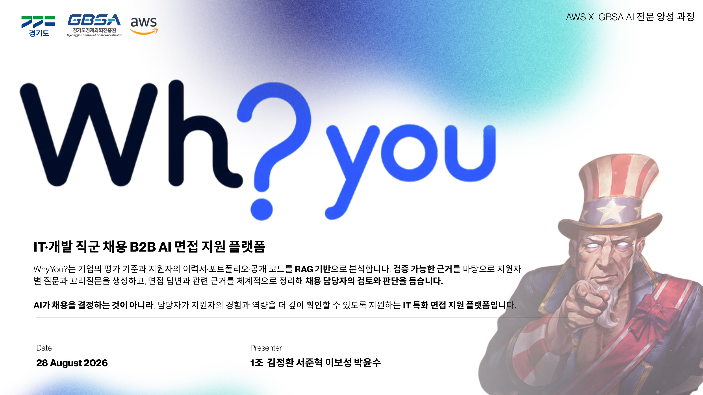
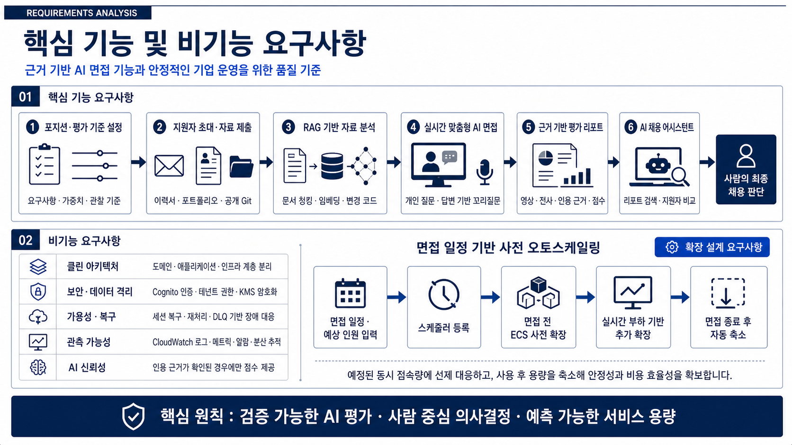
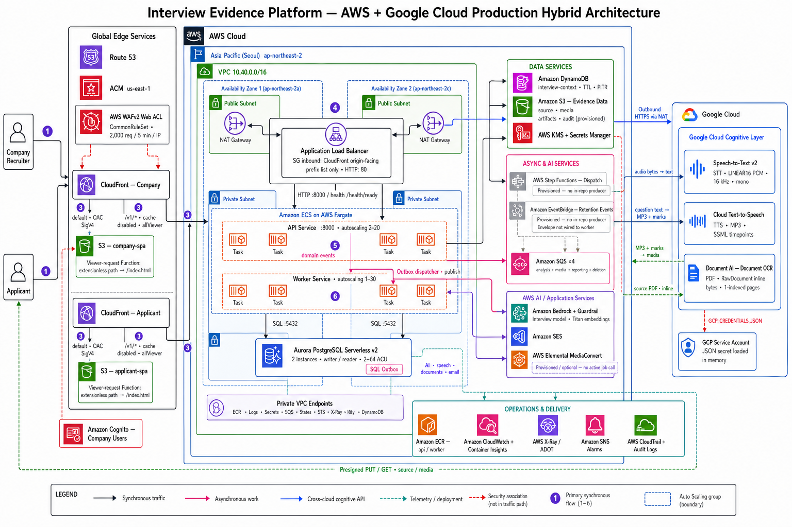

<p align="center">
  
</p>

<h1 align="center">근거 기반 IT 직군 AI 면접 지원 플랫폼</h1>

<p align="center">
  기업의 평가 기준과 지원자의 실제 경험을 연결해<br />
  <strong>개인 맞춤형 질문, 실시간 AI 면접, 검증 가능한 채용 근거</strong>를 제공합니다.
</p>

<p align="center">
  
  
  
</p>

> **AI가 채용을 결정하지 않습니다.** WhyYou는 흩어진 자료와 면접 답변을 검토 가능한 근거로 구조화하고, 최종 채용 판단은 사람이 수행합니다.



## 프로젝트 정보

| 구분          | 내용                                                                                                                                  |
| ------------- | ------------------------------------------------------------------------------------------------------------------------------------- |
| 교육 과정     | 경기도경제과학진흥원 X AWS 기반 AI 전문가 양성                                                                                        |
| 교육 기간     | 2026.07.13 - 2026.08.28                                                                                                               |
| 프로젝트 기간 | 2026.08.11 - 2026.08.28 (3주)                                                                                                         |
| 프로젝트명    | WhyYou - Interview Evidence Platform                                                                                                  |
| 대상          | 한국어 기반 IT·개발 직군 B2B 채용                                                                                                     |
| 팀            | 1조 - 김정환, [서준혁](https://github.com/Aptsii), [이보성](https://github.com/bosung0505), [박윤수](https://github.com/parkysoo0330) |
| 프로젝트 자료 | [기획서·발표자료·제출본 Google Drive](https://drive.google.com/drive/folders/1iQfjJuuBDRwKjUmpFZbXaVB9ZybXcqMY)                       |

## 팀 구성

| 이름                                          | 역할                                                                               |
| --------------------------------------------- | ---------------------------------------------------------------------------------- |
| **김정환**                                    | 팀장 · Testing & Quality · CI/CD & DevOps · Infrastructure · Async Workers · AI/ML |
| **[서준혁](https://github.com/Aptsii)**       | Testing & Quality · CI/CD & DevOps · Infrastructure · Async Workers · AI/ML        |
| **[이보성](https://github.com/bosung0505)**   | Testing & Quality · Data Layer · AI/ML · Backend API & Core                        |
| **[박윤수](https://github.com/parkysoo0330)** | Testing & Quality · Data Layer · Frontend Applications · Backend API & Core        |

## Contents

1. [프로젝트 개요](#프로젝트-개요)
2. [문제 정의](#문제-정의)
3. [사용자와 서비스 여정](#사용자와-서비스-여정)
4. [핵심 제품 설계](#핵심-제품-설계)
5. [면접 및 평가 설계](#면접-및-평가-설계)
6. [시스템 아키텍처](#시스템-아키텍처)
7. [신뢰성·보안·확장성](#신뢰성보안확장성)
8. [기술 스택](#기술-스택)
9. [로컬 실행](#로컬-실행)

## 프로젝트 개요

WhyYou는 기업이 정의한 직무 역량과 평가 기준을 지원자의 이력서, 자기소개서, PDF 포트폴리오, 공개 Git 저장소에 연결하는 **RAG 기반 AI 구조화 면접 플랫폼**입니다.

지원자 자료를 단순히 요약하거나 점수화하지 않습니다. 자료에서 검증할 지점을 찾고 개인 맞춤형 질문과 꼬리질문을 생성한 뒤, 지원자가 면접에서 직접 설명한 내용을 영상·자막·원문 위치와 연결해 채용 담당자가 다시 확인할 수 있도록 합니다.

### 한 문장으로

> WhyYou는 “왜 이 지원자를 더 만나야 하는가?”에 답할 수 있도록, 지원자의 실제 답변을 채용 판단의 근거로 만드는 플랫폼입니다.

### 프로젝트 범위

| 포함                                  | 제외                              |
| ------------------------------------- | --------------------------------- |
| 한국어 기반 IT·개발 직군              | 비IT 직군과 다국어 면접           |
| 이력서·자기소개서·PDF·공개 코드 분석  | 비공개 저장소 인증 연동           |
| 실시간 음성 면접과 답변 기반 꼬리질문 | AI의 자동 합격·불합격 결정        |
| 영상·자막·인용 근거 기반 리포트       | 근거 없는 지원자 서열화           |
| 기업별 평가 기준과 사람의 최종 검토   | 제출 자료 자체를 역량 점수로 단정 |

## 문제 정의

생성형 AI로 문서와 코드의 완성도는 빠르게 높아졌지만, 결과물만으로 지원자의 실제 이해도와 기여도를 판단하기는 더 어려워졌습니다. 결국 기업은 지원자에게 질문하고 되물어 판단 과정과 경험의 깊이를 확인해야 합니다.

| Pain Point                                               | WhyYou의 접근                                            |
| -------------------------------------------------------- | -------------------------------------------------------- |
| 잘 정리된 서류가 실제 이해도와 본인 기여를 보장하지 않음 | 자료의 주장을 개인 맞춤형 검증 질문으로 전환             |
| 모든 지원자를 사람이 깊게 면접하기에는 시간과 비용이 큼  | 반복적인 사전 면접을 구조화하고 검토 구간을 압축         |
| 면접관마다 질문의 깊이와 기록 방식이 다름                | 기업 기준을 고정하고 동일한 근거 구조로 리포트 생성      |
| 고정 질문은 비교하기 쉽지만 실제 경험을 파고들기 어려움  | 자료와 직전 답변에 따라 같은 평가축 안에서 꼬리질문 생성 |
| 전체 영상을 다시 보며 판단해야 함                        | 평가 항목에서 관련 답변·자막·영상 시점으로 바로 이동     |

WhyYou의 개인화는 지원자마다 평가 기준을 바꾸는 방식이 아닙니다. **같은 평가축을 어떤 실제 경험으로 깊게 확인할지**를 정하는 방식입니다.

## 사용자와 서비스 여정

### 기업·채용 담당자

- 포지션, 자격요건, 평가축, 가중치, 관찰 기준과 면접 난이도를 설정합니다.
- 지원자를 초대하고 제출 자료와 면접 진행 상태를 관리합니다.
- 평가 항목별 답변 근거, 영상 구간, 판단 이유와 추가 질문을 검토합니다.
- AI 채용 어시스턴트로 리포트를 검색하고 지원자를 비교합니다.
- 최종 채용 상태는 담당자가 직접 결정합니다.

### 지원자

- 만료되는 개인 초대 링크로 접속합니다.
- 개인정보 처리·녹화·AI 평가에 동의한 뒤 이력서, 포트폴리오와 공개 저장소를 제출합니다.
- 면접 환경을 점검하고 실시간 AI 면접에 참여합니다.
- 자신의 기술 선택, 문제 해결 과정, 역할과 성과를 직접 설명합니다.

### End-to-End Flow

| 01               | 02             | 03               | 04            | 05             | 06        |
| ---------------- | -------------- | ---------------- | ------------- | -------------- | --------- |
| 기업 기준 설정   | 지원자 초대    | 자료 분석        | AI 면접       | 근거 정리      | 사람 검토 |
| 직무·평가축 정의 | 개인 링크 발급 | 검증 포인트 추출 | 질문·꼬리질문 | 영상·자막 연결 | 최종 판단 |

## 핵심 제품 설계



### 1. 기업 평가 기준 설계

직무 요건, 관찰할 역량, 필수 질문, 금지 주제, 평가 가중치와 면접 난이도를 기업이 직접 정의합니다. 질문과 리포트는 이 기준을 벗어나 새로운 평가축을 임의로 만들지 않습니다.

### 2. 제출 자료 분석

문서와 공개 코드를 청킹하고, 임베딩 의미 검색과 PostgreSQL 전문 검색을 결합합니다. 경험, 기술 선택, 성과, 충돌, 본인 기여가 불명확한 지점을 검증 포인트로 정리합니다.

### 3. 실시간 맞춤형 AI 면접

한 번에 하나의 질문을 제시하고, 답변에서 역할·판단 근거·대안·결과가 충분하지 않으면 같은 평가축 안에서 짧은 꼬리질문을 생성합니다. 자료 검색이 실패하면 내용을 꾸며내지 않고 공통 평가 기준과 최근 답변만으로 진행합니다.

### 4. 근거 기반 리포트

질문, 답변, 자막, 영상 시점, 관찰 내용, 판단 이유를 함께 보존합니다. 평가 상태는 `확인됨`, `부분 확인`, `근거 부족`, `추가 확인 필요`로 구분하며, 사람이 원본 구간을 다시 검토할 수 있습니다.

### 5. AI 채용 어시스턴트

최종 리포트의 근거를 검색해 지원자 비교, 조건 탐색, 추가 확인 포인트 정리를 돕습니다. 어시스턴트 역시 최종 채용 상태를 변경할 수 없습니다.

### 질문의 근거와 평가의 근거

| 구분        | 근거                                       | 역할                                                          |
| ----------- | ------------------------------------------ | ------------------------------------------------------------- |
| 질문의 근거 | 이력서·포트폴리오·코드의 관련 구간         | 왜 이 질문을 했는지 설명하는 재료이며 그 자체로 평가하지 않음 |
| 평가의 근거 | 지원자의 실제 면접 답변과 연결된 자막·영상 | 관찰 내용과 판단 이유를 뒷받침하고 원본을 다시 검토하게 함    |

## 면접 및 평가 설계

### 3단계 면접 흐름

| 단계               | 비중 | 핵심 검증 포인트                                                   |
| ------------------ | ---: | ------------------------------------------------------------------ |
| 기술 검증          |  30% | 기술 선택 이유, 구현 원리, 대안 비교, 트레이드오프, 문제 해결 방식 |
| 프로젝트 Deep Dive |  40% | 프로젝트 목표, 본인 역할, 설계·구현 범위, 성과와 배운 점           |
| 행동·협업 검증     |  30% | 협업 과정, 의견 충돌 해결, 책임감, 피드백 수용과 문제 해결 태도    |

### 모든 답변을 보는 5가지 축

| 평가축    | 확인 질문                                             |
| --------- | ----------------------------------------------------- |
| 정확성    | 답변이 사실·기술적으로 정확한가?                      |
| 깊이      | 선택 배경과 이유, 대안과 트레이드오프까지 설명하는가? |
| CS 기본기 | 비동기 처리, 큐, 동시성 등 기반 원리를 이해하는가?    |
| 본인 기여 | 실제 본인이 맡은 역할과 구현 범위가 명확한가?         |
| 설명력    | 문제 → 선택 → 구현 → 결과를 구조적으로 설명하는가?    |

## 시스템 아키텍처



WhyYou는 실시간 요청과 오래 걸리는 비동기 작업을 분리한 AWS 중심 하이브리드 아키텍처입니다.

### 실시간 요청 경로

```text
기업/지원자 SPA → CloudFront + S3 → ALB → ECS Fargate API
                                         ├─ REST API
                                         └─ WebSocket 실시간 면접
```

- 기업 사용자는 Amazon Cognito로 인증합니다.
- 지원자는 만료되는 초대 토큰과 세션으로 접근합니다.
- API는 실시간 면접, 답변 확정, 체크포인트와 업무 트랜잭션을 처리합니다.

### 비동기 작업 경로

```text
API Transaction
  └─ PostgreSQL Transactional Outbox
       └─ Outbox Dispatcher
            └─ SQS Main Queue + DLQ
                 └─ ECS Worker
                      ├─ 자료 분석
                      ├─ 미디어 처리
                      ├─ 리포트 생성
                      ├─ 데이터 삭제
                      └─ 예약 용량 계산
```

`analysis`, `media`, `reporting`, `deletion`, `capacity`의 5개 작업 큐와 각각의 DLQ를 사용합니다. Worker는 at-least-once 전달, visibility timeout 연장, 멱등 처리와 재시도를 전제로 설계했습니다.

### Hybrid RAG

```text
지원자 자료
  ├─ Embedding 의미 검색: Amazon Bedrock Titan v2 + pgvector
  └─ 키워드 검색: PostgreSQL Full-Text Search
                         ↓
                   근거 결합·범위 필터
                         ↓
                  Gemini 질문 생성
```

의미 검색은 표현이 달라도 같은 경험을 찾고, 키워드 검색은 기술명·함수·오류 코드처럼 정확히 구분해야 하는 문자열을 보완합니다. 검색 결과에는 기업·지원자 범위를 적용하고 실제로 찾은 근거만 LLM에 전달합니다.

### 환경별 데이터베이스

- 발표 시점 개발 배포 환경: Amazon RDS for PostgreSQL 16.11 + pgvector
- 운영 Terraform 구성: Aurora PostgreSQL Serverless v2 + pgvector
- 로컬 환경: Docker 기반 PostgreSQL 16 + pgvector

## 신뢰성·보안·확장성

| 품질 목표           | 구현 원칙                                                        |
| ------------------- | ---------------------------------------------------------------- |
| 동의와 개인정보     | 유효한 동의 전에는 자료 분석·녹화·AI 평가를 시작하지 않음        |
| 기업별 데이터 격리  | API, 검색, 파일, 큐 메시지마다 tenant 범위를 검증                |
| 면접 복구           | 마지막 확정 답변과 녹화 체크포인트에서 중복 질문 없이 재개       |
| 근거 없는 평가 차단 | 실제 답변과 연결되지 않은 항목을 `확인됨`으로 저장하지 않음      |
| 재처리 안전성       | Transactional Outbox, SQS 재시도·DLQ, 멱등 처리 적용             |
| 민감 정보 보호      | KMS·Secrets Manager 사용, 원문·토큰·임시 URL 로그 제외           |
| 관측 가능성         | CloudWatch, Container Insights, OpenTelemetry, X-Ray, CloudTrail |
| 사람 중심 의사결정  | AI와 자동 작업은 최종 채용 상태를 변경할 수 없음                 |

### 예약 기반 Auto Scaling

```text
면접 일정·예상 인원 입력
  → Outbox 이벤트
  → Capacity SQS
  → 중첩 예약 집계
  → ECS 최소 Task 사전 확보
  → 실시간 부하 기반 추가 확장
  → 면접 종료 후 기준 용량 복귀
```

API는 실시간 면접을, Worker는 후속 분석과 리포트 생성을 독립적으로 확장합니다. CPU 정책을 안전망으로 유지하면서 예약 용량과 SQS 적체를 반영하고, 진행 중인 WebSocket과 작업은 ECS Task Protection으로 scale-in에서 보호합니다.

## 기술 스택

| 영역           | 기술                                                                    |
| -------------- | ----------------------------------------------------------------------- |
| Frontend       | React 18, TypeScript, Vite, React Router, Zustand, Tailwind CSS         |
| Backend        | Python 3.12, FastAPI, SQLAlchemy, Alembic, WebSocket                    |
| AI / RAG       | Gemini 2.5 Flash, Bedrock Titan Embeddings v2, pgvector, PostgreSQL FTS |
| GCP Cognitive  | Vertex AI, Document AI, Streaming STT, Streaming TTS                    |
| Compute        | Amazon ECS Fargate, Application Load Balancer, Auto Scaling             |
| Data / Storage | Amazon RDS or Aurora PostgreSQL, Amazon S3                              |
| Async          | Transactional Outbox, Amazon SQS, DLQ, ECS Worker                       |
| Security       | Amazon Cognito, KMS, Secrets Manager, IAM, WAF                          |
| Observability  | CloudWatch, Container Insights, OpenTelemetry, X-Ray, CloudTrail        |
| IaC / CI/CD    | Terraform, GitHub Actions, Docker                                       |
| Local          | Docker Compose, PostgreSQL + pgvector, LocalStack, Mailpit              |

## 저장소 구조

```text
.
├── apps/
│   ├── company-console/       # 기업용 채용 운영 SPA
│   └── applicant-interview/   # 지원자용 실시간 AI 면접 SPA
├── backend/
│   ├── src/interview_evidence # FastAPI 모듈러 모놀리스와 Worker
│   ├── alembic/               # 데이터베이스 마이그레이션
│   └── tests/                 # Python 테스트
├── packages/
│   ├── contracts/             # OpenAPI 기반 공유 계약
│   └── design-system/         # 공통 디자인 토큰
├── infra/
│   ├── environments/          # bootstrap, dev, prod Terraform root
│   ├── modules/               # 재사용 가능한 AWS 모듈
│   └── tests/                 # Terraform 테스트
├── docs/                      # 개발·설계·운영 문서
├── tests/                     # 계약, E2E, 회귀, 부하 테스트
├── compose.yaml               # PostgreSQL, LocalStack, Mailpit
└── Makefile                   # 개발 및 검증 명령
```

## 로컬 실행

### 사전 요구사항

- Node.js 22 이상
- Python 3.12 이상과 [uv](https://docs.astral.sh/uv/)
- Docker와 Docker Compose
- 실제 AI·음성·OCR 기능을 사용할 AWS/GCP 자격 증명

### 1. 설치와 환경 구성

```bash
make dev-install
cp .env.example .env
cp apps/company-console/.env.example apps/company-console/.env.local
```

`.env`의 AWS/GCP 항목을 채우고 두 환경 파일의 로컬 회사 토큰을 일치시킵니다. 서비스 계정 JSON, 토큰, 비밀번호 등 비밀값은 커밋하지 마세요.

### 2. 로컬 인프라 시작

```bash
make up
```

| 서비스                | 주소                    | 용도                               |
| --------------------- | ----------------------- | ---------------------------------- |
| PostgreSQL + pgvector | `localhost:5432`        | 업무 데이터와 벡터 검색            |
| LocalStack            | `localhost:4566`        | 로컬 S3, SQS, SES, Secrets Manager |
| Mailpit               | <http://localhost:8025> | 초대 이메일 확인                   |

### 3. 애플리케이션 실행

각 명령을 별도 터미널에서 실행합니다.

```bash
make api                  # API: http://localhost:8080
make worker               # 기본 4개 Worker
npm run dev:company       # 기업 콘솔: http://localhost:5173
npm run dev:applicant     # 지원자 면접: http://localhost:5174
```

```bash
curl -s http://localhost:8080/health/ready
```

> **비용 주의:** 로컬 컨테이너가 대체하지 않는 Vertex AI, GCP Speech/Document AI, Bedrock, MediaConvert 등은 설정된 실제 클라우드 계정으로 호출되며 비용이 발생할 수 있습니다.

Windows PowerShell 사용자는 [`scripts/local.ps1`](./scripts/local.ps1), 상세한 환경 설정과 문제 해결은 [로컬 개발 가이드](./docs/local-development.md)를 참고하세요.

## 개발 및 검증

```bash
make dev-install          # 개발용 editable 의존성 설치
make bootstrap            # CI/컨테이너용 non-editable 설치
make migrate              # Alembic 마이그레이션
make assistant-backfill   # 누락되거나 오래된 RAG 문서 재생성

npm run format:check      # Prettier + Ruff
npm run lint              # ESLint + Ruff
npm run typecheck         # TypeScript + mypy
npm test                  # Frontend + Python 테스트
npm run build             # 전체 workspace 빌드

make infra-format-check   # Terraform 포맷 검사
make infra-validate       # dev/prod Terraform 검증
```

## 추가 문서

- [로컬 개발 가이드](./docs/local-development.md)
- [신뢰성·관측성·예약 용량 설계](./docs/specs/reliability-observability-scheduled-capacity-plan.md)
- [평가 시스템 제안](./docs/scoring-system-proposal.md)
- [AWS·GCP 하이브리드 아키텍처](./docs/architecture/interview-evidence-aws-gcp-hybrid-4k.png)

## License

현재 저장소에는 별도 오픈소스 라이선스가 선언되어 있지 않습니다.
