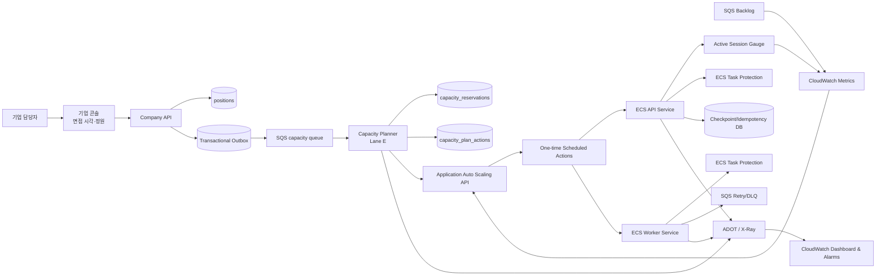

# Whyyou? 신뢰성·관측성·예약 기반 용량 관리 개발 계획

> 작성 기준: 2026-08-22 현재 저장소 코드와 AWS 공식 문서
>
> 목적: 이미 구현된 복구·멱등성·DLQ·CPU 오토스케일링을 보존하면서, 실시간 면접 세션 보호와 기업 일정 기반 ECS 사전 확장/안전 축소를 실제 운영 가능한 수준으로 연결한다.
>
> 문서 우선순위: 예약 기반 용량 관리에 대해서는 `track-4-identity-and-capacity.md` 2부의 “정적 근무시간 스케줄부터” 제안을 대체한다. 이번 계획은 기업이 입력한 런타임 일정을 직접 반영하는 최종 구조다.

---

## 1. 결론

이번 개발의 핵심은 새 면접 기능을 만드는 것이 아니라, 이미 저장되는 `interview_at`과 `interview_capacity`를 AWS의 실제 용량으로 바꾸는 **용량 관리 제어면(control plane)**을 추가하는 것이다.

최종 구조는 다음과 같다.

```text
기업 담당자
  → 포지션의 면접 시각·예상 동시 인원 저장
  → position.capacity_changed Outbox 이벤트 발행
  → Capacity Worker가 포지션별 예약 스냅샷 저장
  → 모든 기업의 겹치는 예약을 시간대별로 합산
  → 부하 테스트에서 얻은 태스크당 안전 세션 수로 API/Worker 최소 용량 계산
  → Application Auto Scaling one-time Scheduled Action 생성
  → 면접 전 API 최소 태스크 수 상향
  → CPU·활성 세션·SQS backlog 정책이 실수요에 따라 추가 확장
  → 면접 종료 후 최소 태스크 수만 기준선으로 복구
  → 활성 세션/작업을 보호한 채 ECS가 점진적으로 축소
```

중요한 안전 원칙은 두 가지다.

1. **일정 기반 확장과 축소는 `desired_count`를 직접 반복 변경하지 않는다.** Scheduled Action은 최소 용량의 바닥을 올리고 내리는 역할만 맡고, 반응형 Auto Scaling은 그 범위 안에서 계속 동작한다.
2. **자동 축소는 ECS Task Scale-in Protection과 graceful drain이 먼저 완성된 뒤 활성화한다.** 면접 중인 WebSocket이나 처리 중인 SQS 작업을 비용 절감을 위해 중단시키면 안 된다.

---

## 2. 현재 구현 상태 재판정

| 영역 | 현재 판정 | 코드 근거 | 이번 개발 범위 |
| --- | --- | --- | --- |
| 면접 세션 재개 | 구현 | 서버 `resume.snapshot`, DB 체크포인트, 클라이언트 재연결·로컬 청크 재전송 | ECS 강제 종료 통합 테스트 보강 |
| 체크포인트 | 구현 | `CheckpointService`가 최종 턴·미디어 청크·pending turn을 DB에 저장하고 Outbox 이벤트 발행 | 체크포인트 지연/실패 지표 추가 |
| 명령 멱등성 | 구현 | 요청 digest와 결과를 `interview_command_results`에 영속 저장, 같은 키의 다른 요청 거부 | chaos/중복 전달 회귀 테스트 추가 |
| SQS 재처리·DLQ | 구현 | capacity를 포함한 5개 queue에 visibility heartbeat, retry, processed-message, redrive/DLQ 구성 | DLQ 운영 redrive 훈련 |
| CloudWatch 로그·알람 | 구현 | 용량 최소치·포화, 작업 보호 실패, Worker 적체, Evidence 인용 보류 지표·대시보드·알람 | 실제 운영 임계치 보정 |
| X-Ray 분산 추적 | 구현, 운영 검증 필요 | dev/prod `enable_tracing = true`, ADOT sidecar, FastAPI/botocore instrumentation | WebSocket turn·평가 구간의 수동 span과 trace continuity 검증 |
| AI Evidence 검증 | 구현 | 존재하지 않는 Evidence ID를 인용한 축 점수는 `None`으로 바꾸고 accepted/withheld 수치를 기록 | 골든셋 회귀 평가 추가 |
| API/Worker 동적 오토스케일링 | 구현 | API 60%·Worker 65% CPU target tracking + SQS 적체 Worker step scaling | 부하 테스트로 계수·임계치 보정 |
| 면접 일정·정원 저장 | 구현 | 30분·timezone·최대 400명 요청 계약, Outbox `position.capacity_changed`, 취소 UI | 다중 슬롯은 후속 범위 |
| 일정 기반 사전 확장 | 구현 | 중첩 예약 sweep-line planner, capacity SQS/DLQ, one-time ECS Scheduled Action | 실제 AWS smoke test |
| 면접 종료 후 자동 축소 | 구현 | API +40분, Worker +75분 경계에서 baseline 복구 Scheduled Action | 운영 부하에서 cooldown 보정 |
| ECS Task Scale-in Protection | 구현 | WebSocket과 SQS handler 수명에 ECS agent task-protection 0→1/1→0 연결 | 강제 종료 chaos test |

### 2.1 이미 있는 복구 경로

현재 복구 경로는 다음처럼 실제로 이어져 있다.

```text
WebSocket 연결 종료
  → 브라우저가 reconnect 상태로 전환
  → 같은 session_id로 재접속
  → session.resume 전송
  → 서버가 최신 durable checkpoint 조회/재구성
  → resume.snapshot 반환
  → 클라이언트가 server sequence, 마지막 확정 턴, 미디어 청크 위치 복구
  → 로컬에 남은 녹음 청크 재전송
```

따라서 신규 복구 프로토콜을 다시 설계할 필요는 없다. 이번 작업은 이 경로가 **ECS 태스크 교체 상황에서도 실제로 통과하는지**를 검증하고, 정상 면접 중에는 태스크 자체가 불필요하게 종료되지 않도록 보호하는 일이다.

### 2.2 현재 관측성의 정확한 상태

- X-Ray 리소스만 있는 수준이 아니다. dev/prod에서 ADOT sidecar가 켜지고 API/Worker가 OpenTelemetry를 초기화한다.
- 구조화 로그는 답변·문서 원문·토큰 같은 필드를 제거한다.
- API 5xx, ALB 5xx, unhealthy target, running task, Aurora, SQS age, DLQ 알람이 있다.
- 하지만 운영 대시보드는 현재 제목만 있는 text widget이라 실제 면접 운영 상태를 한 화면에서 판단할 수 없다.
- `ActiveInterviewSessions`, `ResumeFailure`, `EvidenceScoreWithheld`, `CapacityPlanLag` 같은 업무 지표가 없다.

---

## 3. 목표 아키텍처



### 3.1 Clean Architecture 적용

새 기능은 기존 `company_management`, `interview_engine`, `reporting` 내부에 AWS SDK 호출을 섞지 않는다. 별도 bounded context인 `capacity_management`를 추가한다.

```text
backend/src/interview_evidence/capacity_management/
  domain/
    reservation.py          # 예약·시간창·용량 계산 규칙
    plan.py                 # 계산된 전역 액션과 상태
  application/
    event_handler.py        # position.capacity_changed 소비
    planner.py              # 겹치는 예약 sweep-line 계산
    event_handler.py        # desired action 계산·AWS 반영
    ports.py                # ScheduledScalingPort, CapacityRepository
  adapters/
    aws_scheduled_scaling.py
  repositories/
    postgres.py
  public.py
```

의존 방향은 `domain ← application ← adapter/runtime`로 유지한다.

- `company_management`는 AWS를 알지 못한다. 포지션 변경 이벤트만 발행한다.
- `capacity_management.application`은 boto3를 알지 못한다. `ScheduledScalingPort`만 호출한다.
- AWS API 호출과 `ECS_AGENT_URI` HTTP 호출은 adapter에 둔다.
- 새 lane을 `scripts/check_module_boundaries.py`에 등록해 다른 lane의 private domain/repository import를 금지한다.
- fleet 전체 예약 합산은 회사별 사용자 API로 노출하지 않는 시스템 전용 read model에서 수행한다.

현재 경계 검사 기준선은 이미 깨져 있다. `python3 scripts/check_module_boundaries.py` 실행 시 `recruiting_assistant`의 company/reporting domain import 2건과 `runtime/worker.py`의 reporting domain import 2건이 검출된다. 신규 lane을 넣기 전 public DTO/boundary로 치환해 검사를 green으로 만들고, 이후 capacity lane 위반을 같은 CI gate로 막는다.

---

## 4. 예약 기반 용량 관리 시스템 로직

### 4.1 입력 데이터 규칙

MVP는 이미 존재하는 필드를 그대로 사용한다.

| 입력 | 출처 | 규칙 |
| --- | --- | --- |
| 면접 시작 | `Position.interview_at` | timezone-aware datetime, DB는 UTC 저장 |
| 예상 동시 인원 | `Position.interview_capacity` | 신규 요청 1~400, 과거 행은 1~10,000 읽기 허용 |
| 면접 길이 | 제품 고정 상수 | **30분 고정**: 기술 9분 + 프로젝트 심층 12분 + 협업·인성 9분 |
| 포지션 상태 | `Position.status` | ACTIVE이면서 미래/진행 중인 예약만 반영 |
| 포지션 버전 | `Position.row_version` | 오래 도착한 이벤트 무시 |

한 포지션에 여러 면접 슬롯이 필요한 단계에서는 `position_interview_windows` 테이블을 별도 도입한다. 이번 MVP에서는 기존 단일 `interview_at` 계약을 깨지 않는다.

커밋 `8ef24c07`에서 UI가 30분으로 고정됐고, 이번 구현에서 신규 API/OpenAPI 요청도 `Literal[30]`으로 제한했다. 과거 published version 응답은 감사 이력 때문에 10~120분 읽기를 유지한다. Capacity Planner는 과거 값과 관계없이 운영 window를 30분으로 계산한다.

### 4.2 포지션 저장과 이벤트 발행

`CompanyService.create_position`과 `update_position`의 트랜잭션 안에서 원본 저장과 함께 다음 Outbox 이벤트를 기록한다. 면접 길이는 제품 상수 30분이므로 평가 기준 버전 변경이 capacity event를 다시 발행할 이유가 없다.

```json
{
  "event_type": "position.capacity_changed",
  "event_version": 1,
  "aggregate_type": "position",
  "aggregate_id": "<position_id>",
  "aggregate_version": 7,
  "payload": {
    "position_id": "...",
    "status": "active",
    "interview_at": "2026-09-10T01:00:00Z",
    "interview_capacity": 200
  },
  "idempotency_key": "position-capacity-<position_id>-v7"
}
```

이벤트는 다음 변경에 모두 발생한다.

- 시작 시각 변경
- 정원 변경
- DRAFT → ACTIVE
- ACTIVE → CLOSED 또는 취소

포지션 저장과 이벤트 발행은 같은 DB transaction에 있어야 한다. API 응답 이후 이벤트가 유실되는 dual-write 구조를 허용하지 않는다.

### 4.3 예약 스냅샷

`capacity_reservations`는 회사 도메인 테이블을 fleet 단위로 직접 조회하지 않기 위한 독립 read model이다.

| 컬럼 | 의미 |
| --- | --- |
| `reservation_id` | UUID |
| `company_id`, `position_id` | 원본 식별자, unique pair |
| `source_version` | Position row version, stale event 차단 |
| `status` | pending / active / cancelled / completed |
| `interview_at` | UTC 시작 시각 |
| `expected_concurrency` | `interview_capacity` |
| `api_window_start/end` | API 사전 확장~drain 종료 |
| `worker_window_start/end` | 종료 후 후처리 burst 대비 구간 |
| `updated_at` | 감사·지연 계산용 |

추천 초기 설정값은 코드 상수가 아니라 환경 설정으로 둔다.

- `CAPACITY_API_PREWARM_MINUTES=15`
- `CAPACITY_API_DRAIN_MINUTES=10`
- `CAPACITY_WORKER_PREWARM_MINUTES=5`
- `CAPACITY_WORKER_POSTWARM_MINUTES=45`
- `CAPACITY_HEADROOM_RATIO=1.25`

위 값은 운영 확정치가 아니다. staging 부하 테스트에서 Fargate 시작 시간, WebSocket 연결 분포, 리포트 처리 p95를 측정한 뒤 조정한다.

### 4.4 중첩 일정 합산 알고리즘

각 포지션이 독립 Scheduled Action을 만들면 같은 ECS 서비스의 `MinCapacity`를 서로 덮어쓴다. 따라서 다음 sweep-line 방식으로 전역 시간축을 계산한다.

```python
events = []
for reservation in active_reservations:
    events += [
        (reservation.api_window_start, +reservation.expected_concurrency),
        (reservation.api_window_end, -reservation.expected_concurrency),
    ]

current = 0
for instant, delta in sorted_and_grouped(events):
    current += sum(delta_at_same_instant)
    api_min = max(
        API_BASELINE_MIN,
        ceil(current * HEADROOM_RATIO / SAFE_SESSIONS_PER_API_TASK),
    )
    emit_boundary_only_when_capacity_changes(instant, api_min)
```

Worker도 같은 방식으로 별도 window를 합산한다. 단, Worker 수요는 예상 종료 인원과 실제 SQS backlog가 다를 수 있으므로 예약 값은 **최소 용량 사전 확보**에만 쓰고, 실제 추가 확장은 SQS 지표가 결정한다.

동일 시각의 이벤트는 먼저 묶어서 한 번 계산한다. 포지션 A가 끝나고 B가 시작하는 시각에 일시적으로 기준선까지 내려가는 액션을 만들지 않는다.

### 4.5 태스크 수 계산

추측한 “태스크당 50명” 같은 숫자를 운영 코드에 넣지 않는다. 다음 값을 부하 테스트 결과로 configuration에 저장한다.

```text
SAFE_SESSIONS_PER_API_TASK
SAFE_COMPLETIONS_PER_WORKER_PER_WINDOW
```

계산식은 다음과 같다.

```text
api_min = max(
  api_baseline,
  ceil(overlapping_expected_sessions × headroom_ratio / safe_sessions_per_api_task)
)

worker_min = max(
  worker_baseline,
  ceil(expected_completions × headroom_ratio / safe_completions_per_worker_window)
)
```

계산값이 Terraform의 `max_capacity`를 초과하면 조용히 max로 자르지 않는다.

- 예약 상태를 `capacity_blocked`로 기록한다.
- 기업 콘솔/운영 알람에 “예약 정원 대비 인프라 상한 부족”을 표시한다.
- 시작 전 운영자가 max capacity와 외부 서비스 quota를 검토한다.

ECS만 늘려도 Bedrock, STT, Aurora, NAT, API rate quota가 부족하면 면접은 느려진다. 부하 테스트에는 이 의존성의 throttle과 latency를 함께 포함한다.

### 4.6 Scheduled Action 생성

런타임 예약은 Terraform 시점에 알 수 없으므로 `aws_appautoscaling_scheduled_action` 리소스를 포지션마다 생성할 수 없다. Capacity Reconciler가 Application Auto Scaling API를 호출한다.

사용 API:

- `PutScheduledAction`
- `DescribeScheduledActions`
- `DeleteScheduledAction`
- 현재 진행 중 예약을 즉시 반영할 때 `RegisterScalableTarget`

액션 규칙:

```text
schedule            = at(UTC timestamp)
scalable target     = ecs:service:DesiredCount
scalable action     = MinCapacity만 변경
MaxCapacity         = Terraform이 관리하는 정적 안전 상한 유지
name                = whyyou-{env}-{api|worker}-{epoch_minute}-{plan_hash}
```

Application Auto Scaling의 예약 실행은 분 단위이며 실제 반영에 수 초 지연이 있을 수 있으므로, 정확히 면접 시작 시각이 아니라 충분한 prewarm 구간을 둔다.

### 4.7 desired state 조정과 멱등성

`capacity_plan_actions` 테이블은 AWS 호출의 desired state다.

| 컬럼 | 의미 |
| --- | --- |
| `action_id` | UUID |
| `service_role` | api / worker |
| `effective_at` | UTC 실행 시각 |
| `min_capacity` | 계산된 최소 태스크 수 |
| `action_name` | 결정론적 AWS 이름 |
| `plan_hash` | 입력 예약과 설정의 content hash |
| `operation` | upsert / delete / set_now |
| `status` | pending / applying / applied / failed |
| `attempt_count`, `last_error` | 재시도·운영 확인 |
| `applied_at` | 적용 시각 |

처리 순서:

1. 예약 이벤트 소비 transaction에서 reservation upsert.
2. PostgreSQL advisory lock으로 fleet plan 계산을 직렬화.
3. 새 desired action set과 기존 action set을 비교.
4. 생성/변경은 AWS에 idempotent upsert하고, 사라진 미래 액션은 delete.
5. 적용한 desired action set을 DB에 저장하고 transaction을 commit.
6. 일시 오류나 commit 오류는 SQS가 같은 이벤트를 재전달하며, 결정론적 action name으로 안전하게 재적용한다. 반복 실패는 DLQ와 알람으로 보낸다.

외부 AWS API 호출을 DB transaction 안에서 수행하지 않는다. 네트워크 지연 때문에 포지션 저장 transaction이 오래 잠기는 것을 피하기 위해서다.

### 4.8 일정 변경·취소·이미 진행 중인 예약

- **미래 일정 변경:** 이전 plan hash의 미래 액션 삭제, 새 시각으로 재생성.
- **정원 변경:** 모든 중첩 예약을 다시 계산해 영향받는 시간 경계 전체 갱신.
- **취소/CLOSED:** reservation을 cancelled로 만들고 미래 액션 재계산.
- **prewarm 구간에 들어온 뒤 수정:** 즉시 현재 전역 필요량을 계산해 scalable target의 최소 용량을 올리고, 이후 Scheduled Action도 다시 생성.
- **오래된 이벤트:** `aggregate_version <= source_version`이면 no-op 처리 후 ack.
- **이벤트 유실 대비:** 포지션 transaction과 같은 Outbox에 이벤트를 저장하고 SQS retry·DLQ로 재처리한다. 운영 smoke test에서는 기존 active position backfill 결과를 확인한다.

### 4.9 Terraform 소유권

현재 ECS 서비스의 `desired_count`는 이미 `ignore_changes`라 Auto Scaling과 충돌하지 않는다. 런타임 controller가 scalable target의 `MinCapacity`를 즉시 바꿀 수 있으므로 다음 소유권을 명확히 한다.

- Terraform: baseline 초기값, `MaxCapacity`, target tracking 정책, IAM, 로그·알람.
- Capacity Controller: 런타임 `MinCapacity`, one-time Scheduled Actions.

`aws_appautoscaling_target`에는 `lifecycle.ignore_changes = [min_capacity]`를 추가한다. 대신 baseline 복구 액션과 `CapacityMinDrift` 알람으로 런타임 소유 상태를 검증한다.

### 4.10 무엇이 늘어나는가 — 가장 쉬운 설명

`ECS`와 `Worker`는 서로 반대되는 말이 아니다. **Worker도 ECS 안에서 실행되는 태스크 종류 중 하나**다.

```text
ECS = 사무실을 관리하는 건물 관리자

API Task    = 지원자와 실시간으로 대화하는 면접 부스
Worker Task = 면접이 끝난 자료를 분석하고 리포트를 만드는 후처리 직원
```

따라서 실제 동작은 다음처럼 두 번 나뉜다.

```text
면접 15분 전
  → API ECS Task 증가
  → 지원자 100명이 들어올 면접 부스를 미리 준비

30분 면접 진행
  → API ECS Task가 WebSocket, 질문 생성, STT/TTS 요청을 처리

면접 종료 직전·직후
  → Worker ECS Task의 최소 수를 조금 미리 확보
  → 실제 리포트·미디어 작업이 SQS에 쌓이면 Worker Task 추가 증가

후처리 큐가 비고 보호 중 작업도 없음
  → API는 2개, Worker는 1개의 평상시 기준선으로 복귀
```

서버 자체를 새로 구매하거나 EC2 인스턴스 수를 직접 조절하는 구조가 아니다. 현재 프로젝트는 Fargate이므로 ECS가 요청한 개수만큼 컨테이너 태스크를 실행하고, 실행한 초만큼 비용을 청구한다.

### 4.11 비용 단가와 계산식

현재 task definition은 API와 Worker 모두 `1 vCPU + 2 GB`다. 2026-08-22 AWS 공개 가격표의 서울 리전 Linux/x86 단가를 적용하면 다음과 같다.

```text
vCPU:   $0.04656 / vCPU-hour
Memory: $0.00511 / GB-hour × 2 GB
태스크 1개: $0.05678 / hour
태스크 1개를 30분 실행: $0.02839
```

환율은 AWS 청구 시점에 달라지므로 아래 원화는 발표용 가정인 `1 USD = 1,400원`, VAT 제외로 계산한다.

| 실행 형태 | 월 Fargate 비용 | 원화 환산 |
| --- | ---: | ---: |
| API 1개 또는 Worker 1개, 24시간 | $41.45 | 약 5.8만 원 |
| 평상시 기준선: API 2 + Worker 1 | $124.35 | 약 17.4만 원 |
| API 4 + Worker 4를 24시간 유지 | $331.60 | 약 46.4만 원 |
| 8개 상시 대비 3개 기준선 차이 | $207.25 절감 | 약 29.0만 원, **62.5%** |

단, 현재 CPU Target Tracking이 정상적으로 scale-in하면 이미 API 2 + Worker 1까지 내려갈 수 있다. 따라서 **62.5%는 “4+4를 상시 유지했을 때와 비교한 최대 절감 모델”이지 현재 청구서에서 보장되는 절감률이 아니다.** 실제 기준선은 Cost Explorer의 최근 30일 Fargate task-hour로 확정한다.

Application Auto Scaling과 Scheduled Action 자체에는 추가 서비스 요금이 없다. 신규 제어면의 월 부가비용은 소규모 운영 기준 다음 범위다.

- Application Auto Scaling: $0
- capacity SQS/DLQ: 첫 100만 요청 무료 범위라면 $0에 가까움
- custom metrics 10개: 무료 티어 안이면 $0, 밖이면 약 $3/월
- standard alarms 8개: 무료 티어 안이면 $0, 밖이면 약 $0.80/월
- dashboard 1개: 무료 티어 3개 안이면 $0, 밖이면 통상 $3/월
- 운영 로그 1 GB 추가 가정: 서울 리전 약 $0.76

따라서 **제어 기능 자체는 대략 $0~8/월**, 실제 비용의 대부분은 면접 시간에 추가 실행하는 Fargate 태스크다.

### 4.12 동시 면접별 1차 용량 가설

다음 표는 측정 결과가 아니라 부하 테스트를 시작하기 위한 가설이다. 25% 여유를 두고 API 태스크 1개가 안전하게 처리할 수 있는 동시 세션 수를 20/25/50명으로 나눠 계산했다.

| 동시 면접 | 보수적 20명/Task | 기준 가설 25명/Task | 낙관적 50명/Task |
| ---: | ---: | ---: | ---: |
| 100명 | API 7개 | **API 5개** | API 3개 |
| 200명 | API 13개 | **API 10개** | API 5개 |
| 500명 | API 32개 | **API 25개** | API 13개 |

계산식은 `ceil(동시 인원 × 1.25 / 태스크당 안전 세션)`이다. 현재 API `max_capacity=20`이므로 기준 가설에서 500명은 수용할 수 없고 최소 25 이상으로 상향해야 한다. 이것은 500명 운영 전에 반드시 발견해야 하는 정량적 capacity gate다.

Worker 수는 지원자 수만으로 확정하지 않는다. 현재 Worker는 SQS 메시지를 순차 소비하지만 미디어·리포트 한 건의 실제 처리 시간이 측정되지 않았다. `작업 1건 처리 p95`를 부하 테스트로 얻은 뒤 다음 식으로 확정한다.

```text
필요 Worker = ceil(종료 후 유입 작업 수 × 작업 p95초 / 목표 큐 소진 시간초 × 1.25)
```

### 4.13 발표용 100명 예시

가정:

- 월 20회, 회당 100명 동시 면접
- API는 기준 가설에 따라 총 5개: 평상시 2개보다 3개 추가
- API 추가 실행 구간: 사전 15분 + 면접 30분 + drain 10분 = 55분
- Worker는 운영 전 보정할 1차 계수(25건/Task)를 적용해 총 5개: 평상시 1개보다 4개 추가, 50분 유지

계산:

```text
API 추가비 = 3개 × 55/60시간 × $0.05678 = $0.156/회
Worker 추가비 = 4개 × 50/60시간 × $0.05678 = $0.189/회
회당 추가비 = 약 $0.345 = UI 반올림 약 484원
월 20회 추가비 = 약 $6.91 = 약 9,700원
```

비교 결과:

| 비교 기준 | 월 Fargate 비용 | 해석 |
| --- | ---: | --- |
| 4+4 상시 운영 | $331.60 | 피크 용량을 24시간 결제 |
| 2+1 기준선 + 월 20회 예약 확장 | 약 $131.26 | 필요한 약 55분에만 추가 결제 |
| 차이 | 약 $200.34 | 약 **60.4% 절감** |

반대로 CPU Auto Scaling이 현재도 항상 2+1 기준선까지 정확히 내리고 있다면 비교는 `$124.35 → $131.26`이다. 이 경우 예약 확장은 비용 절감 기능이 아니라 **월 약 $6.91로 면접 시작 전 용량을 보장하는 안정성 투자**다.

### 4.14 정량적 효율성 KPI

발표에서는 추정 절감률 하나만 쓰지 않고 적용 전후에 다음 지표를 측정한다.

| 지표 | 현재 기준 | 적용 목표 |
| --- | --- | --- |
| 면접 5분 전 필요 API 용량 준비율 | 측정 없음 | **100%** |
| 예약 대비 실제 Fargate task-hour | 측정 없음 | 상시 피크 방식 대비 **50% 이상 감소** |
| scale-in으로 중단된 활성 면접 | 보호 없음 | **0건** |
| 강제 task 종료 후 확정 답변 손실/중복 | 단위·통합 테스트만 존재 | chaos test **0건/0건** |
| 재접속 복구 시간 | 측정 없음 | p95 **10초 이내** |
| Worker 큐 소진 시간 | 측정 없음 | 면접 종료 burst p95 목표를 부하 테스트 후 확정 |
| 근거 없는 AI 점수 노출 | 코드상 차단 | 운영에서도 **0건** |

비용 효율 지표는 다음 식으로 매월 계산한다.

```text
예약 효율 = 실제 면접 처리에 사용된 task-hour / 전체 Fargate task-hour
유휴 비용률 = 1 - 예약 효율
비용 절감률 = 1 - 적용 후 task-hour / 상시 피크 task-hour
```

---

## 5. 반응형 오토스케일링 개선

### 5.1 API

현재 CPU 60% 정책은 삭제하지 않는다. 실시간 면접은 외부 STT/LLM/TTS 응답을 기다리는 시간이 길어 CPU가 낮은 상태에서 동시 연결 한계에 먼저 도달할 수 있다.

추가 지표:

- 각 API 태스크가 30초마다 `ActiveInterviewSessions` gauge 발행
- CloudWatch metric math로 전체 활성 세션 / running task 계산
- 부하 테스트에서 확인한 안전 동시 세션 수를 target으로 설정

초기 배포에서는 지표와 대시보드만 켜고, shadow 기간 후 scaling policy를 활성화한다.

### 5.2 Worker

Worker는 queue processor이므로 CPU보다 backlog가 수요를 잘 나타낸다.

- 네 개 작업 큐의 `ApproximateNumberOfMessagesVisible` 합
- `ApproximateAgeOfOldestMessage`
- running worker task 수
- custom `WorkerBacklogPerTask = total_visible / max(running_tasks, 1)`

예약 기반 worker minimum은 종료 직전부터 바닥을 올린다. 실제 종료가 지연되거나 리포트 작업이 더 많이 생기면 backlog target tracking/step scaling이 추가 확장한다. Worker baseline은 삭제 큐와 상시 후처리를 위해 1 이상을 유지한다.

---

## 6. 안전한 축소와 면접 연속성

### 6.1 API Task Scale-in Protection

WebSocket authorization이 성공하면 `accept()`보다 먼저 해당 Fargate task를 보호하고, accept 실패까지 포함한 `finally`에서 해제한다. 보호와 연결 승인 사이의 짧은 scale-in race도 없애기 위해서다.

```text
첫 활성 면접 연결 0 → 1, WebSocket accept 전
  → PUT $ECS_AGENT_URI/task-protection/v1/state
  → ProtectionEnabled=true
  → ExpiresInMinutes=interview_duration + reconnect/drain buffer

활성 연결이 남아 있는 동안
  → 주기적으로 만료 갱신

마지막 연결 1 → 0
  → 짧은 reconnect grace 경과
  → ProtectionEnabled=false
```

한 태스크에 여러 WebSocket이 있으므로 연결마다 보호/해제를 호출하지 않고 process-local atomic counter와 lock을 사용한다. 현재 task definition은 uvicorn process 하나만 실행하므로 이 방식이 task 단위 reference count와 일치한다. 다중 uvicorn worker를 도입할 때는 task-local protection sidecar 또는 공유 task counter로 먼저 교체해야 하며, 이 invariant를 인프라 계약 테스트에 둔다. 보호 호출 실패 시 연결을 바로 끊는 대신 metric/로그를 남기고, 예약 용량과 baseline 여유로 서비스한다. 반복 실패는 즉시 알람하고 자동 scale-in을 일시 중지한다.

연결 지점:

- `create_interview_websocket_router(..., task_protection=...)` 의존성 추가
- authorization 성공 후 `websocket.accept()` 전에 acquire
- 기존 `finally`의 streaming abort 이후 release
- 세션별 예상 duration은 인증된 session snapshot에서 구하거나 안전한 환경 기본값 사용

### 6.2 Worker Task Scale-in Protection

SQS 메시지를 실제 handler에 넘기기 직전에 보호하고 `ack` 또는 retry 결정이 끝난 뒤 `finally`에서 해제한다.

현재 visibility heartbeat와 함께 동작한다.

```text
receive
  → task protection on
  → handler 실행
  → visibility timeout 주기 연장
  → DB commit
  → SQS ack
  → task protection off
```

프로세스가 강제 종료되면 ack되지 않은 메시지는 visibility timeout 이후 다시 나타나며, processed-message 저장소와 각 handler의 멱등성으로 중복 결과를 막는다.

### 6.3 graceful drain

API 컨테이너는 현재 별도 종료 수명주기 설정이 없다. 다음을 추가한다.

- SIGTERM 수신 시 readiness를 `draining`으로 전환해 신규 연결 차단
- 기존 WebSocket은 task protection 안에서 계속 처리
- `stopTimeout`을 Fargate 허용 범위 안에서 명시
- ALB target group `deregistration_delay.timeout_seconds`를 실제 reconnect 전략에 맞게 명시
- drain 제한 시간이 끝나면 클라이언트가 자동 재접속하고 durable checkpoint에서 이어서 진행

ALB deregistration delay만으로 긴 WebSocket을 완전히 보장한다고 가정하지 않는다. 핵심 보호는 ECS Task Protection이고, checkpoint/reconnect는 최종 안전망이다.

### 6.4 축소 로직

종료 시 Scheduled Action은 `MinCapacity`를 baseline으로만 복구한다. `MaxCapacity`를 현재 desired 아래로 강제 설정하지 않는다.

```text
면접 종료 + drain buffer
  → API MinCapacity = baseline 2
  → Worker는 post-processing window 종료 후 MinCapacity = baseline 1
  → target tracking scale-in cooldown 대기
  → 보호되지 않은 idle task부터 ECS가 축소
  → 보호 중 task는 세션/작업 종료 후 축소 가능
```

이 방식은 “정해진 시각에 무조건 태스크를 죽이는 자동 축소”가 아니라 “정해진 시각부터 안전하게 비용 최적화를 허용하는 자동 축소”다.

---

## 7. 가용성·복구 보강 항목

### 7.1 기존 기능을 유지하고 검증할 항목

- DB checkpoint 생성과 Outbox `interview.checkpoint_changed`
- `resume.snapshot`의 server sequence 복원
- 브라우저 녹음 청크 replay
- 동일 idempotency key + 동일 payload는 같은 결과 반환
- 동일 idempotency key + 다른 payload는 conflict
- SQS visibility heartbeat
- processed-message 기록과 redrive/DLQ

### 7.2 신규 자동 복구 검증

| 장애 주입 | 기대 결과 |
| --- | --- |
| 질문 응답 중 API task stop | 클라이언트 재접속, 마지막 durable checkpoint 이후 진행, 확정 답변 중복 없음 |
| 오디오 청크 전송 중 연결 종료 | 확인된 마지막 chunk 다음부터 replay, 미디어 sequence 중복 없음 |
| SQS handler 중 Worker task stop | visibility timeout 뒤 재수신, 최종 산출물 1개 |
| 같은 capacity event 5회 전달 | reservation/action 각 1개, AWS action upsert 1개와 동일 효과 |
| Capacity AWS API 일시 오류 | 메시지 retry, action pending 유지, 알람 후 복구 |
| 일정 취소와 변경 이벤트 역순 도착 | 높은 source version만 반영 |
| DLQ 메시지 redrive | 원래 idempotency key 유지, 중복 부작용 없음 |

### 7.3 잠정 SLO와 완료 기준

수치는 staging 측정 후 확정하되, 개발 acceptance gate는 다음으로 둔다.

- 예약된 API 최소 용량이 면접 시작 5분 전까지 running/healthy 상태
- 태스크 교체 테스트에서 확정 답변 손실 0건, 중복 확정 0건
- 정상 네트워크에서 재접속 p95 10초 이내
- Capacity action 적용 실패가 5분을 넘으면 알람
- DLQ visible message 1개 이상이면 즉시 알람 유지
- 예약 필요 태스크가 max capacity를 넘으면 시작 전에 명시적 blocked 상태

---

## 8. 관측 가능성 개발

### 8.1 추가할 저카디널리티 지표

기존 `MetricRecorder`의 허용 dimension만 사용하고 company/session/position ID를 metric dimension에 넣지 않는다. 개별 ID는 구조화 로그와 trace에서만 찾는다.

| 지표 | 단위 | 주요 dimension | 용도 |
| --- | --- | --- | --- |
| `active_interview_sessions` | Count | service | API concurrency scaling |
| `websocket_connection` | Count | outcome | 연결 성공/거부/비정상 종료 |
| `session_resume` | Count | outcome | 복구 성공률 |
| `checkpoint_latency` | Milliseconds | outcome | durable recovery 지연 |
| `question_generation_latency` | Milliseconds | stage/outcome | RAG·LLM 지연 |
| `assessment_score_withheld` | Count | outcome/config_version | Evidence 불일치/모델 실패 |
| `evidence_citation_resolution` | Count | outcome | AI 신뢰성 |
| `capacity_required_tasks` | Count | service/stage | 계획값 |
| `scheduled_capacity_action_count` | Count | service | 생성된 Scheduler 작업 수 |
| `capacity_shortfall` | Count | service | 필요량 > healthy/running |
| `worker_backlog_per_task` | Count | service | Worker scaling |

### 8.2 trace 구간

자동 FastAPI/botocore trace에 다음 수동 span을 추가한다.

- `interview.websocket.connection`
- `interview.turn`
- `interview.transcription`
- `interview.retrieval`
- `interview.question_generation`
- `report.assessment`
- `capacity.plan`
- `capacity.apply_plan`
- `worker.message`

span attribute에는 opaque ID, 모델/프롬프트/검색 설정 버전, 처리 결과만 기록한다. 이력서 원문, 답변, 전사, 질문 원문, signed URL은 기록하지 않는다.

SQS envelope의 기존 `trace_id`를 consumer context로 복원하고, capacity 이벤트에도 같은 방식으로 전파한다.

### 8.3 대시보드

현재 text-only Operations Dashboard를 네 구역으로 바꾼다.

1. **실시간 면접장:** active sessions, running/healthy API tasks, 연결 오류, resume 성공률, turn p95
2. **예약 용량:** 다음 예약 필요량, scheduled/applied/failed actions, capacity shortfall
3. **비동기 후처리:** 큐별 visible/inflight/oldest age, Worker running tasks, DLQ
4. **AI 신뢰성:** Evidence 인용 성공률, score withheld 비율, unscored criterion, 모델 오류

### 8.4 알람

기존 인프라 알람에 다음 composite/업무 알람을 추가한다.

- `CapacityActionFailed`
- `CapacityNotReadyAtTMinus5`
- `ActiveSessionsNearSafeLimit`
- `TaskProtectionFailure`
- `ResumeFailureRateHigh`
- `QuestionGenerationP95High`
- `EvidenceCitationRejectSpike`
- `AllAxesUnscoredSpike`

Container Insights는 현재 `enabled`다. 비용 검토 후 prod를 enhanced observability로 올리고 service/task/container 단위 원인 분석을 사용한다.

---

## 9. AI 신뢰성 개발

현재 핵심 정책은 올바르게 구현돼 있다.

```text
모델이 축별 점수와 Evidence ID 반환
  → Pydantic schema 검증
  → available Evidence ID 집합과 대조
  → 인용이 없거나 존재하지 않으면 해당 축 score=None
  → 리포트에는 “인용한 답변을 확인할 수 없어 점수를 보류” 표시
  → 모든 점수가 없으면 0점이 아니라 미평가
  → 기업 담당자가 Evidence·전사·영상을 검토하고 최종 판단
```

이번 개발은 정책 변경보다 **측정과 회귀 방지**에 집중한다.

### 9.1 계측

`CriterionAssessor`에 `MetricRecorder`를 주입해 다음 outcome을 기록한다.

- model_unavailable
- invalid_schema
- valid_citation
- missing_citation
- unknown_evidence_id
- score_withheld
- assessment_completed

리포트에는 이미 model/prompt/config version이 저장되므로, 지표의 `config_version`과 결합해 배포 전후 보류율을 비교한다.

### 9.2 오프라인 회귀 평가

개인정보가 제거된 골든셋을 난이도·직무·평가축별로 구성한다.

- 실제로 제공된 Evidence ID만 인용하는가
- 답변에 없는 사실을 rationale에 확정적으로 쓰지 않는가
- 근거가 없을 때 score를 내지 않는가
- 같은 prompt/model/config 버전에서 허용 범위 내 일관성을 보이는가
- 사람이 검토한 override와 AI 판정의 차이가 어떤 축에 집중되는가

배포 gate:

- 존재하지 않는 Evidence 인용 점수 노출 0건
- 모델 장애를 지원자 0점으로 변환 0건
- prompt/model 변경 시 이전 기준보다 citation resolution rate가 유의하게 악화되면 배포 중단
- 사람의 최종 판단을 자동 합격/불합격으로 대체하지 않음

---

## 10. 인프라 변경 목록

### 10.1 `infra/modules/async-workflow`

- `capacity` work queue와 DLQ 추가
- queue age/DLQ 알람은 기존 `for_each`로 자동 포함
- queue URL/ARN output에 capacity 포함

### 10.2 `infra/modules/compute`

- task role 권한:
  - `application-autoscaling:PutScheduledAction`
  - `application-autoscaling:DescribeScheduledActions`
  - `application-autoscaling:DeleteScheduledAction`
  - `application-autoscaling:DescribeScalableTargets`
  - 제한적으로 `application-autoscaling:RegisterScalableTarget`
  - `ecs:GetTaskProtection`
  - `ecs:UpdateTaskProtection`
- API/Worker task environment에 `SQS_CAPACITY_QUEUE_URL`과 capacity 설정 추가
- API/Worker `stopTimeout` 명시
- target group deregistration delay 명시
- scalable target의 runtime min ownership 반영
- Worker queue-depth scaling, API concurrency 지표는 shadow 후 활성화
- 기존 CPU target tracking은 안전망으로 유지

IAM resource 범위는 해당 cluster/service scalable target과 task role에 한정한다. `application-autoscaling:*` 전체 권한을 주지 않는다.

### 10.3 `infra/modules/observability`

- operations dashboard 실제 metric widgets 구현
- capacity/recovery/AI reliability alarms 추가
- log metric filter 또는 custom metric 기반 알람 연결
- 알람 설명에 대응 Runbook 경로 포함

### 10.4 환경 root

- dev/prod 모두 capacity queue URL 전달
- prod에서만 scheduled action apply 활성, dev는 shadow 모드부터 시작
- 환경별 baseline/max/prewarm/headroom 설정
- staging 또는 prod-parity 부하 테스트 환경에서만 용량 계수 산정

---

## 11. 애플리케이션 변경 목록

| 파일/모듈 | 변경 |
| --- | --- |
| `company_management/application/company_service.py` | 포지션 capacity 변경 Outbox 이벤트 발행 |
| `runtime/production.py` | CompanyService에 Outbox, WebSocket router에 task protection 주입 |
| `runtime/worker.py` | capacity routing/handler, worker task protection 주입 |
| `runtime/aws.py` | capacity queue와 Application Auto Scaling adapter 생성 |
| `shared/aws_clients/ports.py` 또는 전용 port | Scheduled Scaling와 Task Protection interface |
| `interview_engine/api/websocket.py` | accept/finally에 protection acquire/release, active session gauge |
| `shared/messaging/worker.py` | handler 실행 범위에 protection acquire/release |
| `reporting/application/assessment_service.py` | Evidence 검증 outcome metric |
| `capacity_management/*` | 신규 도메인·planner·event handler·repository·AWS adapter |
| Alembic migration | reservation/action tables 및 기존 active position backfill |
| `scripts/check_module_boundaries.py` | 신규 lane 경계 규칙 |

---

## 12. 개발 순서와 PR 단위

자동 축소를 먼저 만들지 않는다. 다음 순서가 필수 의존 순서다.

### PR 0 — 기존 모듈 경계 기준선 복구

- `recruiting_assistant`와 `runtime/worker.py`의 private domain 직접 import를 public contract로 치환
- module boundary check를 CI의 필수 gate로 고정

**완료 조건:** 신규 capacity 코드가 없는 상태에서 `scripts/check_module_boundaries.py`가 먼저 통과한다.

### PR 1 — 관측 기준선

- active session, resume, Evidence withheld, capacity shadow metric 추가
- Operations Dashboard 실제 위젯 구성
- X-Ray에서 API → AWS dependency trace가 보이는 smoke test
- 로그·trace 개인정보 비노출 테스트

**완료 조건:** 이후 부하/장애 테스트의 원인을 CloudWatch에서 판단할 수 있다.

### PR 2 — API/Worker Task Protection과 graceful drain

- task protection port와 ECS agent adapter
- WebSocket 연결 수명에 protection 연결
- SQS handler 수명에 protection 연결
- readiness draining, stop timeout, ALB deregistration 설정
- task stop chaos test

**완료 조건:** 수동 ECS scale-in에서도 진행 중 면접/작업이 보호되며, 강제 종료 시 기존 resume/retry 경로로 복구된다.

### PR 3 — Capacity bounded context와 shadow planner

- Outbox capacity event
- capacity queue/DLQ
- reservation/action migration
- 중첩 일정 계산과 stale version 처리
- 기존 active position backfill
- AWS 호출 없이 desired actions만 계산하는 shadow mode

**완료 조건:** 일정 생성·수정·취소와 겹침 케이스에서 예상 min capacity가 결정론적으로 나온다.

### PR 4 — AWS Scheduled Scaling controller

- Application Auto Scaling adapter와 최소 IAM
- deterministic upsert/delete
- 현재 구간 즉시 min 반영
- 실패 재시도·DLQ·알람
- dev apply 후 AWS actual/desired 비교

**완료 조건:** 기업 콘솔 일정 변경이 one-time Scheduled Action으로 연결되고, 중복 이벤트에도 AWS 상태가 동일하다.

### PR 5 — 안전한 자동 축소

- 종료 경계 baseline restore action
- target tracking cooldown 조정
- protected task가 있는 상태의 scale-in 검증
- 배포 중 protected task 처리 Runbook

**완료 조건:** 면접 종료 후 유휴 task는 줄고 진행 중 연결·작업은 종료되지 않는다.

### PR 6 — 업무 부하 기반 동적 확장

- staging 부하 테스트로 safe sessions/task 산정
- API concurrency 지표 target tracking
- Worker backlog-per-task policy
- max capacity·외부 quota 표 확정

**완료 조건:** 100/200/500 동시 세션별 p95와 오류율이 SLO 안에 있고 CPU가 낮아도 필요한 확장이 발생한다.

### PR 7 — AI 신뢰성 회귀 게이트

- CriterionAssessor outcome metrics
- 골든셋 evaluator
- prompt/model 변경 전후 비교 리포트
- citation failure alarm

**완료 조건:** 근거 없는 점수 노출 0건이 자동 테스트와 운영 지표 모두에서 확인된다.

---

## 13. 테스트 전략

### 13.1 단위 테스트

- 겹치지 않는 예약, 완전 중첩, 부분 중첩, 동일 경계, 취소, 정원 수정
- headroom/ceil/baseline/max overflow
- stale event 무시
- deterministic plan hash/action name
- Evidence 인용 성공/실패 outcome
- task protection counter의 0→1, 1→0, reconnect grace

### 13.2 통합 테스트

- Position update + Outbox + capacity reservation 같은 transaction
- SQS duplicate delivery + processed message
- DB plan commit 후 AWS adapter 실패/재시도
- migration backfill
- WebSocket checkpoint 후 새 API process로 resume
- Worker visibility heartbeat와 task protection의 수명 일치

### 13.3 Terraform 계약 테스트

- capacity queue와 DLQ/redrive 존재
- IAM action이 허용 목록을 넘지 않음
- baseline/max 및 runtime min ownership
- task protection permissions
- stopTimeout/deregistration delay
- dashboard/alarms 존재

### 13.4 부하·장애 테스트

단순 HTTP가 아니라 실제 WebSocket 프로토콜과 PCM 오디오를 사용한다.

```text
20 → 50 → 100 → 200 → 500 동시 세션
각 단계 10분 유지
질문 생성/STT/TTS/DB/SQS 후처리 포함
API task 수를 두 배로 했을 때 concurrency 지표가 비례해 감소하는지 확인
```

측정:

- 연결 성공률/비정상 종료율
- 답변→다음 질문 p50/p95/p99
- task당 active sessions
- CPU/memory/network
- Aurora ACU/connection/latency
- Bedrock/STT throttle과 quota
- SQS visible/inflight/oldest age
- 리포트 완료 p95
- resume p95와 데이터 손실/중복 건수

### 13.5 배포 방식

1. dev: shadow mode, AWS write 금지
2. dev: scheduled action write 허용, 실제 면접 없는 synthetic schedule
3. staging/prod-parity: 부하·chaos
4. prod: 한 기업/한 포지션 canary
5. prod: 사전 확장만 전체 활성
6. 1주 관측 후 안전 축소 활성
7. 업무 부하 기반 target tracking 활성

feature flags:

- `CAPACITY_PLANNER_ENABLED`
- `CAPACITY_AWS_APPLY_ENABLED`
- `CAPACITY_SCALE_IN_ENABLED`
- `TASK_SCALE_IN_PROTECTION_ENABLED`
- `BUSINESS_METRIC_SCALING_ENABLED`

---

## 14. 운영 Runbook

### 예약 용량이 준비되지 않음

1. `capacity_scheduled_actions`와 capacity queue/DLQ 확인
2. Application Auto Scaling scheduled action 실제 상태 확인
3. ECS desired/running/healthy와 max capacity 확인
4. Bedrock/STT quota 확인
5. 필요 시 controller apply를 끄고 수동으로 min capacity 상향

### 보호된 task 때문에 배포가 멈춤

1. active session/worker job 지표 확인
2. 보호 만료 시각 확인
3. 실제 active work가 있으면 배포 대기 또는 desired count 상향
4. stale protection만 운영 승인 후 해제

### DLQ 메시지 발생

1. 원본 trace/idempotency key 확인
2. 원인 수정 전 무작정 redrive 금지
3. handler가 멱등한지 확인
4. 소량 redrive 후 산출물 중복 확인
5. 전체 redrive

### Evidence 점수 보류율 급증

1. prompt/model/config version별 비교
2. invalid schema와 unknown Evidence ID 분리
3. 원본 점수 강제 복구 금지
4. 이전 모델/config rollback 또는 점수 미표시 상태 유지
5. 담당자에게 Evidence·전사 중심 검토 안내

---

## 15. 이번 범위에서 하지 않을 것

- AI가 합격/불합격을 자동 확정하는 기능
- 회사별 포지션이 ECS desired count를 직접 덮어쓰는 기능
- 부하 테스트 전 25명/Task 가설을 확정 SLA나 보장 성능으로 홍보
- Worker baseline을 0으로 만들어 삭제/후처리 큐를 멈추는 구성
- transcript/이력서/질문 원문을 metric dimension이나 trace attribute에 저장
- 런타임 포지션 예약을 Terraform 코드 생성으로 해결하는 방식

---

## 16. 완료 정의

다음이 모두 충족되면 요구사항을 “구현”으로 판정한다.

1. 기업이 저장한 포지션 시각·정원이 capacity reservation으로 투영된다.
2. 모든 기업의 중첩 예약이 합산되고 결정론적 API/Worker 최소 용량이 계산된다.
3. 면접 전 one-time Scheduled Action이 실제 AWS에 생성·수정·취소된다.
4. 일정 변경과 이벤트 중복·역순 도착에도 최종 AWS 상태가 일관된다.
5. 면접 종료 후 minimum이 baseline으로 복구되고 유휴 task가 자동 축소된다.
6. 진행 중 WebSocket과 Worker job은 Task Scale-in Protection으로 보호된다.
7. 태스크 강제 종료 시 checkpoint/resume 또는 SQS retry로 데이터 손실 없이 복구된다.
8. CloudWatch에서 용량 준비 상태, 복구 성공률, DLQ, AI 점수 보류를 확인하고 알람을 받는다.
9. Evidence가 확인되지 않은 점수는 계속 표시되지 않으며 회귀 테스트가 이를 보장한다.
10. 100/200/500 동시 세션의 실제 측정표와 외부 서비스 quota 검증이 남는다.

---

## 17. AWS 공식 설계 근거

- ECS Scheduled Scaling은 예측 가능한 부하 전에 task 수를 선제적으로 확보하고 target tracking과 함께 사용할 수 있다.  
  https://docs.aws.amazon.com/AmazonECS/latest/developerguide/service-autoscaling-schedulescaling.html
- Scheduled Action은 지정 시각에 scalable target의 min/max를 바꾸며, one-time/recurring 모두 지원한다. 동일 target의 action 순서는 보장되지만 분 단위 정밀도와 수 초 지연을 고려해야 한다.  
  https://docs.aws.amazon.com/autoscaling/application/userguide/scheduled-scaling-policy-overview.html
- ECS Task Scale-in Protection은 진행 중인 장기 작업이나 세션을 scale-in/배포 종료에서 보호하며, 작업이 끝나면 해제해야 한다.  
  https://docs.aws.amazon.com/AmazonECS/latest/developerguide/task-scale-in-protection.html
- AWS는 queue processor의 대표 scaling metric으로 SQS queue depth를 권장하고, 동시 처리형 서비스는 CPU가 아니라 concurrency가 더 적합할 수 있다고 설명한다.  
  https://docs.aws.amazon.com/AmazonECS/latest/developerguide/capacity-autoscaling-best-practice.html
- ALB deregistration delay는 진행 중 연결의 draining을 돕지만, 애플리케이션 수명주기와 함께 구성해야 한다.  
  https://docs.aws.amazon.com/elasticloadbalancing/latest/application/edit-target-group-attributes.html
- Container Insights와 ADOT/X-Ray는 service/task/container 지표와 분산 추적을 제공한다.  
  https://docs.aws.amazon.com/AmazonECS/latest/developerguide/cloudwatch-container-insights.html  
  https://docs.aws.amazon.com/xray/latest/devguide/xray-services-adot.html
